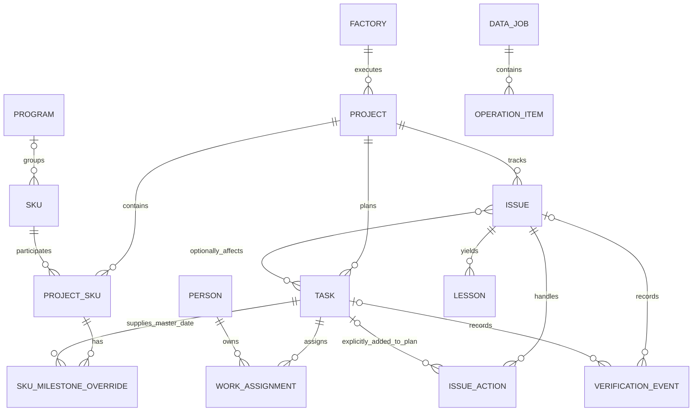

# AutoPM 开发蓝图

**v1.2：先读[Project、Task、Issue简明说明](design/PROJECT-TASK-ISSUE.md)。** 已按用户纠正将项目计划和异常处理分开；字段与交互详见[执行清单](design/PROJECT-TASK-ISSUE-IMPLEMENTATION.md)。

版本 v1.2｜规划负责人使用｜业务默认规则承接 2026-09-11 双平台计划

## 1. 最终要交付的产品

AutoPM 让团队在一个业务入口中建立项目、形成计划、分配和完成任务、维护 SKU 范围与日期差异、恢复问题、验证结果，并生成周报和 Tracker。运行规则应由系统执行；日常使用不依赖开发者或某个 AI 代操作。

目标：**Program／产品身份 → Project开案后建立主计划与SKU执行范围；Issues独立记录项目遇到的意外障碍，处理结果经验证后形成经验。** 计划与异常并行管理，不要求先有Task才有Issue。

首版交付保留现有主要业务能力。P1 是增强项，不能用重新分类的方式删掉正在使用的核心功能。Airtable 完善与 Power Apps 建设独立交付，共用业务规则和验收场景。

## 2. 现状、目标与缺口

| 功能域 | 当前事实与证据边界 | 本轮目标 | 对应任务 |
|---|---|---|---|
| 产品与项目组合 | Program、SKU 上游同步和 Projects 已存在；存在文本匹配和人工历史关系 | 稳定身份、有效执行关系推导 Program 项目范围；数量与下钻明细一致，保留 Unassigned | AT-03/08；MS-02/04/06 |
| 计划建立 | 01 实际读取 CPM Analysis；Task Template 已建但不是当前生成器来源 | 发布模板版本、预览、查重、补缺、完整任务／依赖／Owner 对账 | AT-04；MS-05 |
| 任务执行与统计 | Rollup 总数、Open 条件、完成者人数和自动化17存在不同口径 | 人员身份、结果与证据形成完成依据；统计统一、缺失透明 | AT-01/02；MS-03/05/07 |
| SKU 范围和日期 | Project SKUs、SKU Milestone Plans 已建，现有 Master Date 取 Task.Start | 独立执行状态、移出／重新加入、例外复核和历史；明确主节点的日期语义 | AT-03/04/08；MS-06 |
| 问题恢复 | Issue 的原因、行动、Owner、Target 已有；验证关闭证据不完整 | 问题措施独立保存在Issue Actions；PM纳入正式计划才关联Task；结果、影响、证据、验证、拒绝、重开保留 | AT-05；MS-07 |
| 用户入口 | 两套 Project Detail 绑定当前项目，但功能和筛选不一致 | 一致的 Project Hub；My Work 按责任区分；英文按钮、状态、提示和帮助 | AT-02/08；MS-04/07 |
| 导入与维护 | 16 项目附件导入、桌面 Bridge 周报导入分别存在；不可混称同一条链 | 同一身份和写入规则；预览、冲突、逐条执行、读回、异常重试、团队入口 | AT-06/07；MS-01/03/08 |
| 周报与输出 | 08/8b、09/09b 和新 Tracker 输出已有配置／代码；有失败与旧链接 | 事实可追溯、周报快照、新 Tracker 文件、独立发送结果 | AT-09；MS-09 |
| 知识与 AI | 现有知识表／历史问题不能证明已建立可验证复用链 | P0 最小已核验案例检索；P1 有来源的摘要推荐；自主 Agent 保留远期 | AT-10/14；MS-09/12 |
| 权限、运行、采用 | 单账号可访问；多角色、恢复和连续团队使用未完成整体验收 | 真实角色正反向测试、维护交接、约20项目试用及两个周度周期证据 | GOV-02/03/04；AT-10/11；MS-10 |

**现状截止依据**：R1/R2 审计、已读本地资料，以及此前回合 2026-09-11 的连接器与本地执行记录。本轮未重新操作线上系统，不把后续线上变化当成已检查。

## 3. 业务对象与关系

图中的关系表达目标业务模型。SKU 可处于未匹配 Program 状态；Task是项目正式计划；Issue也直接属于Project，可选关联受影响Task。Issue Actions只属于Issue，默认不进入计划；PM明确纳入计划后只读引用Task执行字段。每次核验事件必须指向一个明确的Task或Issue对象，不能两者都缺失或混成两次结果。Project 的 Program 展示由有效 ProjectSKU→SKU→Program 推导，一个 Project 可涉及多个 Program。存在旧人工关系时先对账，不静默改归属。

| 对象 | 一条记录代表什么／身份 | 维护事实 | 关联与约束 |
|---|---|---|---|
| Program | 一个产品族；稳定来源 ID＋正式业务代码 | 名称、品牌、分类、正式产品状态、图片及来源 | 读取正式上游；不要用子项目风险覆盖 PMO 状态 |
| SKU | 一个产品身份；稳定来源 ID＋正式 SKU 代码 | 产品身份、市场、主数据有效性及来源 | 对应 Program；全局产品状态与项目执行状态分开 |
| Project | 一次开案；Project ID 唯一，内部 record/GUID 保留 | 范围、类型、Factory、PM、部门负责人、阶段、正式健康、周进展 | 一个 Factory；没有 Program 时仍可在 Projects 查找 |
| ProjectSKU | 某 SKU 在某 Project 的执行关系；Project＋SKU 唯一 | Active/Removed、执行状态、范围说明 | 重新加入复用关系；事件独立留存；Factory 从 Project 获取 |
| Task | 一项正式项目计划工作或主里程碑；稳定 Task ID | 结果、交付物、Target、Forecast、Actual、依赖 | 一个Project；可被Issue影响；仅PM纳入计划的措施可链接为来源 |
| WorkAssignment | 一个 Task 对一个 Person 的分工／确认 | 负责人身份、职责、确认、代理实际操作者和原因 | 不能把 Collaborator 或相同人数当成已确认责任人 |
| SKU 日期例外 | 某 ProjectSKU 对某主里程碑的例外 | 覆盖日期、理由、确认及复核状态 | 唯一 ProjectSKU＋Master Task；两者 Project 必须一致 |
| Issue | 一项实际发生的项目意外障碍 | 事实、影响、Severity、原因及确认状态、Result、Target、发生背景与预防建议 | 一个Project；可不关联Task；受影响Task/SKU须同项目 |
| IssueAction | 问题的一项处理措施；稳定Action ID | Owner、Due、Status、Result、Evidence、是否纳入计划 | 一个Issue；默认独立维护，PM纳入计划后引用同项目Task执行事实 |
| VerificationEvent | 一次验证、拒绝、关闭或重开事件 | 实际操作者、时间、结论、结果和证据快照 | 事件追加；新结论不能擦除旧结论 |
| TemplateVersion | 一份可复用且已明确适用范围的计划版本 | 项目类型、任务、角色、工期、依赖、日历、交付物 | Published 后不原地改写；现有项目不自动套新版 |
| DataJob／OperationItem | 一次文件或批量任务／其中一项变更 | 源文件hash、映射版本、预览、旧新值、错误、逐条结果 | 预览版本绑定提交；未知结果先对账；请求幂等 |
| ReportSnapshot／Lesson | 已确认周报／已核验可复用案例 | 周期、事实版本、来源、确认者／适用条件 | 历史快照稳定；案例引用原问题和验证证据 |
| RuleConfig／运行记录 | 有版本的业务规则／后台运行事实 | 状态映射、别名、提醒和日志、回执、责任 | 不把这些配置硬编码到页面按钮 |

Airtable 可保留现有 Owner/Completed By 链接作为兼容层；若无法表达完整分工／代理记录，再由任务设计明确扩展，不能因 Dataverse 有 WorkAssignment 就机械增加所有同名表。

## 4. 字段归属和数据流

| 字段类别 | 权威维护位置 | 用户入口 | 后台责任 |
|---|---|---|---|
| Program/SKU 产品主数据 | 已确认的 PMO/PLM 上游 | 查看、发起数据纠错 | 读取、身份匹配、Source Missing，对既有执行历史停用而非删除 |
| Project 执行事实 | 该 Project 当前负责的平台 | Project Hub | 规则校验、版本与历史 |
| Task计划事实 | 同Project的Tasks | Plan / My Tasks | 正式计划的Owner、日期、结果与完成判定 |
| Issue / IssueAction异常事实 | Issues / Issue Actions | Issue Detail / My Issues / My Issue Actions | 影响、原因、措施、结果和关闭；纳入计划的措施只读引用Task |
| Baseline | 已批准计划的不可变版本 | 查看；通过明确的重基线操作生成新版本 | 不被日常 Forecast 更新或导入覆盖 |
| Target/Forecast/Actual | 对应业务事实；来源与更新时间明确 | 计划和进展更新 | 日期语义、清空与冲突检查 |
| 汇总、有效日期、提醒候选 | 系统计算 | 看板／记录下钻 | 同一规则版本；不可由普通用户直接填写 |
| 文件 | 文件库，或 Airtable 已批准附件入口 | Data Center 上传／下载 | 原文件hash、解析源行、权限和保留策略 |
| 系统配置、别名、模板发布 | 管理入口 | Administration | 版本与影响回归 |

必须区分三条现有链：①计划附件→Automation16→Tasks；②Shark/Ninja周报→Bridge→Projects/Tasks/Issues；③业务事实→Bridge→新 All Tracker 文件。Airtable 的 ALL Tracker 上游同步表是另一条读取链，不等于③的输出已经回写上游。

未来统一导入：**上传→解析→暂存校验→变更预览→确认→逐条执行→读回→对账→异常处理。** 团队用户在业务应用内完成全过程；后台服务替代个人桌面依赖。长期双向 Airtable 同步不属于默认交付。

## 5. 共用业务规则目录

以下是实施默认契约；不冒充公司已批准制度。默认值调整见变更规程，不能靠执行 AI 临时猜测。

| 规则 | 实施与验收要求 |
|---|---|
| BR-01 身份 | Project 稳定 ID；Project-SKU 多对多；每Project一个Factory；未归类项目保留 |
| BR-02 归属 | 上游维护产品身份；负责平台维护执行事实；系统维护派生值 |
| BR-03 确认 | 按负责人身份逐个核对；代理确认保留操作者、被代理人、原因和时间 |
| BR-04 证据 | 普通任务需结果；关键里程碑需证据和核验；问题措施保留结果/证据，Issue单独验证；周报绿色仅为来源声称完成 |
| BR-05 历史 | 原始完成状态保留并注明证据覆盖；不补造历史核验或无记录地改旧进度 |
| BR-06 日期 | Baseline/Target/Forecast/Actual分别维护；日期过去不代表完成 |
| BR-07 排期 | 明确点状里程碑可Start=Due；已有起止用源值；不明单日期进入映射异常；取消无依据的加7天 |
| BR-08 例外 | 无例外继承；确认例外优先；主日期变化保留例外并要求复核；范围历史不删除 |
| BR-09 关闭 | Open→In Recovery→Pending Verification→Closed；拒绝回Recovery；Closed可Reopen；每次有结果和事件 |
| BR-10 责任 | PM核验；PM兼执行者时由配置的独立核验人核验；无人可核验时保持待验证 |
| BR-11 状态维度 | Lifecycle、Stage、Health、完成率分开，In MP不等于On Track |
| BR-12 健康 | 关键节点预测晚于Baseline／关键逾期产生Delayed候选；关键依赖阻塞／影响关键节点的High/Critical问题产生At Risk候选；不足为Unknown；PM发布正式健康，覆盖留理由 |
| BR-13 统计 | Active排除Closed/Cancelled；Open排除终结项；High与Critical合并时明示；Program SKU为有效范围去重数 |
| BR-14 时间 | Asia/Shanghai、周一至周日、今日到期不算逾期；工作日08:30合并提醒，完成／取消停止，升级先由PM发起 |
| BR-15 导入 | 精确身份；空值不默认清空；明确清空独立变更；源旧或预览后目标变更进入冲突 |
| BR-16 重试 | 稳定请求和源身份；创建／更新均读回；未知结果先对账；不把写入响应当独立验证 |
| BR-17 输出 | 周报保存已确认快照；Tracker生成新文件；AI不决定Actual、正式健康或关闭 |

补充口径：Issue Actions不计入Task总数或计划完成率；PM批准新增的正式Task才进入当前计划，原Baseline保留。完整 Task 总数包含 Cancelled，用于反映记录范围；当前执行完成率分母排除 Cancelled，界面同时显示 Eligible/Cancelled，历史差异留痕。该细化是本次规划默认，不能据此批量改历史。

“近期节点”工程默认采用未来7个自然日的可配置窗口。模板默认周一至周五，无额外节假日；既有模板保留原日历直至核对。当前日期继承取 Start 的旧实现不直接改成 Due，须在 AT-04/MS-06 做字段语义映射后验收。

## 6. 统一界面和用户旅程

全英文界面。普通用户导航：**My Work / Programs / Projects / Issues / Weekly Updates / Data Center**。Administration 只对管理角色显示。

Project Hub 固定头部：**Project ID / Name → Lifecycle / Stage / Health → Next Milestone → Open Issues / Next Action → Owner / Factory**。

详情标签：**Overview / Plan / SKUs / Issues / Weekly Updates / History**。Program、Projects、My Work 和提醒进入同一个项目上下文。SKU页面区分Program全部SKU、Project有效SKU和Removed；数量明确表示产品身份数还是执行关系数。

| 用户旅程 | 起点→操作→结果 | 必备异常反馈 |
|---|---|---|
| 找项目 | Programs/Projects→搜索／分类→Project Hub | 无Program仍可查；筛选为空显示清除筛选；无权限不暴露记录 |
| 建项目 | New Project→身份／类型／Factory／SKU／模板→计划预览→确认 | 重复ID、无模板、循环依赖、Owner未分配均明确显示 |
| 做任务 | My Work→任务背景→更新Forecast／结果／交付物→提交 | 保存失败留输入；冲突不静默覆盖；缺证据不显示完成 |
| 改SKU范围 | SKUs→加入／移出／重加入→日期例外→保存 | 不影响同SKU另一个项目；主节点变化显示待复核 |
| 关问题 | Issue→Recovery→结果／影响处置→提交验证→通过／拒绝 | 行动完成不直接关闭；核验责任不明确时显示阻塞原因 |
| 维护周报 | Data Center→上传→预览→修正→提交→结果 | 部分成功逐条可查；可安全重试；未知结果不重复写入 |
| 输出材料 | Weekly Updates→确认快照→Export Tracker | 过期数据和缺失标识；文件失败可定位；原文件保持不变 |

颜色：Green=On Track/Complete/Closed；Amber=At Risk/Pending Verification；Red=Delayed/Blocked；Gray=Unknown/Not Started/Cancelled；Blue=主操作和选中态。搭配文字与依据，键盘可操作，错误消息说清如何处理。项目状态不应由颜色独自表达。

Project Hub 可用性基线：试用者在30秒内回答“状态、原因、负责人、下一步”；界面操作后重开记录仍读到保存值。最终显示与操作需真人／浏览器验证，不能靠页面配置JSON代替。

## 7. 两个平台的独立落地架构

| 层 | Airtable 路线 | Power Apps 路线 |
|---|---|---|
| 数据 | 保留有效18表快照；目标增加Issue Actions、Operation Items、Execution History、Rule Config；Schedule Import→Data Jobs | Dataverse正式关系、唯一键、来源映射、安全角色和历史 |
| 计划与执行 | 复用CPM生成器并转已发布模板；Tasks只保存正式计划，Issue Actions独立；22按集合读取和分批 | TemplateVersion/Task/Dependency、ProjectSKU/Override、WorkAssignment和业务API |
| 规则 | 统一脚本／计算字段；操作请求收口；Creator直接改表属于受控维护 | 同步插件守住表写入约束，Custom API承载复合业务操作 |
| 界面 | Interface为普通用户入口；两详情无法合并时遵守同一组件规范并回归 | 响应式Canvas；Model-driven仅作管理员工具 |
| 后台 | 轻量Automations＋公司批准的文件处理服务 | Power Automate编排＋Azure Functions解析／Tracker输出 |
| 文件 | 保留已批准的附件／文件库入口，统一作业引用 | SharePoint文件库，Dataverse存文件引用与关联 |
| 发布 | 测试Base、字段和脚本版本、消费者清单、分批发布回退 | Solution、环境变量、连接引用、Dev/Test/Prod和版本库 |

Airtable不具备等同数据库事务的多记录操作保证，必须保存检查点、逐条结果、单写入协调与补偿。Power Apps不能用隐藏按钮替代数据层权限；Custom API也不能自动约束所有直接表写入。

Dataverse还未取得时可做接口、模型、规则、代码和离线测试；不得称为已部署，也不继续扩大SharePoint临时关系层作为正式替代。既有MVP保留交互及合法用户修改，在正式迁移时对账合并。

## 8. 并行开发、范围和完成标准

开发期：Airtable保有正式事实；微软端使用隔离快照。试用转移时按Project记录负责平台、切换时间和字段范围；同一事实只有一个写入方。是否整体迁移是后续验收决定，本包不自动停用Airtable。

任务按依赖波次执行，不用虚构日期或“完成行数百分比”承诺工期。P0功能验收与两个真实周度周期分别记录：技术链完成不等于业务采用已证明。

最终交付证据：完整范围数据对账、同SKU多Project、建案重复／部分失败、日期例外、任务证据、问题验证重开、批量冲突重试、周报／Tracker、提醒、角色并发、团队独立操作及恢复交接。详细步骤和预期值见验收用例库。

P1：更丰富计划交互、模板升级比较、批量调度、管理Review、带来源AI摘要和案例推荐。REQ-024 Copilot与REQ-025自主Agent保留远期需求，不在P0中新增自主执行。
