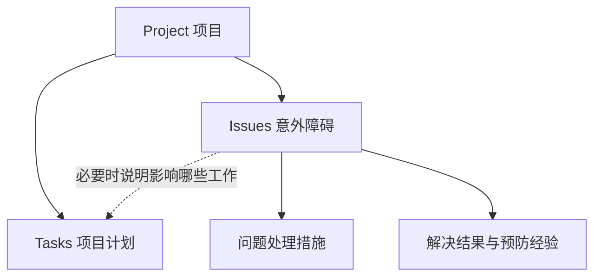

# Project、Task、Issue：先把项目和问题分清楚

2026-09-11｜FD-14 修订｜业务方向已由用户确认，平台尚未按本稿改造。

**项目有两条独立的管理线：按计划做事，以及处理意外障碍。**

## 1. 三类内容，各管什么

| 内容 | 管什么 | 例子 |
| --- | --- | --- |
| Project | 项目整体进展、关键节点、需要关注的障碍 | 一个新产品开案 |
| Task | 项目本来就要完成的工作 | 设计评审、开模、测试、试产 |
| Issue | 推进过程中实际出现的意外障碍 | 供应商停供、样品异常开裂 |

没有任何 Issue，项目仍有一套完整的 Tasks。没有对应 Task，也可以记录一个 Issue。任务逾期是提醒信号，不自动生成问题。

## 2. 用户怎样维护

**项目开案：** 选择模板或导入计划，确定工作、负责人、时间和依赖。

**发现问题：** 从 Project 点 Add Issue，记录发生了什么、影响什么。Project 自动带入。刚发现时不要求已经知道根因和解决办法。

**推动解决：** 每个问题明确一个推进负责人；在问题里面逐条安排处理措施，每条有执行人、目标日期和结果。这些措施不会自动进入项目计划。

**确认解决：** 处理措施做完后，检查问题是否真正消除，保留结果和验证。完成工作不等于解决问题。

**需要调整正式计划：** 例如问题导致必须增加一轮认证，由 PM 明确把这项工作纳入计划，并保留来源关联。原问题页面引用该任务，执行日期和结果只维护一次。

## 3. 项目页面长什么样

| 区域 | 用户看到什么 |
| --- | --- |
| Plan Progress | 当前阶段、下一节点、计划任务、负责人、即将到期和逾期工作 |
| Needs Attention | 影响交付或关键节点的重要问题、负责人、处理措施、解决目标日期 |
| Issues | 当前项目全部问题；可以查看未关闭、待验证和历史问题 |

点任务进入 Task Detail，点问题进入 Issue Detail。所有入口复用同一份详情；不用在 Project 再填写一遍相同内容。

My Work 分清 My Tasks、My Issues 和 My Issue Actions。分别读取实际记录，不建立个人待办副本。

**计划完成率和问题情况分别展示。** 项目完成了90%的工作，也可能被一个关键问题卡住。普通问题处理措施不改变计划完成率；PM批准加入计划的额外工作才参与计划统计，原 Baseline 保留。

## 4. 解决以后，要留下经验

每个问题保留：类别、发生阶段、当时的工厂或供应商背景、核实后的原因、处理措施、实际效果、影响和预防建议。

这样可以查清：哪类问题经常发生、在哪个阶段发生、哪些办法有效、下一版模板应增加什么检查。

初步猜测和已核实原因分开。历史问题和验证结果继续保留；没有原因或证据的记录明确显示缺失，不由 AI 补造。

## 5. 本次修正了什么

- 取消“恢复行动全部作为 Tasks 类型”的旧建议。
- Task 和 Issue 都直接属于 Project，不要求经过彼此建立归属。
- 多项问题处理措施在 Issue 内维护，后台单独保存，员工不需要多开一个工具。
- 只有 PM 明确纳入正式计划时，处理措施才关联已有或新建的计划任务。
- 问题关闭之后仍用于经验检索和规律分析。

给执行 AI 的字段、页面和验收要求见[执行清单](PROJECT-TASK-ISSUE-IMPLEMENTATION.md)。本文件是业务说明，执行清单与它冲突时，以这里已确认的业务边界为准。
