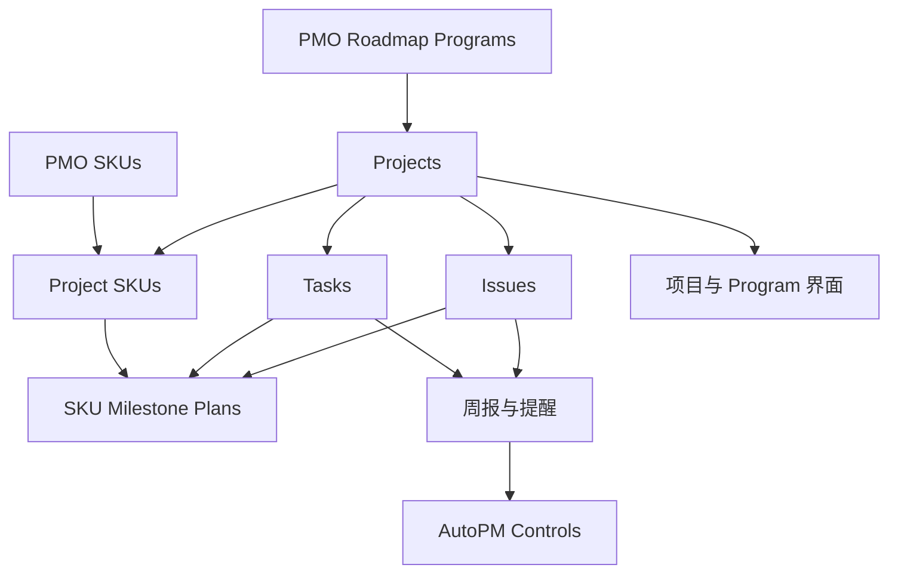

# AutoPM 系统盘点与开发任务建议

检查对象：AutoPM V2（Pilot），Base `appOMWiK4CTOH7iQu`。检查日期：2026-09-10；运行历史中的时间按浏览器显示的 PDT 记录。

本次通过已登录浏览器实际打开 Data、Automation 配置和代码、运行历史、Interface 编辑器及已发布页面；用只读记录查询补充关系和字段核对。没有修改记录、字段、关联、公式、脚本、自动化、权限或发布设置，没有测试、重跑或发送通知。

## 1. 结论与覆盖边界

AutoPM 已具备项目、任务、问题管理和 Program／Project／SKU 的基础结构，能展示真实项目、负责人、任务、问题及部分 SKU 执行计划。主要短板是：**自动化执行结果不可靠、完成度存在不同口径、两个项目详情入口展示能力不一致、Issue 尚未形成可核验的关闭流程。** 不能将整套系统评为已完成闭环。

只看自动化 ON/OFF 不足以审查系统。本次已补充读取全部 32 条自动化的步骤配置，其中 30 条有脚本，读取了完整脚本内容并检查关键分支；另外 2 条为原生动作。检查了可见历史，并对典型成功、跳过和失败展开日志。代码检查并不等于所有分支经过运行验证。

| 覆盖项 | 已完成的检查 | 边界 |
|---|---|---|
| 设计资料 | Master PRD 正文、Capability Matrix 29 项能力及用户批注列、现有表结构和 System Knowledge & Progress | 未取得独立的 Phase 1 Engineering Closure Plan 和额外字段／关系／自动化说明文件；没有以其他资料替代 |
| Data | 18 张表、498 个字段的类型／关系／可见配置；18 张表的页面入口；关键公式、Lookup 来源和真实记录 | 未逐行核查全库；部分 Rollup 聚合表达式和全部 View 条件未在编辑器逐一展开 |
| Automation | 32 条全部清单、触发／输入／动作、30 份脚本、可见历史；关键失败展开 | 未执行测试；历史成功不能证明当前版本或实际收件结果成功 |
| Interface | 初次盘点 5 个组、32 个顶层页面；打开其中 30 个，另查嵌套记录详情 | 初次 Sandbox 的 2 个隐藏页面未打开；随后页面目录发生变化，详见下文 |
| 真实流程 | 3 个核心 Project Detail 样本；另有模板、导入、日期例外、跨项目 SKU、失败任务和 Closed Issue 样本 | 只读追踪已有输入、配置和结果，没有新建测试数据或重新运行流程 |

**盘点期间的版本变化：** 初次目录有 32 页；收尾重新从 Airtable 首页进入编辑器，当前目录为 Project Portfolio 的 **13 页（8 个导航页、5 个隐藏页）**，Knowledge Center 和 Department intelligent 两组存在但未列出页面；Sandbox 和 My Daily work 组已不在目录。Project Portfolio 显示 **Last published Sep 10, 2026 / No changes**，初查时显示 Sep 7 且有未发布改动。先前可访问的 Sandbox 地址复访返回无法打开。没有检查是谁执行了这些变更，也不能据此推断删除原因。自动化清单收尾仍为 32 条。下文把已移出目录的页面作为历史快照，不建议再按旧清单逐页修复。

状态定义：**已核对可用**＝在明确样本范围内核对了实际结果；**部分实现**＝部分步骤存在且有结果，但有具体断点；**仅有配置待验证**＝看到实现配置，未核对业务结果；**未发现实现**＝在本次可见范围未找到；**无法检查**＝资料、入口或只读边界不足。另以“已验证正常／已验证问题／未验证”区分证据，不将代码风险冒充已发生事故。

## 2. 系统现在如何运作

项目在 Projects 中维护身份、Factory、各部门 Owner、计划日期、周进展和状态。Tasks 和 Issues 分别管理执行工作与异常。PMO SKUs 保存 SKU 主数据，Project SKUs 保存 SKU 在某个项目中的执行身份、状态和工厂文本；SKU Milestone Plans 将这一执行身份关联到项目的 Master Task，并通过 Lookup／Formula 继承或覆盖日期。Program 通过 Projects 汇总 SKU。

输入主要有项目表单、详情页／数据表手工维护、计划文件导入和外部主数据。自动化负责模板生成、标识分配、日期联动、协作者写入、关联补全、SKU 计划补建、汇总邮件与提醒。当前任务导入主要由自动化 16 从 Projects 附件读取 CSV／XML；代码提到外部 Smart Project Converter，不能把它当作已经检查过的系统组件。

图表示业务依赖，不表示每条边都是自动化：Project↔Program、Project↔PMO SKU、Project↔Task／Issue 和 Project SKU↔Master Task 的具体字段见附录。

### 2.1 七条业务流程的实际状态

| 流程 | Data／Automation／Interface／外部依赖 | 状态及证据 | 断点与下一步 |
|---|---|---|---|
| 创建项目→模板→计划任务→Owner | Projects → CPM Analysis → Tasks；01、04、07c、11；New projects | **部分实现**。表单和任务生成代码存在，历史有成功，已有 Tasks Generated 项目和任务 | 生成器实际读 CPM Analysis，不读 Task Template；L4 缺模板会降为 L3；有任何现存任务就整体跳过；旧 Owner 字段映射可能留下未分配任务。未核对一份完整原始输入对应完整任务及 Owner 集合 |
| 导入周报→匹配项目→更新任务／问题／进展→界面 | Projects 附件／导入回执、Tasks；16 为计划文件导入；19–21 为身份关联；周报输入外部依赖未知 | **部分实现**。实际有计划导入成功回执和创建记录，项目也有本周进展文本 | 计划导入不等于周报导入。16 按项目＋任务名称跳过已有任务，并不更新既有任务、Issue 和周进展；没有取得周报原文件及外部转换／更新实现 |
| Program→Project→SKU 汇总和下钻 | PMO Roadmap Programs、Projects、PMO SKUs、Project SKUs；19–22；Program 页面与两套项目详情 | **部分实现**。PG30X→NXA0010→6 个 SKU 实际下钻正确；执行详情可展开 SKU 计划 | NXA0245／NXA0229 的精确 SKU 主数据匹配未找到；两入口显示不同内容；Program SKU Quantity 的计数粒度需明确 |
| 项目主计划→SKU 日期继承／例外 | Tasks.Start Date → SKU Milestone Plans.Master Date → Effective Date；两条 22；Program 入口项目详情 | **部分实现**。SXA0061 的 FW575PK1 覆盖到 9/6，另两 SKU 继承 8/22；公式结果吻合 | 02／03 日期联动输入有缺口；22 有额度失败；已发布列表未展示 Effective Date；4 条例外样本中 3 条原因空，1 条为 Test，不能证明业务审批成立 |
| 任务更新→项目进度／健康→提醒 | Tasks 完成公式／Projects Rollup、存储进度、手工状态；17、09、09b | **部分实现**。任务状态和提醒队列存在；17、09b 有历史成功 | 17 完成口径与公式不同，触发只监听 Completed By；没有核对到健康状态自动闭环；09 多日失败且可能部分入队 |
| Issue→Recovery→Result→Verification→Close／Reopen | Issues 的 Root Cause／Recovery Action／Recovery Owners／Target Date／Status／Closed Date；05、07d；Issues Overview／Task、Project 详情 | **部分实现**。问题、负责人、恢复行动可查 | 没有找到 Result／Verification／Verified By／重开依据的完整结构与自动化；Closed 样本有缺关联、缺关闭日期。外部 Jira 验证流程未检查 |
| 执行数据→Weekly Summary→Tracker／其他输出 | Projects／Tasks／Issues；08、8b、09b；Weekly Summary；ALL Tracker；外部主表／转换工具 | **部分实现**。仪表盘和邮件配置存在；8b 原生收件人／主题／正文输出绑定已核对，有历史成功 | 未验证收件箱实际送达和邮件链接；08 当前引用缺失字段；未发现这 32 条自动化写 ALL Tracker，外部同步实现无法检查 |

可确认形成的局部工作路径是：查项目→看关联任务／问题→识别 Recovery Owner，以及 Program→项目→SKU 执行计划的只读路径。**没有一条涉及保存、自动化处理、通知送达的完整业务流程在本次只读检查中获得端到端运行验收。**

## 3. 真实样本与 Project Detail 检查

### 3.1 核心三个项目

| Project ID／记录 | 选样原因 | 已核对结果 | 数据缺失与页面缺失 |
|---|---|---|---|
| **NXA0010** `recJ1j632jSffpBrR`，PG301 INTL | 多 SKU＋开放问题＋计划任务 | 6 个 PMO SKU、6 个 Project SKU；7 个任务，按当前完成公式 4 个完成；2 个开放 Issue；NPI Levin Huang、PMO Shivani Ray、Yueda；Planned MP 9/1，当前 MP 10/15，差 44 天 | 旧详情未展示已有周进展／Current process／SKU 执行层；Program 入口详情有执行层。Project SKU 状态空是底层为空。存储进度 66.7%，公式 57.1% |
| **NXA0245** `recjEAsw00jRjy1R8`，PG3XX DE/FR upsell | 开放 MP artwork 问题＋延期 | 6 个任务、公式完成 3 个；NPI Levin Huang、PMO Shivani Ray、Yueda；Planned MP 8/2，当前 MP 9/11，差 40 天；界面进度 60%，公式 50% | SKU 文本含 XSKULTIBNDLEU、XSKESNTBNDEUK，但 PMO SKU／Project SKU 关联为 0；对这两个 DEV_SKU 精确查询未找到主数据，不能只修页面 |
| **NXA0229** `recadFhuJaPBQK5HZ`，CCO905KSSL | MCU／PCBA 延期＋有计划任务 | 6 个任务、公式完成 5 个；NPI Simon Qiu、PMO Macarena Albo、Donlim Indonesia；Planned MP 9/16，当前 MP 10/30，差 44 天；进度 83.3% 一致 | CCO905KSSL 精确主数据匹配未找到；本周更新有 PCBA ETA 9/11→10/27，但旧详情未展示该周进展。两条 PCBA Issue 是否重复需业务确认 |

三个样本手工 Project status 均为 On Track，同时存在 MP 日期差和开放问题。**“On Track”的业务定义未取得，不能直接把三条状态判错**；但当前界面确实缺少解释这些信息如何并存的口径。

入口操作：从导航点 Projects list → 点搜索图标 → 输入 Project ID → 点目标行打开详情，约 4 个操作单元（包含一次文本输入）。搜索能定位上述项目；NPI Owner 等筛选可用；Back to Projects list 能返回并保留搜索状态。残留筛选可能使项目不出现，应显示当前筛选条件／提供清除入口。Program 路径为 PMO Roadmap Programs → All records → 搜索 PG30X → 打开 Program → 展开 NXA0010 SKU 或 Open detail view；步骤更多，但能看到 SKU 执行层。

已实际打开并核对的关联样本包括：NXA0010 Award 任务 `recWMJ0KTXH3nwe9p`；NXA0245 MPRA 任务 `recZ3hckLSQi5xOk7` 和 artwork Issue `recjuryBih7z1zfV9`；NXA0229 MP Start 任务 `recsPG3eDNtYqZCeF` 和 PCBA Issue `recvhYghilm9msOwC`。这些记录的 Project 关联与所在项目一致，**没有在这些打开的记录中发现串项目**。不能据此证明全库无错误。

维护入口：项目字段、任务详情、Issue／Recovery 字段存在编辑入口；检查中未改值，进入编辑的地方取消或退出。旧项目详情写有需到 Issue list 编辑关键问题的说明；周报邮件勾选／按钮和导入入口存在，但未点击触发。保存权限、表单提交、完成回写和自动通知均未验证。

### 3.2 额外链路样本

| 样本 | 实际证据 | 结论范围 |
|---|---|---|
| PG30X `recQxsdMT2J2xa7mw` | Program 展示 25 项目、SKU Quantity 56；SKU Models 返回 33 个非空唯一名称；展开 NXA0010 显示 6 个正确 SKU 主数据行 | 汇总与下钻存在；56 是否应为跨项目去重 SKU 数取决于指标定义，尚未逐个核对 25 项目的并集 |
| SXA0061 `recu4kMoP2UCtyKem` | Tooling Transfer Arrival 主任务 `recJEadU64XmNW5wi` 的 Start 为 8/22；FW575PK1 Override 9/6、Independent、Reason=Test；FW575GN1／GD1 同任务继承 8/22 | 公式和已有数据结果正确；例外业务有效性待确认，未改日期验证联动 |
| SXA0348、SXA0129、XSXA80250 共用 FH320GN | 同一 PMO SKU `recn1WZ10WERg2Wjv` 对应不同 Project SKU；SXA0348 MPRA 计划为 Inherited 10/19，SXA0129 对应计划 Unscheduled | 执行层确实按项目分开，样本不存在强制共用同一执行日期；没有对所有跨项目 Master Task 做完整一致性检查 |
| NXA0014，失败 Task `recfg1Nj4eK0mLY1o` | 关联项目 53 个任务；22 的 Task 触发历史报 30 次 table queries 超限；脚本逐任务 selectRecordAsync | 明确性能断点；不能由此推断该项目所有 SKU 计划均未生成 |
| SXA0342 Task `recUXo5DPSVhnqAqN` | 02 历史 Success，但输出 updatedTaskIds=[]／Skipped: unknown mode；当前 Est. Duration 空，另一 Duration for Start Date 为 8 | 已验证空执行；恢复 mode 前还须核对工期字段，避免空值按 0 计算 |
| XSXA80455 `recSCLI9hzWi2kLXU` | 导入回执 Success 16，明确警告缺少旧 % Complete 字段；当前 9 条关联任务均为 0%，Owner Edric，创建时间与历史一致 | 已证明导入跳过缺失字段；没有取得源文件，不能断言 9 条应为完成，也不能把 16→9 归因于导入丢失 |
| 18 条 Closed Issue 样本 | 其中 4 条 Project 关联空；NXA0006-ISS001／002 同时 Closed Date 空 | 样本数据完整性问题；Closed 不足以证明结果已核验 |

## 4. 架构问题清单

优先级：P1＝影响当前执行可信度，应优先修复或验证；P2＝效率、治理或局部展示；P3＝历史清理。所有影响范围均限于所述配置或样本。位置中的 A 编号对应附录完整自动化名称。

| 编号 | 实际现象／证据等级 | 业务影响与范围 | 证据位置 | 建议修改／类别 | 优先级 |
|---|---|---|---|---|---|
| F01 | **已验证问题**：02／03 代码读 mode，输入只有 taskId；02 历史成功实际跳过 | 日期变动不能据绿色 Success 判断已经传递；两条配置 | A02／A03；9/7 19:45，SXA0342 Task `recUXo5DPSVhnqAqN` | 修复输入契约；缺模式应明确失败；先确定工期字段／多前置规则后恢复联动。**修复** | P1 |
| F02 | **已验证问题**：22 Task 分支因 30 次查询额度失败；代码逐个读项目任务 | 较多任务的项目可能只建出部分执行计划；本次明确 NXA0014 | A32，9/8 01:44，Task `recfg1Nj4eK0mLY1o`；历史 script:142，当前逐任务读取段位置有版本差 | 批量取必要任务建立索引；保留幂等键与例外；对失败回执记录阶段／数量。**修复** | P1 |
| F03 | **已验证问题**：项目存储进度和 Rollup 完成比例不同；17 用“Completed By 非空”判完成，公式按人数比 | NXA0010 66.7% 对 57.1%；NXA0245 60% 对 50%；新增／移除任务可能不触发17 | Projects.Progress／Completion %；A23 | 先确认“全部负责人完成”还是其他口径，再让详情和周报共用一个结果来源；核对旧任务计数 Rollup。**修复** | P1 |
| F04 | **已验证问题＋未验证后果**：16 引用缺失字段 `fldWRF3A9HyjxxTuR`；解析完成度受字段存在条件限制；回执实际警告 | 可能导入任务却漏完成状态；XSXA80455 有明确缺字段回执，完成结果需源文件对照 | A21；Projects 导入回执；9 条当前任务 | 映射到当前完成机制；逐行成功／跳过／失败计数准确，部分失败不得报整体成功。**修复** | P1 |
| F05 | **已验证问题**：从 Projects list 与 Program 打开同一项目进入两套详情，能力不一致 | 用户在列表详情找不到已有 SKU 执行层；Program 详情缺完整项目 Issue 操作 | NXA0010 两个页面 E01／E04 | 先加当前项目的双向导航，再确定统一详情布局；保留 Tasks、Issues、SKU 三种入口。**改善** | P1 |
| F06 | **已验证问题**：09 在可见 9/1–9/10 多次失败；9/10 写 Email Body 字段被拒绝，之前已有队列日志 | 有人可能已入队、有人未入队，不能简单整体重跑；真实收件未检查 | A12，9/10 06:32；字段 `fldwsEvt93yUswjcY`，script:377；A13 | 查具体失败正文类型／长度及队列结果，按收件人记录失败，重试去重且不重复通知。**修复** | P1 |
| F07 | **已验证配置缺陷**：12 读不存在的 Last Modified By 并在历史报错；11 读不存在的 Projects.Created by | 创建者／修改者协作者补充不可靠；仅12有当前失败证据 | A15／A16；12 在9/8 23:57 Task `recX7olbeCXjCjeH9` | 对照当前人员来源修复字段契约；不要仅为旧脚本盲目补字段。**修复** | P1 |
| F08 | **已验证代码差异，覆盖事故未验证**：10 将全 People 中 NPI 部门成员与 Owner 合并后覆盖 Collaborators；07c／11／12为追加 | 可能扩大“我的任务”范围并覆盖已有协作者；真实权限扩大未验证 | A14 与 A09／A15／A16 | 明确项目参与者规则、单一维护责任和保留策略；回归两种触发顺序。**改善／待验证** | P1 |
| F09 | **已验证配置缺陷**：PLM 精确匹配使用 DEV_SKU＝触发记录的 Base record URL | 正常 SKU 值难以命中；历史成功可只是零结果 | A24 原生 Find records | 使用实际 SKU 字段匹配；核对重复／无匹配分支，不改动无关主数据。**修复** | P1 |
| F10 | **已验证配置缺陷＋代码风险**：19b 监听 Project type 而非 SKU 文本；19–21 对空／无匹配不清旧关联 | 改 SKU 后可能不重算，名称变化可能保留旧关系；未证明具体串项目 | A26–A30；Projects.PMO SKU／PMO Program | 补正确触发；明确“没有匹配／多个 Program／删除 SKU”的保留或待处理策略，显示异常原因。**修复** | P1 |
| F11 | **已验证样本数据问题**：NXA0245／NXA0229 SKU 文本有值，精确主数据不存在、关联空 | 用户无法下钻 SKU，生成执行计划也缺输入 | E02／E03；PMO SKUs.DEV_SKU 精确查询 | 由主数据责任人确认编码／别名／来源后修复，不能自动创建臆测 SKU。**修复／待验证** | P1 |
| F12 | **已验证部分实现**：Issue 有恢复行动和关闭状态，缺核验结果结构；18 Closed 样本4条缺Project | 关闭不能回答谁确认、凭什么关闭；历史孤立记录不进入项目汇总 | Issues；NXA0010-ISS001 `recKC9EBgQohaIC7Q`、NXA0245-ISS001 `recK3DsFo1bQ2bn9e`、NXA0006 两条 | 先确认外部 Jira 验证是否权威；再用现有 Issues 承载最小 Result／Verification／重开依据，按记录修复归属。**新增／修复／待验证** | P1 |
| F13 | **已验证样本问题**：4条 Override 中3条原因空、1条 Test；Effective Date 有值但已发布计划表没列出 | 看见主日期和覆盖日期仍需自己判断执行日期；追溯例外不足 | SXA0348、SXA0061；E05；SKU Milestone Plans | 先展示 Effective Date 与来源；按业务规则要求例外理由及可追溯变更，不新增独立表。**改善** | P2 |
| F14 | **已验证代码问题，生成结果未完整核验**：01 实读CPM且缺L4会降级；有任意现存任务即跳过 | L4计划和部分生成修复不能被 Tasks Generated 勾选证明 | A01；CPM Analysis56／Task Template111 | 确认模板权威来源和L4策略；显式“不支持／部分生成”；保留任务级去重。**修复／改善** | P1 |
| F15 | **已验证当前字段依赖缺口**：08 选择 Current Gate (Manual) 已不存在；读取 WeeklyReportRecipients 也无对应字段并被catch | 当前周报可能失败或回退；9/3历史成功不是当前字段兼容证据 | A10 代码／AutoPM Controls5字段 | 对齐当前阶段和收件人来源；显式报告缺依赖。原生收件人固定为 Sun Sun，与脚本输出并非同一配置。**修复** | P1 |
| F16 | **已验证界面问题，隐藏页范围**：Weekly Overview 的 Overdue Tasks 数字2997，来源实际Projects行数；Weekly Project Review 有 Field deleted | 隐藏管理报告可能误导；不推断已发布 Weekly Summary 同样错误 | `pagh9IRt1U9sNUAYQ`／`pagHk4Vzw8rStr7K7` | 只保留有明确口径的指标；对保留页修数据来源，对停用页另作决策。**修复／保留** | P2 |
| F17 | **已验证界面问题**：旧详情优先展示附件空区、多个空链接和系统字段，已有周进展／Current process未展示；Issue Target Date未列出 | 用户难迅速回答“下一步谁、何时处理” | E01–E03；Issues.Target Date有值 | 首屏优先Owner、阶段、当前／基准MP、差异、本周进展、问题＋行动＋Owner＋Target Date；将系统与低频链接折叠。**改善** | P2 |
| F18 | **未验证风险**：Task／Issue ID为文本，04通过最大序号+1；05名称含Task自动关联但代码只生成ID | 并发可能重复；6个核心开放Issue样本ID空且Related Task空，不能凭名称认定自动归属存在 | A04／A05；Issues字段 | 明确分配责任及幂等策略；补创建／归属变化覆盖；先回溯具体记录。**修复／待验证** | P2 |
| F19 | **已验证数据／配置欠缺**：Schedule Import3个Lookup缺关联配置；Factories110条中10条Factory ID空、99条Factory code空 | 旧导入维护困难，工厂编码匹配可靠性不足；不代表主业务Factory显示都坏 | 两表字段配置及样本统计 | 根据是否继续使用旧导入决定修复；先指定Factory匹配主键，不为形式补齐所有字段。**待验证／改善** | P2 |
| F20 | **未验证边界**：ALL Tracker为文本快照；32条代码未发现写它；独立周报输入和外部转换未提供 | 无法认定执行数据已经同步到团队最终Tracker | ALL Tracker、A21、外部系统入口 | 取得真实周报和Tracker输出、外部脚本及运行责任人，追踪一批输入到输出。**待验证** | P1 |

## 5. 最应该先做的五项任务

排序按“已证实的执行失效→数据结果可信→用户能找到正确执行信息”确定，不以自动化数量或架构整齐程度排序。建议由业务负责人确认完成／日期口径；具体修改另开任务执行。

| 排序／任务 | 目的与修改对象 | 前置依赖 | 独立验收标准 | 类型／优先级 |
|---|---|---|---|---|
| **1. 让任务日期修改真正更新计划，并对未执行明确报错** | 修复02／03的mode输入契约；统一工期来源；对无模式、空工期、多前置依赖给明确处理；不在本任务重做模板系统 | 确认 Start／Due 与工期算法、多前置取值、哪些MP日期允许自动写；取得可运行测试环境或另行授权 | start与due两入口各1案例；无mode不得绿色空成功；空工期不默默按0覆盖；多前置使用批准规则；重复触发收敛；不改变其他项目和SKU Override | **修复，P1**；已有绿色空执行证据，排第一 |
| **2. 让多任务项目完整生成缺失SKU计划** | 修改两条22共享逻辑的读取方式、统计和幂等检查；保留Unique Key和现有例外 | 明确Milestone多任务歧义与项目移除SKU的规则；使用现有数据副本或批准样本 | 以NXA0014规模（53任务）不再超查询额度；计算符合条件的Project SKU×Master Task集合并逐条对齐；重复运行不新增重复；已有Override／Reason不变；失败报告具体阶段 | **修复，P1**；已有真实失败且阻断SKU执行层 |
| **3. 让项目详情和周报显示同一个可信完成度** | 对齐Tasks完成定义、Projects公式／存储进度、17和相关显示；核查旧Total/Open Task Count | 业务确认多人任务完成规则、代理完成是否允许、是否按任务或权重计；盘点存储进度的引用 | 对NXA0010、NXA0245、NXA0229逐任务算出预期值，详情和周报一致；新增／删除／改归属／改Owner后均符合口径；在旧字段停用前替换所有使用者 | **修复，P1**；直接影响项目判断和报告 |
| **4. 让计划导入准确保留完成状态，并给出可信回执** | 修改16的旧字段依赖、完成数据映射和批次错误处理；不扩展成周报AI导入 | 提供XSXA80455原始文件或可比真实文件；批准Owner与Completed By映射规则；明确重导入策略 | 导入记录与源文件逐行核对；完成／未完成均正确；已有任务按既定策略处理；成功＋跳过＋失败总数等于输入有效行数；有失败不能整体报Success；重导入不产生重复 | **修复，P1**；已有跳过缺失字段的真实回执 |
| **5. 从项目列表详情直接找到当前项目SKU执行计划** | 在列表入口详情加入指向同一Project的SKU执行详情入口，并保证返回；暂不合并全部页面 | 收尾确认 `pag13iJZweBRoXJTB` 为继续保留的SKU执行详情；明确用户可见权限 | 从NXA0010列表详情1次点击到同项目6个Project SKU；返回后仍是NXA0010；NXA0245／NXA0229显示未关联而非其他项目；Tasks／Issues原有入口仍可用；无需用户重搜项目 | **改善，P1**；复用已有能力，范围小、可独立验收 |

**最适合作为下一次单独分派的小任务：第5项。** 它不依赖先修复全部自动化，也不需要增加表或复制数据。只改变两个详情之间的当前项目导航；验收就是上述三个项目的跳转、空关联和返回行为。本报告仅提出，不执行。

### 5.1 其余可分派候选任务

| 任务／对应问题 | 目的与修改对象 | 前置依赖 | 验收方法 | 类型／优先级 |
|---|---|---|---|---|
| 恢复每日提醒完整入队（F06） | 09正文构造／队列失败处理，09b去重和发送状态 | 查9/10失败正文；核对已入队／已发送收件人 | 每订阅者独立成功／失败可追溯；单人失败不阻断其他人；重试不重复通知；另授权后验实际收件 | 修复／P1 |
| 修复PLM与项目身份匹配（F09–11） | 18原生条件、19b触发、19–21无匹配／歧义策略 | 确认权威SKU字段及三个缺失SKU来源 | 正常／缺失／重复／改名／移除五类样本结果明确；不静默保留错误新旧关系，不自动造主数据 | 修复／P1 |
| 统一协作者维护（F07–08） | 07c/d、10–12人员来源及覆盖规则 | 用户角色／参与者规则；实际访问测试授权 | 创建、换Owner、换Project NPI、多人协作两种事件顺序结果一致；无跨项目无关成员；实际可见范围另测 | 改善／修复／P1 |
| 建立可核验的Issue关闭（F12） | 优先现有Issues的结果、证据、核验与重开机制 | 确认Jira是否权威、核验责任人和问题格式 | Recovery完成但未验证不能等同Closed；失败可Reopen并保留原结果；4条孤立样本归属逐条确认 | 新增／修复／P1 |
| 明确模板生成的完整性（F14） | 01、CPM Analysis、Task Template使用规则／回执 | 确认L0–L4任务标准；不因重复表就直接合并 | 每级预期任务与依赖／Owner可对照；缺模板显式失败；部分生成补跑只补缺失 | 改善／待验证；确认为同一事实后才合并／P1 |
| 验证周报输出到团队最终Tracker（F15、F20） | 08、8b、外部转换／更新脚本与输出字段 | Closure Plan、周报原件、Tracker样本及外部代码 | 一批输入可追至Project／Task／Issue变化和最终Tracker／邮件；每个未更新项有原因 | 待验证／P1 |
| 在SKU计划展示实际执行日期（F13） | 现有计划列表加入Effective Date，明确Inherited／Independent | 确认继续保留的执行详情页 | SXA0061覆盖9/6、另两SKU继承8/22清楚显示；不改原日期或Master Task | 改善／P2 |
| 清晰展示下一步行动（F17） | 详情首屏、本周更新和Issue Target Date | 决定两详情最终主入口 | 三核心项目无需跨表即可说出主要问题、Recovery Owner、行动、目标日及当前／基准MP差 | 改善／P2 |
| 校正保留报告页指标（F16） | Weekly Overview／Weekly Project Review和Weekly Summary逐卡片来源／过滤 | 决定哪些隐藏页继续保留；明确Active／Critical／Overdue定义 | 每卡片可列出底层记录，人数／任务／项目粒度正确；无Field deleted | 修复／保留／P2 |

保留建议：保留 Program／Project／SKU 主数据与执行层的职责分离；保留 Formula 日期继承和原有 Override；保留有效的个人任务、Issue 和项目导航入口。两条事件自动化使用相同代码不等于多余：创建和更新可能需要不同触发，不能为减少数量直接删除；可在后续代码维护时同步公共逻辑和版本。已移出目录的历史页面不列入本轮修复任务。

## 6. 资料对照及未检查项

PRD 文件名为 v3.5，正文封面标 v3.4；本报告按内容解释设计意图。PRD明确区分 SKU身份与项目执行，强调例外理由及追溯、Issue行动完成与核验关闭不同。当前结构部分落实，不能由文档“已完成”替代当前运行证据。

Capability Matrix 已读取29项及F列“Comment 8/31”；没有发现原生Excel批注对象，用户意见在单元格中。验证关闭行用户批注 Done 与结构化状态 Needed、采纳支持行 Done 与 Pilot／Needs Design 等不一致；分别保留为历史意见，未擅自决定哪边正确。批注中的风险状态定义、导入验证、提醒、证据和权限指南在现状检查中仍有具体待确认项。95%／80%等候选阈值未当作已批准验收标准。Decision、AI Agent和大集成不因资料提到就建议优先新增。

| 未检查／待确认 | 原因及对结论的影响 | 下一步需要 |
|---|---|---|
| Phase 1 Engineering Closure Plan、独立字段关系／自动化说明原件 | 当前未提供且未检索到对应文件；不能确认逐里程碑验收或历史设计决策 | 提供原件或明确入口；对照本报告差异表补齐，不重做全部盘点 |
| 初查Sandbox两个隐藏页 | 尚未打开时目录发生变化，复访旧入口无法打开 | 若需审计历史版本，提供版本记录／保留副本；当前不据它们判断生产能力 |
| 收尾13页的全部组件最新配置 | 目录已复核，NXA0010的列表详情和Program路径执行详情均已再打开；非核心页未在最新发布后逐组件重验 | 若本次发布改了功能，按变更清单定向回归；旧快照不可视作新版本逐组件验收 |
| 18表全部记录、所有View条件、全部Rollup表达式 | 盘点已覆盖schema，业务记录为抽样；元数据并不暴露所有编辑器聚合设置 | 对F03／F16涉及的具体Rollup与卡片继续定向展开 |
| 当前每段代码与所有历史运行版本一一对应 | 未取得发布版本映射；历史报错行号与当前脚本可能不同 | 任务开始时记录当前脚本版本和输入；不得用旧成功覆盖新配置问题 |
| 保存、表单提交、触发／重试、邮件实际送达 | 本任务禁止写入与发送 | 后续单独授权的测试任务；本次一律未验证 |
| 角色权限、普通成员独立操作 | 仅当前登录用户；未切换其他角色或更改权限 | 提供目标角色与测试账号；确认查看／编辑／关闭／收件边界 |
| 外部计划转换、周报输入、Jira关闭、SharePoint证据、Tracker同步 | 只见链接、字段或代码注释，未取得外部实现与输入输出 | 提供真实文件、代码和运行责任人；不能因Airtable内没自动化认定外部功能不存在 |
| 自动化并发／循环／覆盖新数据 | 静态代码可见风险，未实际触发重现 | 按F01／F08／F10／F18对应测试计划验证，不报告为已发生整库事故 |

## 7. 可访问证据入口

链接需使用具有相应权限的 Airtable 账号。具体自动化可从 E06 按附录完整名称打开，再选择所列日期的 History；本报告未点击 Test／Run。

- **E01**：[NXA0010：Projects list 入口详情](https://airtable.com/appOMWiK4CTOH7iQu/pagRChzyUg9wthYhB/recJ1j632jSffpBrR?home=pagwdTu2hq5vGcxcC)。收尾发布后已重新打开，仍显示66.7%、Delay 44Days和旧详情布局。
- **E02**：[NXA0245：项目详情](https://airtable.com/appOMWiK4CTOH7iQu/pagRChzyUg9wthYhB/recjEAsw00jRjy1R8?home=pagwdTu2hq5vGcxcC)。
- **E03**：[NXA0229：项目详情](https://airtable.com/appOMWiK4CTOH7iQu/pagRChzyUg9wthYhB/recadFhuJaPBQK5HZ?home=pagwdTu2hq5vGcxcC)。
- **E04**：[NXA0010：Program 入口执行详情](https://airtable.com/appOMWiK4CTOH7iQu/pag13iJZweBRoXJTB/recJ1j632jSffpBrR?n6IvM=allRecords&home=pagWxoZ87HOM12Lmh)。收尾发布后已再次核对，SKU执行列表和计划仍可见。
- **E05**：[SXA0061：SKU 日期例外](https://airtable.com/appOMWiK4CTOH7iQu/pag13iJZweBRoXJTB/recu4kMoP2UCtyKem)。
- **E06**：[AutoPM Automations](https://airtable.com/appOMWiK4CTOH7iQu/automations)。
- **E07**：[PG30X：Program 与25个项目](https://airtable.com/appOMWiK4CTOH7iQu/pagabNDVGYw7XklpA/recQxsdMT2J2xa7mw?n6IvM=allRecords&home=pagWxoZ87HOM12Lmh)。
- **E08**：[AutoPM Data](https://airtable.com/appOMWiK4CTOH7iQu)。附录给出表ID和关键字段，便于定位，不要求重新猜表关系。

## 附录 A：18 张表与主要维护位置

数量为读取时快照，检查期间有数据变化，不作为容量保证或固定验收基准。`Auto`、`system manage` 等名称不代表字段只读，须看真实字段类型。

| 表名／表ID | 记录／字段数 | 用途、核心身份与关系 | 主要维护入口／来源 |
|---|---|---|---|
| PMO Roadmap Programs `tbl4XSiYGfBDlq5QP` | 151／50 | Program_Name、Program_Code、ALE_ID；Projects ID (Link)；SKU Models／SKU Quantity Rollup；Program／Milestone Status、各地区渠道Launch日期、Lead | Data主数据；PMO Roadmap Programs展示；19–21匹配时依赖Program_Code。Lead及不少日期是文本 |
| PMO SKUs `tblmPaonKzQ3VITjR` | 9,924／20 | DEV_SKU、Auth_SKU、Master_Item、Program_Code、Market、SKU Status；关联Projects、PLM、Project SKUs及Plans | Data／外部主数据；18链接PLM；20回填Project。Program_Code是文本，不是Program直接链接 |
| Projects `tbllvOHZdwfBRWGM0` | 2,997／119 | Project ID／name／type／status；Program、PMO SKU、Factory、各部门Owner；Task／Issue／Project SKU；基准与当前MP、周更新、导入回执、完成汇总 | New projects、两套Project Detail、Data；01／16写任务和回执，17写进度，19–22补关系 |
| Tasks `tblS2my1r93KothyZ` | 5,027／37 | Task ID文本、Task Name、Projects、Owners／Completed By、Start／Due、Depends On、CPM Source、Milestone、Deliverables；完成公式 | My daily work／任务详情／Data；01／16创建，02／03日期，04标识，07c及10–12协作者 |
| Issues `tblqYHGaZL6FoTZHV` | 398／25 | Issue ID文本、Issue Record、Projects、Related Tasks、Severity／Impact MP、Root Cause／Recovery Action／Owners／Target Date／Closed Date；链接执行SKU和Plans | Issues Overview、Task／Project详情、Data；05标识，07d协作者；无核验关闭自动化 |
| People `tblFnOJklkLYMesuk` | 1,695／44 | Person身份／Email／Department／Collaborator；多个部门Project反向链接，任务和问题负责人；项目／开放任务Rollup | People members／Data；06、14部分自动补全。当前用户身份解析依赖email／name匹配 |
| Factories `tblu6r1fuMN3W1pOY` | 110／10 | Factory ID／code／Full Name等工厂信息；反向Projects | Data主数据；Projects Factory链接；22复制工厂名到Project SKU空文本字段 |
| Task Template `tbljot9yt7YorTPyR` | 111／23 | Template ID、Task ID [STD]、任务、Gate、Department、Duration、Predecessor、L0–L4 | Data维护；当前01未读取，不能称当前运行模板来源 |
| CPM Analysis `tbl5Ok06J4tm0ytSJ` | 56／22 | Task ID [STD]、Depends On [STD]、Est. Duration、L0–L3与NPD列、Milestone、Department、ES／EF／LS／LF／Float | Data维护；01实际模板源；CPM Source链接Tasks。描述中的86条与快照56不同 |
| Schedule Import `tblrhLbSSytMZW5Xk` | 0／13 | Project链接、Import File／Status／Note／Count、Default Owner、Start／Due；3个失效Lookup | 旧导入页面（收尾已不在目录）／Data；两条13为OFF，当前16读Projects附件 |
| AutoPM Controls `tblZoSsLMKKJCZBEx` | 46／5 | Name、Email To、Email Subject、Email Body、Email Sent | 09写提醒队列；09b发邮件并置Sent；Data查看。没有独立审批状态或脚本所找WeeklyReportRecipients字段 |
| System Knowledge & Progress `tblYpSrdHi84mJ8rO` | 103／26 | Key、Title、Contents、Type／Topic／Status／Validity／Source／Verified Date；Task／Issue与Supersedes／Blocks自关联 | Data；记录含历史设计和大量TK建议，不能当已验证缺陷／已完成能力 |
| Issue Summary `tblE10VAfX0JZKAye` | 126／16 | Board ID、产品反馈、中英Issue、Priority／Status、Action Plan、Value、Document | Comment页面／Data。是AutoPM产品反馈，不是项目执行Issues |
| Volume `tblsINurCMSrGgEuQ` | 14／6 | 表名、容量／用量／剩余／时间；普通存储字段 | Data；未发现已核对的自动实时统计链路 |
| ALL Tracker `tbl6BKcL7qnsfsXrT` | 6,620／49 | PROJECT_TRACKER_SKU_KEY；SKU／项目／工厂／Owner／各里程碑与remarks文本 | Data／外部来源待确认；未见本次32自动化写入；不等于外部同步不存在 |
| SKU Milestone Plans `tblljB3thwJpugFbq` | 4,564／14 | Unique Key、Project SKU、Master Task、SKU；Master Date Lookup、Override／Reason、Effective Date／Plan Source公式、Related Issues | Program路径Project详情／Data；22补建，人工例外；不应回写SKU主数据日期 |
| Project SKUs `tblEQB288fIZ1g0rM` | 2,971／11 | Unique Key、Project、SKU、SKU Status、Factory文本、Notes、Related Issues、Plans、Last Modified | Program路径Project详情／Data；22补建和填空工厂；同SKU不同Project独立执行 |
| SKU From PLM `tblXfBPujjcxQ9HFh` | 12,300／8 | SKU_ID、SKU Name、BaseModel、Supplier、Category、Creation；PMO SKU Link、Projects | PLM来源／Data；18尝试匹配PMO SKU，外部导入实现未检查 |

### A.1 关键事实的来源与写入责任

| 事实 | 实际来源／转换 | 维护位置与风险 |
|---|---|---|
| Project身份 | `Projects.Project ID (Manual)`文本；内部record ID是关联定位依据 | 新项目／Data维护；并未验证业务ID全库唯一约束 |
| 项目覆盖SKU和Program | Project SKU (Manual)文本 →19–21按DEV_SKU及Program_Code→PMO SKU／Program链接 | 文本与链接同时存在；无匹配不清旧值，19b触发字段不对；不能只改链接后认为源文本已一致 |
| SKU主数据／执行状态 | PMO SKUs有SKU Status；Project SKUs另有SKU Status (Manual) | 两者粒度不同，应明确主数据生命周期与项目执行状态，不能无条件互相同步 |
| 执行唯一键 | Project SKUs：Project record ID＋SKU record ID；Plans：Project SKU record ID＋Master Task record ID | 22脚本写入文本；不是数据库唯一约束。Plans描述曾写SKU record ID，与实际代码不符 |
| Master Date | `SKU Milestone Plans.Master Task` → `Tasks.Start Date (Manual)` | Lookup取开始日期；Task时间线还可能显示Due日期，不应直接判两日期不一致是错误 |
| Effective Date | 有Override Date取Override，否则取Master Date | 公式；Plan Source分别Independent／Inherited／Unscheduled；不校验原因或审批 |
| Relationship Check | 只判断Project SKU和Master Task是否填充 | POPULATED不证明Master Task属于Project SKU的Project，也不证明SKU链接一致 |
| 任务百分比／完成状态 | Completed Count ÷ Owner Count；上限100，Owner为0时0；等于100即完成 | Owners与Completed By人数比较，并未核对成员集合／证据。代理完成是否允许需业务定义 |
| 项目完成比例 | Completed Task Count (Rollup) ÷ Total Task Count (Rollup) ×100 | 动态Formula。另有Project Progress Bar由17写入；旧Total／Open Task Count也存在，样本数值不一致 |
| 项目健康与MP差 | Project Status手工；MP Gap比较Planned MP与MP Start；MP Time Window按当前MP与TODAY分类 | 15每15分钟把Formula复制到Select；17不计算健康；01／02／03有按任务名回写Planned MP的代码，基准是否允许变化需确认 |
| 项目阶段和周进展 | Current process(Manual)、Current progress （Manual）、Update This Week (Manual)、Weekly Report Update Date (System)等字段并存 | 部分详情不展示；外部周报写入责任未知，不能默认最新文本来自自动导入 |
| 问题汇总 | Projects.Issues→Open／Critical Issue及Key issue系列Rollup | 受底层Issue.Project关联和筛选影响；Project空的Closed Issue不会自然进入正确项目汇总 |
| 协作者 | People的人员／email与当前可用collaborator匹配；07c/d追加项目NPI，10覆盖，11/12追加创建／修改人 | 多自动化写同一事实；当前字段缺失和规则冲突，需明确权威来源 |
| Factory | Projects→Factories链接；22将名称复制到Project SKU.Factory / Supplier (Manual) | 仅空值时写入，之后Project换Factory不自动覆盖，是否例外或陈旧需业务规则 |
| 邮件 | 8b项目收件人＋脚本emailTo／emailSubject／emailBody；09→Controls→09b | 08原生动作固定收件人与脚本配置分离；Controls.Sent是动作状态，不等于收件人已阅读或处理 |

## 附录 B：32 条自动化完整盘点

读取口径：ON共29条，OFF共3条（07、13、13 copy）。A序号是本报告索引，不是系统编号。历史栏是实际看见的运行记录，不代表当前配置经重新测试。两条原生自动化是A13、A24，其余30条的脚本内容均已读取。五组脚本内容相同：02／03、19a／b、20a／b、21创建／更新、两条22；共25份不同内容。代码相同本身不构成冗余缺陷。

| 索引／完整名称 | 状态／触发与输入 | 读取→写入／关键步骤 | 可见历史与审查结论 |
|---|---|---|---|
| A01 AutoPM-01 Project Task Generator | ON；Projects满足Tasks Generated未勾、Change Types和Start非空；projectId/changeTypes/startDate | Projects＋CPM Analysis＋People→Tasks／依赖／CPM字段／Generated；有特定任务名的Planned MP回写 | 8/24成功，早期失败；任意已存任务就跳过；L4降级L3；循环／缺依赖的处理及Owner旧字段风险；“成功生成完整业务计划”未核对 |
| A02 AutoPM-02 Task Date Cascade - Start Date | ON；Tasks Start Date更新；只有taskId输入 | Tasks依赖／Start／Due／Est.Duration→本任务与后继日期；特定任务名→Projects Planned MP | 9/7 19:45成功但unknown mode跳过、更新0条，已证实空执行 |
| A03 AutoPM-03 Task Date Cascade - Due Date | ON；Tasks Due Date更新；只有taskId输入 | 同A02，需mode=due | 9/7有成功；当前同样缺mode；未展开这一条的具体输出，不把A02日志直接充当A03日志 |
| A04 AutoPM-04 Task ID Auto from Project | ON；Task ID空且Project非空；taskId | 全Projects／Tasks→按Project最大序号+1写Task ID；有UNKNOWN回退 | 9/7成功；非原子序号存在并发风险，未查得实际重复证明 |
| A05 AutoPM-05 Issue ID Auto + Project Auto-link from Task | ON；Issues.Project更新；issueId | Projects／Issues→Issue ID | 9/8成功；代码没有名称所说的Related Task→Project自动关联；创建即带Project的覆盖待测 |
| A06 AutoPM-06: People Auto-Department & Email Fill | ON；People创建；recordId | People姓名／关联人员→Department／Email等 | 有成功；筛选调用与取首条记录的来源需核验，不能据代码形式直接宣布误写；email猜测规则有边界 |
| A07 AutoPM-07 Owner Sync | OFF；Project多字段更新，含2个Invalid字段 | 旧Project People／Owner同步逻辑 | 8/9旧失败；当前停用，不按正在执行报告 |
| A08 AutoPM-07d: 新 Issue 创建时自动设置 Project NPI 为 Collaborator | ON；Issues创建；issueId | Issue.Project→Project.NPI→People email→active collaborators；追加Issue.Collaborators | 9/5成功；只覆盖创建，不覆盖之后换项目／换NPI |
| A09 AutoPM-07c: 新 Task 创建时自动设置 NPI 为 Collaborator | ON；Tasks创建；taskId | Task.Project→NPI→People email→collaborators；追加Task.Collaborators | 9/7成功；同样只覆盖创建，可能与10覆盖冲突 |
| A10 AutoPM-08 Weekly Report | ON；周四17:00 PDT；无项目按钮输入 | Projects／Tasks／Issues／People／Controls→HTML；原生Send email | 9/3成功；当前缺Current Gate和配置字段；原生To固定Sun Sun、主题固定，Message=emailBody。注释按钮触发与实际定时不同 |
| A11 AutoPM-8b Project Weekly Email | ON；Projects.Generate Weekly Email勾选；项目recordId | 读取本项目与Task／Issue／People→emailTo／emailSubject／emailBody→原生Send→触发记录Generate Weekly Email=false | 8/29成功、旧失败；三个邮件绑定均经UI核对。未确认实际送达；正文含旧详情链接，目录变化后须回归 |
| A12 AutoPM-09 Daily Task Reminder | ON；每日06:30 PDT；代码注释08:00 | Tasks／People／2订阅者→按Owner／collaborator和日期筛选→Controls逐条创建；按名称＋日期去重 | 9/1–9/10可见失败；9/10在已有一人queued日志后Email Body写入失败；支持部分入队判断，不代表全部没发 |
| A13 AutoPM-09b Automation | ON；Controls Email To非空、Sent未勾、Name含DailyReminder | 原生Send email→原生更新Email Sent=true | 9/10成功；真实收件／重复发送未测试；没有独立批准字段 |
| A14 AutoPM-10 Collaborator Sync on Owner Change | ON；Tasks Owners更新；taskId | People所有NPI成员＋Task Owner→覆盖Collaborators；部分错误被catch | 8/24成功；项目粒度规则与07c不一致；覆盖后实际成员范围未全库验 |
| A15 AutoPM-11 Task Collaborator from Project Creator | ON；Tasks创建；taskId | Project.Created by→追加Task.Collaborators | 9/7历史成功；当前Projects缺Created by，当前兼容性有问题；未重新触发 |
| A16 AutoPM-12 Task Collaborator from task modificator | ON；Tasks 8个字段更新；taskId | Task.Last Modified By→追加Collaborators | 9/8 23:57报No field Last Modified By，Task `recX7olbeCXjCjeH9`；当前字段缺失与日志吻合 |
| A17 AutoPM-13 Schedule Import | OFF；Schedule Import文件非空、状态空 | 脚本实际按Projects内联导入取recordId，读CSV／XML→Tasks／回执 | 8/5失败；触发表与代码预期不一致，当前停用 |
| A18 AutoPM-13 Schedule Import copy | OFF；Schedule Import条件触发 | CSV／TXT→按Project ID匹配或创建Project；按Project＋Task名称去重；补Owner／Completed By；新建仍用旧完成字段 | 没有可见历史；不能作为当前主导入；创建Project行为需谨慎审查后再启用 |
| A19 AutoPM-14: Auto-fill Collaborator from Person Name | ON；People.Person Name更新 | 姓名→Email，已有email跳过 | 8/18成功；当前代码不设置Collaborator，名称与实际功能不一致 |
| A20 15-Sync MP Time Window | ON；每15分钟 | Projects.MP Time Window Formula→Select，仅差异更新，50条批量 | 9/10成功；注释每日与实际每15分钟不同；是Formula复制，不是健康判断 |
| A21 16-AutoPM v9.0 — Project Detail Inline Task Importer | ON；Interface按钮；Projects recordId | Projects第一个Import File→CSV／XML解析→Tasks、Owner／依赖／里程碑→Import回执；代码标v10.5 | 8/19成功；旧完成字段、已有任务仅跳过、批次失败可被吞；外部Converter未读，Excel不直接支持 |
| A22 临时测试用 | ON；一次性9/7 01:30时间已过 | 工厂名称映射→Projects.Factory批量维护脚本 | 9/7失败；不应称它持续定时运行；是否保留为工具需任务责任人决定 |
| A23 17-project progress | ON；Tasks.Completed By更新 | 扫Tasks，以Completed By非空计完成→Projects.Project Progress Bar | 9/8成功；与人数完成公式不同；Task增删／换Project／Owner变化不在触发内 |
| A24 18-PLM → PMO Exact Match | ON；SKU From PLM创建 | 原生Find PMO SKUs.DEV_SKU＝Base record URL；命中后更新PLM.PMO SKU Link | 8/31有成功；当前匹配字段不正确。旧测试有重复record token错误，是不同证据，不混为当前条件 |
| A25 AutoPM-19 a Project →Match Project to SKU & Program created | ON；Project创建 | 分割大写SKU文本→PMO SKUs.DEV_SKU索引→Program_Code索引→Project SKU／Program链接及Note | 无可见历史；重复DEV_SKU可能返回多条；多个Program／无匹配分支需回归 |
| A26 AutoPM-19 b Project →Match Project to SKU & Program updated | ON；实际监听Project Type (Manual) | 同A25；无匹配不清旧链接 | 9/6成功、9/5旧失败；与PRD所谓SKU文本触发不一致 |
| A27 AutoPM-20 a : PMO SKU Backfill to Projects Created | ON；PMO SKU创建 | 扫Projects／SKU／Program→匹配并补Project关联 | 9/10成功；全表扫描；旧SKU名称关系不主动对账，可能触发22 |
| A28 AutoPM-20 b: PMO SKU Backfill to Projects updated | ON；PMO SKU DEV_SKU／Program_Code更新，配置含01 Basic infor视图 | 同A27 | 9/8成功；未证明事件合并／并发及改名清旧关系正确 |
| A29 AutoPM-21: Program Backfill to Projects Created | ON；Program创建 | Program_Code与SKU代码→回填Project Program等关联 | 无可见历史；共用名称索引及空值处理风险 |
| A30 AutoPM-21: Program Backfill to Projects updated | ON；Program_Code更新，配置含01 PMO program视图 | 同A29 | 9/8两次成功；改名不等于旧关联已安全对账 |
| A31 22-AutoPM — Create Missing Project SKU Plans | ON；Project Status／Program／PMO SKU／Factory更新；sourceType Project＋recordId | Project＋PMO SKUs＋Tasks→Project SKUs缺失补建→每Milestone唯一Master Task对应Plans；不写Override | 9/10成功；Project SKU单次上限100；逐Task查询、歧义跳过；Factory只填空；无移除失效处理 |
| A32 22-AutoPM — New Milestone Task Creates SKU Plans | ON；实际Task Milestone／Project更新；sourceType Task＋recordId | 与A31同代码，先由Task定位Project | 9/8 01:44额度失败；名称说New Task但实际为record updated；创建即带值是否自动执行须测试 |

### B.1 需要保留给开发者的代码级判断

- **日期联动**：02／03读取 `{ taskId, mode }`，只识别 `start`／`due`，其他值输出 `Skipped: unknown mode.`；当前输入面板没有mode。使用 `Est. Duration (days) (Auto) || 0`，不能在未确认工期来源时只补mode上线。后继按单个已访问前置更新，未见完整“所有前置最大结束日期”约束；跨两自动化的重复触发收敛未验证。
- **SKU计划补建**：两条22按Project链接逐个 `tasks.selectRecordAsync(taskId, ...)`，有查询次数随任务数增长的明确原因。历史行号来自运行版本，不能直接当当前源码行号。计划唯一键是执行身份＋Master Task，保留此粒度；脚本仅补缺不会清理已移出项目的SKU历史执行记录。
- **导入**：16仍声明 `fldPercent: 'fldWRF3A9HyjxxTuR'`；源完成度解析受旧字段是否存在影响。当前批次错误处理可能继续输出Success；需要让回执汇总失败，不只修字段名。按任务名称去重会把“导入更新”变成“跳过”，必须先确定业务预期。
- **完成与健康**：17的“有任何Completed By”不是当前Tasks公式的完成条件；项目状态是另外手工字段。只有业务确认口径后，才决定保留公式还是脚本聚合，不能为了消除重复盲删字段。
- **重复写入与一致性**：19–21使用名称／代码索引并回填相同关联；22有两个入口；07c、10–12共同写Collaborators。观察到的是重叠写入责任和竞态风险，未实测循环、重复记录或权限事故，不推断整库已受影响。

## 附录 C：页面—用户—功能—数据—自动化对应表

### C.1 收尾仍在目录的13个页面

全部属于Project Portfolio，面向项目执行者、NPI／PMO及组合管理者；普通成员实际权限未单独验证。8个导航页与5个隐藏页均在初查实际打开，收尾重新核对目录；“隐藏”不等于不可通过旧链接访问。

| 页面／page ID | 导航／来源与过滤 | 功能／操作／自动化关系 | 已核对及待验证 |
|---|---|---|---|
| My daily work `pag4NK1doMNmaiPgZ` | 可见；Tasks＋Issues；动态当前collaborator与Project／Owner过滤 | 个人任务／问题、详情、Raise Issue入口；创建Task／Issue关联07c/d，完成变化关联17，日期关联02/03 | 当前Sun Sun筛选实际显示；各数字卡片过滤口径未全部逐项展开，不以不同计数直接判错 |
| Projects list `pagwdTu2hq5vGcxcC` | 可见；Projects，基础Filter None，NPI／PMO等筛选 | 搜索／排序／筛选／分组／详情；CSV导出开、导入关；项目写入关联19b／22等 | 三样本实测；详情是`pagRChzyUg9wthYhB`，缺执行SKU层 |
| Weekly Summary `pagp6Y9VN4zafCg9f` | 可见；Projects／Tasks／Issues多组件 | 周范围项目／任务／问题概览；读取现有数据，不等于08邮件动作 | 页面可用；全部卡片底层过滤、关键／Active口径待逐一验 |
| Issues Overview `pagbjPxswa0000cfb` | 可见；Issues | 问题清单、Owner／Action、筛选／详情；05／07d关联创建与ID | 398条总体数据可见；描述提到Recovery State／Closure Ready但当前Issues无同名字段；Target Date未在主列表体现 |
| People members `pagBfxIAbHLBCDsij` | 可见；People，Department筛选 | 人员目录与email；06／14补全 | 1695成员、NPI163／PMO82为当时卡片值；身份／权限不由目录单独证明 |
| New projects `pag69K6q8smBxPw7y` | 可见；Projects表单 | Project name／SKU／type／brand／category／factory／NPI／PMO，Change Types；01生成、19a匹配 | 未提交；Project ID可选，Start／Change Types不是所有新建都必填，创建后不一定满足01条件；无明确模板选择器 |
| Comment `pag4qPdn3LjAlFqdz` | 可见；Issue Summary | AutoPM产品意见和Action Plan；无已核对项目Issue自动化 | 126条、Closed29为反馈板，不可拿来证明项目Issue关闭闭环 |
| PMO Roadmap Programs `pagWxoZ87HOM12Lmh` | 可见；Programs，Filter None；Shark／Ninja／All | 搜索／筛选／排序；Program→Project→SKU；数据由19–22关系支撑 | PG30X实际下钻；SKU主数据行点击未打开独立详情；Program字段Milestone Status重复展示 |
| Project detail (upgrade) `pagj725C7XdvnUppo` | 隐藏；Projects记录选择器，旧详情 | 多字段、任务／问题与邮件入口；08邮件代码链接此页 | 初查默认选中已有测试项目999999999999；不是三个业务样本；保留旧链接需测试带项目定位 |
| Weekly Project Review `pagHk4Vzw8rStr7K7` | 隐藏；Projects及相关指标 | 周复盘／Critical计数 | Open Critical Tasks出现Field deleted；一些名为Issue数的卡片实际项目粒度，需明确口径 |
| Weekly Overview `pagh9IRt1U9sNUAYQ` | 隐藏；Projects仪表盘 | 周总览 | Overdue Tasks (Instructions)=2997来自Projects行数，已确认指标对象错误 |
| Project report `pagh9nWCD3zQcni8v` | 隐藏；Projects／Issues | 组合项目报告 | 与其他报告重复；用户采用情况／完整过滤条件待确认，不直接建议删除 |
| Projects `pagQdUPokoP0r1gsr` | 隐藏；Projects，Filter None，All objectives等Tab | 另一项目列表，CSV导出关 | 与主Projects list入口重叠；是否保留依赖实际使用者 |

额外嵌套详情不计入13个顶层页：Program详情 `pagabNDVGYw7XklpA`；列表路径Project详情 `pagRChzyUg9wthYhB`；Program路径Project执行详情 `pag13iJZweBRoXJTB`；本次实际打开的Task／Issue详情。执行详情读取当前Project→Project SKUs→SKU Milestone Plans，展示Factory／状态／Master Date／Override／Plan Source／Reason；没有展示Effective Date，且缺完整Project Issues列表。列表路径则有Task／Issue与编辑信息，但没有同等SKU执行区。

### C.2 初查存在、收尾已不在目录的19页：历史快照

下表不是当前生产缺陷清单，也不证明页面已经永久删除。初查期间除特别标注的两个隐藏页外均实际打开；收尾不再从当前目录可达。

| 原组／页面／page ID | 初查来源与功能 | 初查结果 |
|---|---|---|
| Project Portfolio／Tasks `pagGIIDcM3e6bgKZU` | Tasks Roadmap，Filter None | 旧任务时间线入口 |
| Project Portfolio／Project detail `pagsanXHyAY3PZfj7` | Projects记录选择器；8b代码旧链接 | 已有NXA0176数据及Field deleted；Send Weekly Report在编辑模式不可执行，未点击 |
| Project Portfolio／Project detail Codex `pagJLm5eBPLMfZ6My` | 另一Projects旧详情 | 重复详情，已打开 |
| Project Portfolio／Automation Task manage `pagprcH2Ap9SKHi4G` | Tasks列表，Filter None；导出开／新增关 | 后台任务维护入口 |
| Project Portfolio／Back to project detail to import task `pagpBIXcOW1iDtXkh` | Schedule Import列表，Filter None | 当前0记录，旧导入入口 |
| Project Portfolio／Project report copy `pagWYC6lSHfJ1DcLb` | Projects＋Issues | 重复项目报告 |
| Sandbox／Project Detail Workspace `pagEy8M6cO0VbfwgH` | Projects多组件工作区 | 描述单项目但画布有多项目；完整组件条件未核对；收尾复访无法打开 |
| Sandbox／Program Detail Workspace `pag1akuno3LFqP6Ru` | Programs及Project／SKU相关描述 | 原型工作区，部分文案仍提旧阶段字段 |
| Sandbox／Program Portfolio `paguuI79YRpJFyisD` | Programs列表／组合视图 | 可见原型页面，未发布 |
| Sandbox／Program Portfolio `pagKxnw7WgVNH614o` | 数据源失效 | Table deleted／Invalid source |
| Sandbox／Program Portfolio `pagErI2CaTRPhEYI0` | 数据源失效 | Table deleted／Invalid source |
| Sandbox／Program Workspace `pag0cgFy1EVVza2dN` | 数据源失效 | Table deleted |
| Sandbox／Project detail `pag6JdzcqGcPihGwR` | 数据源失效 | Table deleted |
| Sandbox／AutoPM Sandbox - Program Project SKU Interface `pagacRPLD0J0UQMGZ` | 数据源失效 | Table deleted |
| Sandbox／隐藏Program Portfolio，page ID未取得 | 仅在目录看见名称 | **未检查**，不猜数据来源或功能 |
| Sandbox／隐藏Sandbox，page ID未取得 | 仅在目录看见名称 | **未检查**，不猜数据来源或功能 |
| My Daily work／My Task Dashboard `pagX94jSdS0QOk1A3` | 未发布任务面板 | 初查4处Field deleted |
| Knowledge Center／Project Info `pagi1dFbbQBfYvfmu` | 未发布，实际为Project指标面板 | 多处Field deleted；不是已核对知识检索功能；收尾组存在但页面未列出 |
| Department intelligent／Untitled `pagwksnqWdjoEqMYc` | 未发布空白画布 | Drag and drop空页面；收尾组存在但页面未列出 |

## 附录 D：Capability Matrix 29 项功能对照

状态指本次可见系统能力，不覆盖无法访问的外部实现。表中“用户批注”仅指已读文件的历史意见；不将Done解释为现在通过验收。

| 能力 | 当前实现对象 | 状态 | 本次结论／下一步 |
|---|---|---|---|
| 业务对象模型 | Program、Project、PMO SKU、Project SKU、Plans | 部分实现 | 已有分层和多对多执行身份；缺失关联和一致性校验仍有断点 |
| 主数据与身份 | PLM／PMO SKU／Program／People／Factory；18–21 | 部分实现 | 精确匹配配置、缺主数据、名称索引和ID约束需修复／确认 |
| 数据输入与系统连接 | New projects、16、外部Converter、Tracker | 部分实现 | 创建与计划导入存在；独立周报输入和最终同步未查清 |
| 数据质量与治理 | Audit Notes、Relationship Check、Knowledge记录 | 部分实现 | 能记录问题；POPULATED只检非空，未见完整异常处置闭环 |
| Project Hub | 两套Project Detail、Projects list | 部分实现 | 能查项目／Task／Issue；SKU执行层入口不一致，周更新不突出 |
| 项目健康与状态 | 手工Status、MP Gap、完成度、15／17 | 部分实现 | 日期差存在，健康定义和完成口径不一致；用户批注也要求解释At Risk |
| Portfolio视图 | Program、Weekly Summary等 | 部分实现 | 下钻可用，部分隐藏页计数错误；组件过滤待定向验证 |
| Task & Action | Tasks、My daily work、任务详情 | 部分实现 | 任务Owner／日期／完成可查，日期联动空执行、导入更新未闭环 |
| Milestone与模板 | CPM Analysis、Task Template、01／22 | 部分实现 | 模板／继承存在，L4和规模失败；用户批注中的计划核验仍需完成 |
| 提醒催办升级 | 09→Controls→09b | 部分实现 | 队列和发送历史存在，多日失败；未发现完整升级／处理回写 |
| 完成证据审计 | Tasks.Deliverables、Completed By、Last Modified | 部分实现 | 有证据链接字段，完成判定不要求证据；用户批注“证据难”仍有实际依据 |
| Issue识别影响 | Issues.Severity／Category／Impact MP／Impacted Gate | 部分实现 | 手工登记和影响字段存在；影响量化与部门格式待业务确认 |
| Root Cause Recovery | Issues.Root Cause／Recovery Action／Owners／Target Date | 部分实现 | 可以查看行动和负责人；没有多行动结果核验链 |
| Decision管理 | Issue文本／Jira链接中可能承载决定 | 未发现实现 | 未发现独立可追溯决策流程；外部未查，不建议因矩阵TBD立即加表 |
| 验证关闭 | Issues.Status／Closed Date | 部分实现 | 批注Done与矩阵Needed不同；现有Closed不能证明Verification |
| Lesson Learned | System Knowledge & Progress | 仅有配置待验证 | 有知识容器，未核对Issue关闭→经验沉淀流程 |
| 案例检索复用 | Knowledge表的Topic／Summary／关联 | 仅有配置待验证 | 未核对团队可用的案例搜索→应用结果；原Knowledge界面不是知识库 |
| 模板资产 | Task Template、CPM Analysis | 部分实现 | 资产存在，权威源与版本／适用级别需治理 |
| Weekly Summary | Weekly Summary页面、08／8b、Projects周更新 | 部分实现 | 展示和邮件配置存在；输入来源、口径和送达未端到端核对 |
| Management Review | Weekly Project Review等隐藏页 | 部分实现 | 页存在但有失效字段；用户批注阶段范围需保留，不扩大开发 |
| 通知行动回写 | 8b复位checkbox、09b置Sent | 部分实现 | 仅发送状态回写，不等于收件人采取行动／任务完成；外部回写未查 |
| AI Summary | 部分Knowledge内容／设计文档 | 未发现实现 | 未发现经核对的当前自动摘要生产链；不将文字内容反推AI运行 |
| 风险瓶颈分析 | CPM Float／日期差／Issue筛选 | 部分实现 | 有基础指标；未验证完整跨项目瓶颈分析或预测 |
| 建议Copilot | Knowledge中的TK建议记录 | 仅有配置待验证 | 建议内容不是已部署、能执行的Copilot工作流 |
| AI Agent | 无已核对执行入口 | 未发现实现 | 不能以本次AI审查本身证明AutoPM内部有Agent |
| 权限安全审计 | Collaborators、角色菜单、Last Modified | 无法检查 | 仅当前账号只读审查；多角色访问、操作权限和通知边界未验 |
| 平台运营 | Automation History、Controls、Volume、Knowledge | 部分实现 | 有历史和记录，但失败无统一可见处置；Volume不是已证实实时计数 |
| 采纳用户支持 | People members、Comment反馈板、说明文案 | 部分实现 | 有反馈入口；Done批注与Pilot／Needs Design状态冲突；团队独立操作未验证 |
| 平台架构边界 | Airtable表／自动化／页面、PLM／Jira／SharePoint／Converter／Tracker链接 | 部分实现 | Airtable内边界已盘点；外部代码、同步与责任尚缺，不能宣称全系统闭环 |

## 交接时应遵循的检查顺序

下一位开发者先选第5节一个具体任务，打开证据链接和附录所列对象；确认当前版本是否与快照一致，再按验收标准修改。若仅页面目录继续变化，不必重做全部Data和代码盘点；若脚本或字段发生变化，只复核相关输入、输出、历史和样本。开发前仍需明确本次新任务的写入／测试边界，本报告不构成自动化测试、发信或发布的授权。
