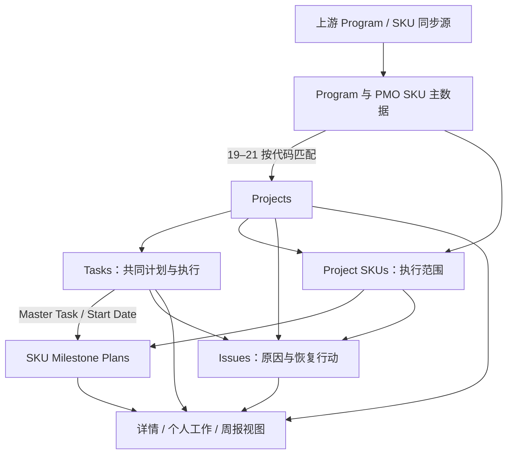
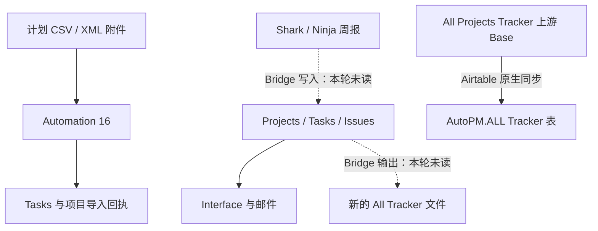

# AutoPM 目标—现状可追溯蓝图

版本：R2／2026-09-11。**用于审查和任务分派；不是发布批准或完整验收结论。** 检查区间2026-09-10 23:47至2026-09-11 00:22左右UTC。原报告保留；本轮增量见《AutoPM_Round2_Supplement_2026-09-11.md》。本蓝图独立描述已知结构和关键规则；外部文件不可访问造成的缺口明确保留。

## 1. 怎么读这份蓝图

目标依据来自提供的PRD正文和Function Capability Matrix。PRD文件名v3.5，但正文封面仍写v3.4，正文包含后续增补；此版本标签冲突保留，不自行选择。Matrix使用Function Matrix的D/E列目标与验收、F列Comment 8/31批注；M列历史判断不作为当前事实。已检查工作簿单元格批注对象，未发现独立批注；用户意见主要在F列。

证据层次：**配置存在**只证明规则或入口；**历史运行成功**只证明某次运行的记录；**真实结果核对**需要具体记录／原文件／输出相符。下表状态严格区分：已核对可用／部分实现／仅有配置待验证／未发现实现／无法检查。“未发现实现”限定已检查的Airtable范围，不否定未读的Bridge或专业系统。

P1/P2是审查建议，不是产品负责人最终优先级。所有Airtable修改和Power Apps建设均为候选，本轮未执行。每条Power Apps建议保留业务行为，而不照搬Airtable的表数量、脚本数量或页面数量。

## 2. 目标与当前架构

目标主线（PRD§3.1.1、§3.1.2、§4.1.1、§6.2.1）：Programme管理产品族；Project表示一次具体开案并对应一个Factory；SKU主数据与Project–SKU执行上下文分开；同SKU可参与多个Project。Project维护共同主计划，SKU只保留关键例外；移出与重新加入保留历史。Task要有责任、日期及证据，Issue从原因和行动走到结果、核验、关闭或重开。

当前运行方式：上游Airtable同步提供Program／SKU主数据；Projects保存项目身份、部门Owner、日期和执行摘要；19–21通过SKU文本匹配补链接；01从CPM生成任务，16从项目附件导入任务；任务完成公式与17存储进度并行；22建立Project SKUs及SKU Milestone Plans；Interface从这些关系和公式展示；08／8b生成邮件，09→Controls→09b处理提醒。Windows Data Bridge作为另一组外部输入输出处理边界存在于用户给定任务定义，本轮没有读取其实现，不能把它和16混称“导入”。

图中虚线是待核对的外部边界；ALL Tracker同步表与新生成的Tracker文件不是同一对象。没有证据把它们连接成同一条写回链。

## 3. 数据清单与维护责任

以下18表沿用R1用途盘点，字段ID／名称／类型／连接器配置本轮逐项比较无变化；记录数量是R1快照，不是本轮整库数据质量结论。

| 表名／表ID |记录／字段数 | 用途、核心身份与关系 | 主要维护入口／来源 |
|---|---|---|---|
| PMO Roadmap Programs `tbl4XSiYGfBDlq5QP` | 151／50 | Program_Name、Program_Code、ALE_ID；Projects ID (Link)；SKU Models／SKU Quantity Rollup；Program／Milestone Status、各地区渠道Launch日期、Lead | 上游同步（本轮已核对）；PMO Roadmap Programs展示；19–21匹配时依赖Program_Code。Lead及不少日期是文本 |
| PMO SKUs `tblmPaonKzQ3VITjR` | 9,924／20 | DEV_SKU、Auth_SKU、Master_Item、Program_Code、Market、SKU Status；关联Projects、PLM、Project SKUs及Plans | 上游同步（本轮已核对）；18链接PLM；20回填Project。Program_Code是文本，不是Program直接链接 |
| Projects `tbllvOHZdwfBRWGM0` | 2,997／119 | Project ID／name／type／status；Program、PMO SKU、Factory、各部门Owner；Task／Issue／Project SKU；基准与当前MP、周更新、导入回执、完成汇总 | New projects、两套Project Detail、Data；01／16写任务和回执，17写进度，19–22补关系 |
| Tasks `tblS2my1r93KothyZ` | 5,027／37 | Task ID文本、Task Name、Projects、Owners／Completed By、Start／Due、Depends On、CPM Source、Milestone、Deliverables；完成公式 | My daily work／任务详情／Data；01／16创建，02／03日期，04标识，07c及10–12协作者 |
| Issues `tblqYHGaZL6FoTZHV` | 398／25 | Issue ID文本、Issue Record、Projects、Related Tasks、Severity／Impact MP、Root Cause／Recovery Action／Owners／Target Date／Closed Date；链接执行SKU和Plans | Issues Overview、Task／Project详情、Data；05标识，07d协作者；无核验关闭自动化 |
| People `tblFnOJklkLYMesuk` | 1,695／44 | Person身份／Email／Department／Collaborator；多个部门Project反向链接，任务和问题负责人；项目／开放任务Rollup | People members／Data；06、14部分自动补全。当前用户身份解析依赖email／name匹配 |
| Factories `tblu6r1fuMN3W1pOY` | 110／10 | Factory ID／code／Full Name等工厂信息；反向Projects | Data主数据；Projects Factory链接；22复制工厂名到Project SKU空文本字段 |
| Task Template `tbljot9yt7YorTPyR` | 111／23 | Template ID、Task ID [STD]、任务、Gate、Department、Duration、Predecessor、L0–L4 | Data维护；当前01未读取，不能称当前运行模板来源 |
| CPM Analysis `tbl5Ok06J4tm0ytSJ` | 56／22 | Task ID [STD]、Depends On [STD]、Est. Duration、L0–L3与NPD列、Milestone、Department、ES／EF／LS／LF／Float | Data维护；01实际模板源；CPM Source链接Tasks。描述中的86条与快照56不同 |
| Schedule Import `tblrhLbSSytMZW5Xk` | 0／13 | Project链接、Import File／Status／Note／Count、Default Owner、Start／Due；3个失效Lookup | 旧导入页面（收尾已不在目录）／Data；两条13为OFF，当前16读Projects附件 |
| AutoPM Controls `tblZoSsLMKKJCZBEx` | 46／5 | Name、Email To、Email Subject、Email Body、Email Sent | 09写提醒队列；09b发邮件并置Sent；Data查看。没有独立审批状态或脚本所找WeeklyReportRecipients字段 |
| System Knowledge & Progress `tblYpSrdHi84mJ8rO` | 103／26 | Key、Title、Contents、Type／Topic／Status／Validity／Source／Verified Date；Task／Issue与Supersedes／Blocks自关联 | Data；记录含历史设计和大量TK建议，不能当已验证缺陷／已完成能力 |
| Issue Summary `tblE10VAfX0JZKAye` | 126／16 | Board ID、产品反馈、中英Issue、Priority／Status、Action Plan、Value、Document | Comment页面／Data。是AutoPM产品反馈，不是项目执行Issues |
| Volume `tblsINurCMSrGgEuQ` | 14／6 | 表名、容量／用量／剩余／时间；普通存储字段 | Data；未发现已核对的自动实时统计链路 |
| ALL Tracker `tbl6BKcL7qnsfsXrT` | 6,620／49 | PROJECT_TRACKER_SKU_KEY；SKU／项目／工厂／Owner／各里程碑与remarks；含同步字段，不概称全是文本 | 本轮确认来自All Projects Tracker Base的原生同步；与Bridge输出文件分开 |
| SKU Milestone Plans `tblljB3thwJpugFbq` | 4,564／14 | Unique Key、Project SKU、Master Task、SKU；Master Date Lookup、Override／Reason、Effective Date／Plan Source公式、Related Issues | Program路径Project详情／Data；22补建，人工例外；不应回写SKU主数据日期 |
| Project SKUs `tblEQB288fIZ1g0rM` | 2,971／11 | Unique Key、Project、SKU、SKU Status、Factory文本、Notes、Related Issues、Plans、Last Modified | Program路径Project详情／Data；22补建和填空工厂；同SKU不同Project独立执行 |
| SKU From PLM `tblXfBPujjcxQ9HFh` | 12,300／8 | SKU_ID、SKU Name、BaseModel、Supplier、Category、Creation；PMO SKU Link、Projects | PLM来源／Data；18尝试匹配PMO SKU，外部导入实现未检查 |

### 3.1 已核对的同步输入

| 目标 | 上游精确入口 | 配置／维护含义 | 尚未验证 |
|---|---|---|---|
| PMO Roadmap Programs | [上游表与视图](https://airtable.com/appyuYEyXI3Q03VK2/tblqmQMkbaavenBQD/viwR7KcvqqATSxhaD) | 自动定期同步；Edit source records＝Off；源删除或隐藏时删除本表对应记录 | 上游视图过滤、主数据审批、源变更审计和同步失败提示 |
| PMO SKUs | [上游表与视图](https://airtable.com/appyuYEyXI3Q03VK2/tblwpSE6IELNvKzxe/viwDQcvJv0LlkhVPi) | 同上；源Base主页名称PDPMO (Demo only)，不据名称推断内容真假 | DEV_SKU／Program_Code的权威性、别名与改码治理 |
| ALL Tracker | [上游表与视图](https://airtable.com/appuQi6xxc5EVhPdF/tblSw9eiGyI9IfHPK/viwKcK9bAe5vbOgpR) | 同上；上游Base为All Projects Tracker | 与Windows新Tracker输出的关系未核对 |

因此这些源字段的主要维护位置在上游；AutoPM中的本地关联、Rollup和执行字段另行维护。源视图隐藏／删除会形成关系变化事件，19–22的更新脚本并不能据此自动证明所有删除与失效分支正确。

### 3.2 关键规则与消费者

字段ID、原始公式全文和取证位置附在后文“精确配置附录”。下表描述实际业务含义。

| 事实／字段 | 来源与当前表达式／条件 | 结果粒度与维护者 | 页面／脚本／外部消费者 |
|---|---|---|---|
| Tasks.Owner Count／Completed Count | Owners／Completed By→People.Person Name；分别COUNTA(values)，无条件 | 每Task的非空名字数量；由关联与People名字派生，不核对成员一致性 | Task Completion、% Complete、完成标志、项目汇总；个人工作和详情 |
| Tasks.Task Completion | OwnerCount=0先报缺Owner；CompletedCount≥OwnerCount报Complete；再检查Start、Due、逾期、进行中、未开始 | 每Task、自动公式；完成判断不要求交付证据 | My daily work、详情、邮件及项目Open Task旧汇总 |
| Tasks.% Complete／Is Completed | MIN(ROUND(CompletedCount/OwnerCount×100,0),100)，无Owner为0；%＝100则Is Completed=1 | 每Task，百分数单位0–100；与17逻辑不同 | Projects.Completed Task Count、Completion % |
| Projects.Total Task Count (Auto) | Tasks→Task Name，SUM(1)，无条件 | 每Project恒定表达式，三个样本均1 | 旧页面／脚本若引用即受影响；完整消费者需在修改前补查询 |
| Projects.Total Task Count (Rollup) | Tasks→Task Count Helper(恒为1)，SUM(values) | 每Project当前关联Task数 | Completion % (Formula) |
| Projects.Completed Task Count | Tasks→Is Completed，SUM(values) | 每Project完成Task数 | Completion % |
| Projects.Open Task Count | Tasks→Task Completion，COUNTALL；条件Complete且Priority High | 实际为已完成High Task数，与字段名不符 | 旧详情／Overview列表；不能用作未完成任务量 |
| Projects.Completion % | 总数0返回0，否则ROUND(完成数/总数×100,1) | 每Project，数值0–100；格式精度也要核对 | 对账基准候选，不能未经业务决定替换所有进度 |
| Project Progress Bar (Auto) | 17只在Completed By更新时，按Completed By非空的Task比例存储 | 每Project，存储0–1；不是Formula，名称Auto不等于只读 | 两详情、Program项目列表、部分输出；外部Bridge依赖未读 |
| Project Status／Current process／Current progress | 独立存储字段，不由17计算；Current process与Current progress不是同名同义保证 | 每Project；界面／人工或外部处理责任须确认 | Portfolio、Weekly、Project Detail；不能由MP差自动推断状态错误 |
| Planned MP／MP Start／MP Gap | 两个Date；Gap比较当前MP Start与Planned MP，输出Pull in／On plan／Delay | 每Project；01／02／03特定任务名也会写Planned MP，Baseline可变性待决定 | 日期差、详情、08／8b；Bridge映射未读 |
| MP Time Window Auto／Select | 当前MP相对TODAY：过去／不足7天／不足14天／不足30天／Later／无日期；15每15分钟仅差异复制到Select | 每Project滚动时间窗，Current Week不是严格自然周 | Weekly Summary动态筛选使用Select；MP Month图却使用Planned MP Date |
| Program.Project quantity | Count Projects ID (Link)，无过滤 | 每Program链接Project数，不排除Cancelled | Program画廊／详情 |
| Projects.SKU quantity | Count PMO SKU (Link)，无过滤 | 每Project主数据链接数，不是Project SKUs表行数 | Program.SKU Quantity |
| Program.SKU Quantity／SKU Models | SUM(Project.SKU quantity)；ARRAYUNIQUE(Project.SKU List Lookup→DEV_SKU) | SKU次数与去重文本并列，粒度不同；不证明唯一SKU数相等 | Program画廊／详情 |
| Projects.Open Issue Count | Issues→Status，COUNTALL，Status≠Closed | 每Project开放Issue链接数；孤立Issue不被纳入 | 两详情、报告、8b等 |
| Projects.Open Critical Issue | 同上＋Severity∈{High,Critical} | 每Project开放High/Critical Issue数量 | Review再对“值>0的Projects”计数，得到受影响项目数 |
| Key issue／Root cause／Recovery／status／owner | 沿Projects.Issues分别ARRAYUNIQUE；唯一筛选Impact MP勾选，无Closed过滤／排序 | 每Project多值文本，不保持一行Issue的对应关系 | 两类旧详情的关键问题摘要；建议改为关联Issue明细组合 |
| Master Date | Plans.Master Task→Tasks.Start Date Lookup | 每ProjectSKU×MasterTask；不取Due | 计划列表及Effective Date；Master Task更新传递靠Lookup，无需22重跑 |
| Override Date／Effective Date／Plan Source | Override非空优先，否则Master；Independent／Inherited／Unscheduled | 每执行计划；人工例外；未检查审批／冲突复核实现 | Program路线SKU计划；现有列表缺Effective Date |
| Relationship Check | 仅检查Project SKU、Master Task链接非空，返回BOTH_EMPTY／NO_PROJECT_SKU／NO_MASTER_TASK／POPULATED | 每Plan的完整性提示，不是关系一致性校验 | Data维护；不能作为“不会串项目”的验收依据 |
| Project SKU／Plan唯一键 | 22写Project record ID＋SKU record ID；Plan用ProjectSKU record ID＋MasterTask record ID | 执行上下文；普通文本键，不是数据库唯一性约束 | 22去重；后续替换平台须保留语义，不能使用可变任务名当唯一键 |

Tasks另有原生日期配置：Enabled，Start／Due／Duration for Start Date，Duration精度Days，Predecessor未选，Flexible，Omit weekends and holidays关闭。02／03读取的是另一个Est. Duration (days)字段。开始／结束／工期的实际自动改写和原始数值单位转换未在本轮写入验证；不得直接把连接器的number类型当普通天数。

### 3.3 当前样本复核

| Project／记录ID | 关联Task／完成数／公式比例 | 存储进度 | 其他当前事实 | 证据范围 |
|---|---|---|---|---|
| NXA0010／recJ1j632jSffpBrR | 7／4／57.1 | 66.7% | 六SKU执行项；MP当前10/15、基准9/1；开放Issue2；9/3周更新有内容 | 本轮连接器复核上述汇总与周更新；Program路线实际打开，6SKU上下文沿用R1核对 |
| NXA0245／recjEAsw00jRjy1R8 | 6／3／50 | 60% | 9/3周更新“Re-submit ECN approval…”；R1发现SKU文本精确主数据未匹配 | 本轮核对数量／日期／周更新；SKU未匹配沿用R1样本，未重搜全库 |
| NXA0229／recadFhuJaPBQK5HZ | 6／5／83.3 | 83.3% | 当前MP10/30；周更新说明MCU短缺、PCBA ETA延后 | 本轮数据复核；旧详情关联抽查沿用R1 |
| NXA0176／recA67WYsCHrBZpIb | 本轮未重算进度 | 页面100% | 列表详情默认样本；关键问题摘要含Closed；SharePoint链接移除 | 本轮实际打开，用于页面绑定及外部链接检查，不扩展为全库结论 |
| SXA0061／recu4kMoP2UCtyKem | 共用主Task recJEadU64XmNW5wi | — | R1：FW575PK1覆盖9/6，另两SKU继承8/22 | Formula与字段配置本轮无差异；具体覆盖记录未重新写入验证 |
| XSXA80455／recSCLI9hzWi2kLXU | 当前9条Tasks；历史日志解析／拟创建／回执16 | — | 同记录有CSV附件和缺完成字段警告 | 本轮实际页面、当前记录与历史日志相互定位，详见链路C1 |

## 4. Automation 和非Automation处理清单

索引A01–A32沿用原报告，不等于自动化名称中的业务编号。本轮重读全文并匹配的为A01、A02、A03、A10、A11、A12、A14、A15、A16、A21、A23、A25–A32。它们当前脚本与R1一致；**并不证明8月／9月历史运行使用同一脚本**。A23、A26、A31、A32触发字段另经本轮配置页确认；其余触发配置以下注明为R1基线，本轮目录描述与输入面板可见内容用于交叉检查。

| 索引／完整名称 |状态／触发与输入 | 读取→写入／关键步骤 | 可见历史与审查结论 |
|---|---|---|---|
| A01 AutoPM-01 Project Task Generator | ON；Projects满足Tasks Generated未勾、Change Types和Start非空；projectId/changeTypes/startDate | Projects＋CPM Analysis＋People→Tasks／依赖／CPM字段／Generated；有特定任务名的Planned MP回写 | 8/24成功，早期失败；任意已存任务就跳过；L4降级L3；循环／缺依赖的处理及Owner旧字段风险；“成功生成完整业务计划”未核对 |
| A02 AutoPM-02 Task Date Cascade - Start Date | ON；Tasks Start Date更新；只有taskId输入 | Tasks依赖／Start／Due／Est.Duration→本任务与后继日期；特定任务名→Projects Planned MP | 9/7 19:45成功但unknown mode跳过、更新0条，已证实空执行 |
| A03 AutoPM-03 Task Date Cascade - Due Date | ON；Tasks Due Date更新；只有taskId输入 | 同A02，需mode=due | 9/7有成功；当前同样缺mode；未展开这一条的具体输出，不把A02日志直接充当A03日志 |
| A04 AutoPM-04 Task ID Auto from Project | ON；Task ID空且Project非空；taskId | 全Projects／Tasks→按Project最大序号+1写Task ID；有UNKNOWN回退 | 9/7成功；非原子序号存在并发风险，未查得实际重复证明 |
| A05 AutoPM-05 Issue ID Auto + Project Auto-link from Task | ON；Issues.Project更新；issueId | Projects／Issues→Issue ID | 9/8成功；代码没有名称所说的Related Task→Project自动关联；创建即带Project的覆盖待测 |
| A06 AutoPM-06: People Auto-Department & Email Fill | ON；People创建；recordId | People姓名／关联人员→Department／Email等 | 有成功；筛选调用与取首条记录的来源需核验，不能据代码形式直接宣布误写；email猜测规则有边界 |
| A07 AutoPM-07 Owner Sync | OFF；Project多字段更新，含2个Invalid字段 | 旧Project People／Owner同步逻辑 | 8/9旧失败；当前停用，不按正在执行报告 |
| A08 AutoPM-07d: 新 Issue 创建时自动设置 Project NPI 为 Collaborator | ON；Issues创建；issueId | Issue.Project→Project.NPI→People email→active collaborators；追加Issue.Collaborators | 9/5成功；只覆盖创建，不覆盖之后换项目／换NPI |
| A09 AutoPM-07c: 新 Task 创建时自动设置 NPI 为 Collaborator | ON；Tasks创建；taskId | Task.Project→NPI→People email→collaborators；追加Task.Collaborators | 9/7成功；同样只覆盖创建，可能与10覆盖冲突 |
| A10 AutoPM-08 Weekly Report | ON；周四17:00 PDT；无项目按钮输入 | Projects／Tasks／Issues／People／Controls→HTML；原生Send email | 9/3成功；当前缺Current Gate和配置字段；原生To固定Sun Sun、主题固定，Message=emailBody。注释按钮触发与实际定时不同 |
| A11 AutoPM-8b Project Weekly Email | ON；Projects.Generate Weekly Email勾选；项目recordId | 读取本项目与Task／Issue／People→emailTo／emailSubject／emailBody→原生Send→触发记录Generate Weekly Email=false | 8/29成功、旧失败；三个邮件绑定均经UI核对。未确认实际送达；正文含旧详情链接，目录变化后须回归 |
| A12 AutoPM-09 Daily Task Reminder | ON；每日06:30 PDT；代码注释08:00 | Tasks／People／2订阅者→按Owner／collaborator和日期筛选→Controls逐条创建；按名称＋日期去重 | 9/1–9/10可见失败；9/10在已有一人queued日志后Email Body写入失败；支持部分入队判断，不代表全部没发 |
| A13 AutoPM-09b Automation | ON；Controls Email To非空、Sent未勾、Name含DailyReminder | 原生Send email→原生更新Email Sent=true | 9/10成功；真实收件／重复发送未测试；没有独立批准字段 |
| A14 AutoPM-10 Collaborator Sync on Owner Change | ON；Tasks Owners更新；taskId | People所有NPI成员＋Task Owner→覆盖Collaborators；部分错误被catch | 8/24成功；项目粒度规则与07c不一致；覆盖后实际成员范围未全库验 |
| A15 AutoPM-11 Task Collaborator from Project Creator | ON；Tasks创建；taskId | Project.Created by→追加Task.Collaborators | 9/7历史成功；当前Projects缺Created by，当前兼容性有问题；未重新触发 |
| A16 AutoPM-12 Task Collaborator from task modificator | ON；Tasks 8个字段更新；taskId | Task.Last Modified By→追加Collaborators | 9/8 23:57报No field Last Modified By，Task `recX7olbeCXjCjeH9`；当前字段缺失与日志吻合 |
| A17 AutoPM-13 Schedule Import | OFF；Schedule Import文件非空、状态空 | 脚本实际按Projects内联导入取recordId，读CSV／XML→Tasks／回执 | 8/5失败；触发表与代码预期不一致，当前停用 |
| A18 AutoPM-13 Schedule Import copy | OFF；Schedule Import条件触发 | CSV／TXT→按Project ID匹配或创建Project；按Project＋Task名称去重；补Owner／Completed By；新建仍用旧完成字段 | 没有可见历史；不能作为当前主导入；创建Project行为需谨慎审查后再启用 |
| A19 AutoPM-14: Auto-fill Collaborator from Person Name | ON；People.Person Name更新 | 姓名→Email，已有email跳过 | 8/18成功；当前代码不设置Collaborator，名称与实际功能不一致 |
| A20 15-Sync MP Time Window | ON；每15分钟 | Projects.MP Time Window Formula→Select，仅差异更新，50条批量 | 9/10成功；注释每日与实际每15分钟不同；是Formula复制，不是健康判断 |
| A21 16-AutoPM v9.0 — Project Detail Inline Task Importer | ON；Interface按钮；Projects recordId | Projects第一个Import File→CSV／XML解析→Tasks、Owner／依赖／里程碑→Import回执；代码标v10.5 | 8/19成功；旧完成字段、已有任务仅跳过、批次失败可被吞；外部Converter未读，Excel不直接支持 |
| A22 临时测试用 | ON；一次性9/7 01:30时间已过 | 工厂名称映射→Projects.Factory批量维护脚本 | 9/7失败；不应称它持续定时运行；是否保留为工具需任务责任人决定 |
| A23 17-project progress | ON；Tasks.Completed By更新 | 扫Tasks，以Completed By非空计完成→Projects.Project Progress Bar | 9/8成功；与人数完成公式不同；Task增删／换Project／Owner变化不在触发内 |
| A24 18-PLM → PMO Exact Match | ON；SKU From PLM创建 | 原生Find PMO SKUs.DEV_SKU＝Base record URL；命中后更新PLM.PMO SKU Link | 8/31有成功；当前匹配字段不正确。旧测试有重复record token错误，是不同证据，不混为当前条件 |
| A25 AutoPM-19 a Project →Match Project to SKU & Program created | ON；Project创建 | 分割大写SKU文本→PMO SKUs.DEV_SKU索引→Program_Code索引→Project SKU／Program链接及Note | 无可见历史；重复DEV_SKU可能返回多条；多个Program／无匹配分支需回归 |
| A26 AutoPM-19 b Project →Match Project to SKU & Program updated | ON；实际监听Project Type (Manual) | 同A25；无匹配不清旧链接 | 9/6成功、9/5旧失败；与PRD所谓SKU文本触发不一致 |
| A27 AutoPM-20 a : PMO SKU Backfill to Projects Created | ON；PMO SKU创建 | 扫Projects／SKU／Program→匹配并补Project关联 | 9/10成功；全表扫描；旧SKU名称关系不主动对账，可能触发22 |
| A28 AutoPM-20 b: PMO SKU Backfill to Projects updated | ON；PMO SKU DEV_SKU／Program_Code更新，配置含01 Basic infor视图 | 同A27 | 9/8成功；未证明事件合并／并发及改名清旧关系正确 |
| A29 AutoPM-21: Program Backfill to Projects Created | ON；Program创建 | Program_Code与SKU代码→回填Project Program等关联 | 无可见历史；共用名称索引及空值处理风险 |
| A30 AutoPM-21: Program Backfill to Projects updated | ON；Program_Code更新，配置含01 PMO program视图 | 同A29 | 9/8两次成功；改名不等于旧关联已安全对账 |
| A31 22-AutoPM — Create Missing Project SKU Plans | ON；Project Status／Program／PMO SKU／Factory更新；sourceType Project＋recordId | Project＋PMO SKUs＋Tasks→Project SKUs缺失补建→每Milestone唯一Master Task对应Plans；不写Override | 9/10成功；Project SKU单次上限100；逐Task查询、歧义跳过；Factory只填空；无移除失效处理 |
| A32 22-AutoPM — New Milestone Task Creates SKU Plans | ON；实际Task Milestone／Project更新；sourceType Task＋recordId | 与A31同代码，先由Task定位Project | 9/8 01:44额度失败；名称说New Task但实际为record updated；创建即带值是否自动执行须测试 |

同代码的创建／更新分支是不同事件入口，保留其职责；不能因为文本相同直接建议删除。静态代码显示的未清旧关系、逐Task查询、非原子序号、覆盖协作者等属于需要验证的风险；仅已有失败日志或具体记录支持的部分标为已确认故障。

非Automation处理：Program／SKU／ALL Tracker原生同步；Tasks原生日期依赖；Formula／Lookup／Rollup派生；New projects与详情的人工作业；Windows Bridge／Converter及专业系统链接。它们同样属于运行架构，不能从32条自动化列表推断系统全部能力。

## 5. 页面、组件与绑定

### 5.1 当前目录（全部实际重开）

| 页面／ID | 当前目录 | 来源 | 主要绑定、操作 | 实现依赖 |
|---|---|---|---|---|
| [My daily work](https://airtable.com/appOMWiK4CTOH7iQu/pag4NK1doMNmaiPgZ) `pag4NK1doMNmaiPgZ` | 导航 | Tasks／Issues | Collaborators当前用户；Task／Issue详情；新增Issue入口 | 07c/d、10–12影响可见集合，Task公式影响卡片 |
| [Projects list](https://airtable.com/appOMWiK4CTOH7iQu/pagwdTu2hq5vGcxcC) `pagwdTu2hq5vGcxcC` | 导航 | Projects | 无基础过滤；Brand分组且默认折叠；可搜索／筛选／排序；行编辑和增删开启；详情11 | 01／16／17／19–22及派生字段 |
| [Weekly Summary](https://airtable.com/appOMWiK4CTOH7iQu/pagp6Y9VN4zafCg9f) `pagp6Y9VN4zafCg9f` | 导航 | Projects | 4卡片、5图表、项目列表；状态／类型／国家／类别／Factory／MP时间窗／Brand筛选 | 15复制MP时间窗；Project状态／汇总／进度来源分别维护 |
| [Issues Overview](https://airtable.com/appOMWiK4CTOH7iQu/pagbjPxswa0000cfb) `pagbjPxswa0000cfb` | 导航 | Issues | 状态／Severity／Impact MP／Category；Issue详情与操作入口 | 05／07d；没有已核对的Result→Verification闭环 |
| [People members](https://airtable.com/appOMWiK4CTOH7iQu/pagBfxIAbHLBCDsij) `pagBfxIAbHLBCDsij` | 导航 | People | 人员目录、部门筛选及统计；不是项目执行Owner的独立事实来源 | 06／14及各Owner链接 |
| [New projects](https://airtable.com/appOMWiK4CTOH7iQu/pag69K6q8smBxPw7y) `pag69K6q8smBxPw7y` | 导航 | Projects表单 | 名称／SKU／类型／Brand／类别／Factory及NPI／PMO显必填；Project ID无必填星号；Change Types | 提交未测；01、19a等创建／条件事件 |
| [Comment](https://airtable.com/appOMWiK4CTOH7iQu/pag4qPdn3LjAlFqdz) `pag4qPdn3LjAlFqdz` | 导航 | Issue Summary | 产品反馈嵌入视图，126／Closed29可见；非项目Issue表 | 反馈行动与实际交付状态不能自动等同 |
| [PMO Roadmap Programs](https://airtable.com/appOMWiK4CTOH7iQu/pagWxoZ87HOM12Lmh) `pagWxoZ87HOM12Lmh` | 导航 | PMO Roadmap Programs | 画廊；Shark／Ninja／All tabs；Program→Projects→详情 | 源同步、19–21关系和Program汇总 |
| [Project detail (upgrade)](https://airtable.com/appOMWiK4CTOH7iQu/pagj725C7XdvnUppo) `pagj725C7XdvnUppo` | 隐藏可达 | Projects记录选择器及关联对象 | 仍含Field deleted，旧邮件08引用；默认选到999999999999内部项目 | 08旧链接依赖应保留检查 |
| [Weekly Project Review](https://airtable.com/appOMWiK4CTOH7iQu/pagHk4Vzw8rStr7K7) `pagHk4Vzw8rStr7K7` | 隐藏可达 | Projects／Tasks／Issues | 统计与问题列表；3个Field deleted可见 | 旧字段引用；不能扩展到Weekly Summary |
| [Weekly Overview](https://airtable.com/appOMWiK4CTOH7iQu/pagh9IRt1U9sNUAYQ) `pagh9IRt1U9sNUAYQ` | 隐藏可达 | 主要Projects；里程碑组未配置卡片 | 错误Overdue统计及未完成里程碑区；Active定义与别页不同 | Project状态／链接与旧Open Task Count |
| [Project report](https://airtable.com/appOMWiK4CTOH7iQu/pagh9nWCD3zQcni8v) `pagh9nWCD3zQcni8v` | 隐藏可达 | Projects／Issues | 7统计卡片已核条件；Project状态与Issue分类列表 | 分类is exactly；多分类是否应纳入需决定 |
| [Projects](https://airtable.com/appOMWiK4CTOH7iQu/pagQdUPokoP0r1gsr) `pagQdUPokoP0r1gsr` | 隐藏可达 | Projects | 基础项目名称、SKU、描述列表；搜索筛选可见 | 本轮重开；未逐项重查所有字段编辑权限 |

历史页面保留在R1附录C.2，不自动进入当前修复范围；例外：8b脚本的`pagsanXHyAY3PZfj7`已不在目录、实测不可达，仍是当前输出依赖。

### 5.2 两套Project Detail的具体绑定

| 页面／组件 | 来源、当前记录绑定及基础筛选 | 用户筛选／排序／分组 | 显示与动作 | 版本 |
|---|---|---|---|---|
| Projects list→Projects Detail 11 `pagRChzyUg9wthYhB` | 选择的Projects记录；本轮编辑器样本NXA0176 | 由列表搜索与Brand分组选入，返回Projects list | 项目身份、Owner、存储进度、MP、链接、导入回执；Current process／Update This Week／Project SKUs在隐藏字段清单 | Last published Aug29；No changes |
| 同详情Critical issue | Objective Detail→Issues (system manage)；All records表示当前链接集合；无额外Severity／Status条件 | 排序None、分组None；未配置当前用户限定 | 问题、根因、Impact、Severity、Recovery Owner／Action、Record／Closed Date、Category；Target Date隐藏；可编辑和增删开，Issue form下钻开 | 同上 |
| 同详情All task | Objective Detail→Tasks (system manage)；All records，同项目链接集合 | Task Completion A→Z分组；Due Earliest→Latest；Owner动态筛选入口可见 | Task Name／Start／Due／Owners／%／Completion／Completed By／Phase／Milestone／交付链接等；编辑／增删／Tasks Detail下钻开 | 同上 |
| Program Detail `pagabNDVGYw7XklpA`→Projects | 当前Program.Projects ID (Link)，无基础过滤；2层列表 | 无分组，1个排序存在；具体排序字段本轮未展开；支持搜索／筛选／排序 | Project及SKU主数据层；不允许inline编辑／增删；目标Objective Detail；PMO SKU下钻开关未开 | Last published Sep7；No changes |
| Program→Project `pag13iJZweBRoXJTB`→Master Milestone | 当前Projects.Tasks (system manage)，字段层无筛选；展示List／Timeline | 字段层用户搜索／筛选／排序关；图形内部更细条件未全部展开 | 主任务时间线；可进任务详情；Go to interface入口 | Last published Sep10；No changes |
| 同Project→Project SKUs status | 当前Projects.Project SKUs关联；字段层Filter None；以关系限定当前项目 | 用户Filter／Sort开，Search关；List／Grid／Roadmap可切换；未逐个图形确认排序 | SKU／执行状态／Factory文本／Project／Notes／Related Issues；下层Master Task／Master Date／Override／Source／Reason／Related Issues；未显示Effective Date；link/unlink关 | 同上；NXA0010实际打开 |

Project详情与Program详情中的“All records”不能脱离来源关系解读。当前绑定限定正确，不代表底层手工关联永远正确；Relationship Check也没有验证Task与ProjectSKU归属一致。全量嵌套详情元数据含14页，详见证据包；本轮深入上述关键链，其余嵌套页没有逐组件展开，保留未检查标记。

### 5.3 卡片的实际筛选口径

卡片默认没有“当前Project”绑定，按所在表／组的集合统计。Count卡片不涉及行排序／分组；下钻记录界面的排序及用户权限效果没有逐一验证。下表为卡片层条件，还必须叠加组和用户筛选。

| 证据ID／页面／组件 | 数据源／粒度 | 实际卡片条件 | 操作 | 核对时间UTC | 入口 |
|---|---|---|---|---|---|
| E-C01 My daily work／Overdue Tasks | Tasks，Count行数 | 全部条件（AND）：generic "1: Task Completion (Auto) is \"🔴 Overdue\"" | 可点开底层记录 | 2026-09-10T23:52:59.022Z | [组件配置](https://airtable.com/appOMWiK4CTOH7iQu/pag4NK1doMNmaiPgZ/edit?u0qmV=b%3AWzAsWyJRbTF3RyIsNixbeyJzcGVjaWFsVmFsdWUiOiJkeW5hbWljQ3VycmVudFVzZXJJZCJ9XSwib2xoOW0iXV0&62EgT=b%3AWzAsWyIzWGkyWSIsNixbeyJzcGVjaWFsVmFsdWUiOiJkeW5hbWljQ3VycmVudFVzZXJJZCJ9XSwiYUFtZjYiXV0) |
| E-C02 My daily work／Task this week | Tasks，Count行数 | 全部条件（AND）：generic "1: Start Date (Manual) is on or before one week from now"；generic "and 2: Task Completion (Auto) is not \"🟢 Complete\"" | 可点开底层记录 | 2026-09-10T23:53:01.252Z | [组件配置](https://airtable.com/appOMWiK4CTOH7iQu/pag4NK1doMNmaiPgZ/edit?u0qmV=b%3AWzAsWyJRbTF3RyIsNixbeyJzcGVjaWFsVmFsdWUiOiJkeW5hbWljQ3VycmVudFVzZXJJZCJ9XSwib2xoOW0iXV0&62EgT=b%3AWzAsWyIzWGkyWSIsNixbeyJzcGVjaWFsVmFsdWUiOiJkeW5hbWljQ3VycmVudFVzZXJJZCJ9XSwiYUFtZjYiXV0) |
| E-C03 My daily work／All task | Tasks，Count行数 | 全部条件（AND）：generic "1: Task Completion (Auto) is not \"🟢 Complete\"" | 可点开底层记录 | 2026-09-10T23:53:03.339Z | [组件配置](https://airtable.com/appOMWiK4CTOH7iQu/pag4NK1doMNmaiPgZ/edit?u0qmV=b%3AWzAsWyJRbTF3RyIsNixbeyJzcGVjaWFsVmFsdWUiOiJkeW5hbWljQ3VycmVudFVzZXJJZCJ9XSwib2xoOW0iXV0&62EgT=b%3AWzAsWyIzWGkyWSIsNixbeyJzcGVjaWFsVmFsdWUiOiJkeW5hbWljQ3VycmVudFVzZXJJZCJ9XSwiYUFtZjYiXV0) |
| E-C04 My daily work／Completed Task | Tasks，Count行数 | 全部条件（AND）：generic "1: Task Completion (Auto) is \"🟢 Complete\""；generic "and 2: Due Date (Manual) is before one month from now" | 可点开底层记录 | 2026-09-10T23:53:05.296Z | [组件配置](https://airtable.com/appOMWiK4CTOH7iQu/pag4NK1doMNmaiPgZ/edit?u0qmV=b%3AWzAsWyJRbTF3RyIsNixbeyJzcGVjaWFsVmFsdWUiOiJkeW5hbWljQ3VycmVudFVzZXJJZCJ9XSwib2xoOW0iXV0&62EgT=b%3AWzAsWyIzWGkyWSIsNixbeyJzcGVjaWFsVmFsdWUiOiJkeW5hbWljQ3VycmVudFVzZXJJZCJ9XSwiYUFtZjYiXV0) |
| E-C05 My daily work／Overdue Issues | Issues，Count行数 | 全部条件（AND）：generic "1: Closed Date (Manual) is yesterday"；generic "and 2: Issue Status (Manual) is not Closed" | 可点开底层记录 | 2026-09-10T23:53:18.357Z | [组件配置](https://airtable.com/appOMWiK4CTOH7iQu/pag4NK1doMNmaiPgZ/edit?u0qmV=b%3AWzAsWyJRbTF3RyIsNixbeyJzcGVjaWFsVmFsdWUiOiJkeW5hbWljQ3VycmVudFVzZXJJZCJ9XSwib2xoOW0iXV0&62EgT=b%3AWzAsWyIzWGkyWSIsNixbeyJzcGVjaWFsVmFsdWUiOiJkeW5hbWljQ3VycmVudFVzZXJJZCJ9XSwiYUFtZjYiXV0) |
| E-C06 My daily work／Issue due this week | Issues，Count行数 | 全部条件（AND）：generic "1: Issue Status (Manual) is not Closed"；generic "and 2: Closed Date (Manual) is before one week from now" | 可点开底层记录 | 2026-09-10T23:53:20.372Z | [组件配置](https://airtable.com/appOMWiK4CTOH7iQu/pag4NK1doMNmaiPgZ/edit?u0qmV=b%3AWzAsWyJRbTF3RyIsNixbeyJzcGVjaWFsVmFsdWUiOiJkeW5hbWljQ3VycmVudFVzZXJJZCJ9XSwib2xoOW0iXV0&62EgT=b%3AWzAsWyIzWGkyWSIsNixbeyJzcGVjaWFsVmFsdWUiOiJkeW5hbWljQ3VycmVudFVzZXJJZCJ9XSwiYUFtZjYiXV0) |
| E-C07 My daily work／All issue | Issues，Count行数 | 全部条件（AND）：generic "1: Issue Status (Manual) is not Closed" | 可点开底层记录 | 2026-09-10T23:53:22.089Z | [组件配置](https://airtable.com/appOMWiK4CTOH7iQu/pag4NK1doMNmaiPgZ/edit?u0qmV=b%3AWzAsWyJRbTF3RyIsNixbeyJzcGVjaWFsVmFsdWUiOiJkeW5hbWljQ3VycmVudFVzZXJJZCJ9XSwib2xoOW0iXV0&62EgT=b%3AWzAsWyIzWGkyWSIsNixbeyJzcGVjaWFsVmFsdWUiOiJkeW5hbWljQ3VycmVudFVzZXJJZCJ9XSwiYUFtZjYiXV0) |
| E-C08 My daily work／Completed Issue | Issues，Count行数 | 全部条件（AND）：generic "1: Issue Status (Manual) is Closed"；generic "and 2: Closed Date (Manual) is before one month from now" | 可点开底层记录 | 2026-09-10T23:53:24.172Z | [组件配置](https://airtable.com/appOMWiK4CTOH7iQu/pag4NK1doMNmaiPgZ/edit?u0qmV=b%3AWzAsWyJRbTF3RyIsNixbeyJzcGVjaWFsVmFsdWUiOiJkeW5hbWljQ3VycmVudFVzZXJJZCJ9XSwib2xoOW0iXV0&62EgT=b%3AWzAsWyIzWGkyWSIsNixbeyJzcGVjaWFsVmFsdWUiOiJkeW5hbWljQ3VycmVudFVzZXJJZCJ9XSwiYUFtZjYiXV0) |
| E-C09 Weekly Summary／Active Projects in Selected Window | Projects，Count行数 | 无卡片条件 | 下钻开关未确认 | 2026-09-10T23:54:53.451Z | [组件配置](https://airtable.com/appOMWiK4CTOH7iQu/pagp6Y9VN4zafCg9f/edit) |
| E-C10 Weekly Summary／On Track Projects | Projects，Count行数 | 全部条件（AND）：generic "1: Project Status (Manual) is On Track" | 下钻开关未确认 | 2026-09-10T23:54:54.701Z | [组件配置](https://airtable.com/appOMWiK4CTOH7iQu/pagp6Y9VN4zafCg9f/edit) |
| E-C11 Weekly Summary／At Risk Projects | Projects，Count行数 | 全部条件（AND）：generic "1: Project Status (Manual) is At Risk" | 下钻开关未确认 | 2026-09-10T23:54:56.034Z | [组件配置](https://airtable.com/appOMWiK4CTOH7iQu/pagp6Y9VN4zafCg9f/edit) |
| E-C12 Weekly Summary／Delayed Projects | Projects，Count行数 | 全部条件（AND）：generic "1: Project Status (Manual) is Delayed" | 下钻开关未确认 | 2026-09-10T23:54:57.318Z | [组件配置](https://airtable.com/appOMWiK4CTOH7iQu/pagp6Y9VN4zafCg9f/edit) |
| E-C13 Weekly Project Review／Total Active Projects | Projects，Count行数 | 全部条件（AND）：generic "1: Project Status (Manual) is not Cancelled" | 下钻开关未确认 | 2026-09-10T23:55:24.431Z | [组件配置](https://airtable.com/appOMWiK4CTOH7iQu/pagHk4Vzw8rStr7K7/edit) |
| E-C14 Weekly Project Review／Open Critical Issues | Projects，Count行数 | 全部条件（AND）：generic "1: Open Critical Issue (Auto) > 0" | 下钻开关未确认 | 2026-09-10T23:55:26.194Z | [组件配置](https://airtable.com/appOMWiK4CTOH7iQu/pagHk4Vzw8rStr7K7/edit) |
| E-C15 Weekly Project Review／Open issues | Issues，Count行数 | 全部条件（AND）：generic "1: Issue Status (Manual) is not Closed" | 下钻开关未确认 | 2026-09-10T23:55:50.595Z | [组件配置](https://airtable.com/appOMWiK4CTOH7iQu/pagHk4Vzw8rStr7K7/edit) |
| E-C16 Weekly Overview／Overdue Tasks (Instructions) | Projects，Count行数 | 无卡片条件 | 下钻开关未确认 | 2026-09-11T00:01:06.792Z | [组件配置](https://airtable.com/appOMWiK4CTOH7iQu/pagh9IRt1U9sNUAYQ/edit) |
| E-C17 Weekly Overview／Projects with Open Issues | Projects，Count行数 | 全部条件（AND）：generic "1: Issues (system manage) is not empty" | 下钻开关未确认 | 2026-09-11T00:01:07.834Z | [组件配置](https://airtable.com/appOMWiK4CTOH7iQu/pagh9IRt1U9sNUAYQ/edit) |
| E-C18 Weekly Overview／Active Projects | Projects，Count行数 | 全部条件（AND）：generic "1: Project Status (Manual) is any of On Track, At Risk, Delayed" | 下钻开关未确认 | 2026-09-11T00:01:08.885Z | [组件配置](https://airtable.com/appOMWiK4CTOH7iQu/pagh9IRt1U9sNUAYQ/edit) |
| E-C19 Project report／Total Projects | Projects，Count行数 | 无卡片条件 | 下钻开关未确认 | 2026-09-11T00:02:21.812Z | [组件配置](https://airtable.com/appOMWiK4CTOH7iQu/pagh9nWCD3zQcni8v/edit) |
| E-C20 Project report／On track | Projects，Count行数 | 全部条件（AND）：generic "1: Project Status (Manual) is On Track" | 下钻开关未确认 | 2026-09-11T00:02:23.887Z | [组件配置](https://airtable.com/appOMWiK4CTOH7iQu/pagh9nWCD3zQcni8v/edit) |
| E-C21 Project report／At risk | Projects，Count行数 | 全部条件（AND）：generic "1: Project Status (Manual) is At Risk" | 下钻开关未确认 | 2026-09-11T00:02:25.502Z | [组件配置](https://airtable.com/appOMWiK4CTOH7iQu/pagh9nWCD3zQcni8v/edit) |
| E-C22 Project report／Delay | Projects，Count行数 | 全部条件（AND）：generic "1: Project Status (Manual) is Delayed" | 下钻开关未确认 | 2026-09-11T00:02:27.185Z | [组件配置](https://airtable.com/appOMWiK4CTOH7iQu/pagh9nWCD3zQcni8v/edit) |
| E-C23 Project report／Workflow issue | Issues，Count行数 | 全部条件（AND）：generic "1: Category (Manual) is exactly Workflow issue" | 可点开底层记录 | 2026-09-11T00:02:28.768Z | [组件配置](https://airtable.com/appOMWiK4CTOH7iQu/pagh9nWCD3zQcni8v/edit) |
| E-C24 Project report／Resource issue | Issues，Count行数 | 全部条件（AND）：generic "1: Category (Manual) is exactly Resource issue" | 下钻开关未确认 | 2026-09-11T00:02:30.394Z | [组件配置](https://airtable.com/appOMWiK4CTOH7iQu/pagh9nWCD3zQcni8v/edit) |
| E-C25 Project report／Technology issue | Issues，Count行数 | 全部条件（AND）：generic "1: Category (Manual) is exactly Technology issue" | 下钻开关未确认 | 2026-09-11T00:02:31.984Z | [组件配置](https://airtable.com/appOMWiK4CTOH7iQu/pagh9nWCD3zQcni8v/edit) |
| E-C26 Issues Overview／Impact MP issue | Issues，Count行数 | 全部条件（AND）：generic "1: Impact MP date(Manual) is checked" | 可点开底层记录 | 2026-09-11T00:02:50.049Z | [组件配置](https://airtable.com/appOMWiK4CTOH7iQu/pagbjPxswa0000cfb/edit) |
| E-C27 Issues Overview／All issue record | Issues，Count行数 | 无卡片条件 | 可点开底层记录 | 2026-09-11T00:02:51.296Z | [组件配置](https://airtable.com/appOMWiK4CTOH7iQu/pagbjPxswa0000cfb/edit) |

组层补充：My daily work默认Collaborators＝Current user，Owner是另外的筛选维度；Issues组Filter None。Weekly Summary组Filter None，7个动态筛选中MP Time Window默认Not set，使用Select而非直接Formula。Project report分类条件为`is exactly`，多分类Issue不会自动归入单一分类卡片；是否改为包含任意分类属于统计定义决定。

## 6. 三条外部输入输出链分别追踪

### C1 计划文件／转换工具 → 16 → Tasks（部分贯通）

- Project：XSXA80455，`recSCLI9hzWi2kLXU`；当前附件ID `attIEMCvh8IoJ413W`，`Yueda CN FH310COPU Schedule.csv`，2184字节。已只读取得附件并按CSV物理行／Excel式列号定位；CSV没有Sheet。第7行为表头，第19–27行为当前9个Open任务来源。文件第1行C1=FH310COPU，C3=NPI Owner Edric Zhu；与Project输入绑定是recordId，不是文件中不存在的Project ID。
- 历史运行：Automation16在UI显示 **2026-08-18 20:19**，输入recordId正是上述项目。该运行的时区和不可变run ID未显示，不强行换算为UTC。已展开Execution log：文件名一致，`task_name=main unit`、`start_date=schedule`、`percent_complete=status`、`department=owner`；解析16、已有Task0、Valid tasks to create16；输出success／importedCount16；警告旧完成字段缺失。日志显示fallback NPI Owner `recvaz8HPrBZhDeA9`。
- 当前代码：名称v9.0、脚本头v10.5，与R1文本相同；**没有历史脚本快照证明上述运行使用当前代码**。当前代码按Project＋Task Name去重，已存在则跳过，不更新；只读第一个附件；旧百分数字段不存在导致完成赋值分支受阻；批量写入catch与整体Success有误报风险。
- 当前结果：9条任务均仍属于此Project，Owner为Edric Zhu，Start空，Due与CSV日期一致，%为0，Task Completion为Start Date Required。由于历史日志把schedule识别为Start，而当前为Due，需当时字段快照／修改历史解释；不直接判运行当时写错。当前附件没有历史校验和，无法保证字节未变。
- 当前16回执与9条当前Task差额不能直接叫“丢失7条”：缺当时创建record ID清单、后续删除／改归属／外部同步记录。文件还包含Done行，但不把其当前缺失自动归因于16。最小缺口是批次脚本版本＋输入hash＋创建清单＋运行后快照。

| 源位置 | Task名称 | 当前目标record ID | 当前Due／与源日期一致 | 其他结果 |
|---|---|---|---|---|
| B19／C19／D19 | EB Building; need samples tracking info | [recMTdtiKoBSwHJwv](https://airtable.com/appOMWiK4CTOH7iQu/tblS2my1r93KothyZ/recMTdtiKoBSwHJwv) | 2026-09-01 | Start空；来源Open；当前0%；Owner Edric Zhu |
| B20／C20／D20 | EB sample Review/Approval | [recgf9O1Jkau7C0I1](https://airtable.com/appOMWiK4CTOH7iQu/tblS2my1r93KothyZ/recgf9O1Jkau7C0I1) | 2026-09-08 | Start空；来源Open；当前0%；Owner Edric Zhu |
| B21／C21／D21 | DQTP/Pkg Test Finish | [recZY3V3n7bQiKpCR](https://airtable.com/appOMWiK4CTOH7iQu/tblS2my1r93KothyZ/recZY3V3n7bQiKpCR) | 2026-10-09 | Start空；来源Open；当前0%；Owner Edric Zhu |
| B22／C22／D22 | Forecast in the System (13 weeks or annualized) | [rec5Ag7XiCoaRSyYb](https://airtable.com/appOMWiK4CTOH7iQu/tblS2my1r93KothyZ/rec5Ag7XiCoaRSyYb) | 2026-08-20 | Start空；来源Open；当前0%；Owner Edric Zhu |
| B23／C23／D23 | LLT Material Released based on Forecast | [rec8M9Nz6GVOfb5Y5](https://airtable.com/appOMWiK4CTOH7iQu/tblS2my1r93KothyZ/rec8M9Nz6GVOfb5Y5) | 2026-08-20 | Start空；来源Open；当前0%；Owner Edric Zhu |
| B24／C24／D24 | Main Unit - Final MP AW Upload, AW Tracker | [recB0rkZwRUNpkpXY](https://airtable.com/appOMWiK4CTOH7iQu/tblS2my1r93KothyZ/recB0rkZwRUNpkpXY) | 2026-09-24 | Start空；来源Open；当前0%；Owner Edric Zhu |
| B25／C25／D25 | PO Release (Main Unit) | [reca4qi2eB0wWbMIf](https://airtable.com/appOMWiK4CTOH7iQu/tblS2my1r93KothyZ/reca4qi2eB0wWbMIf) | 2026-09-19 | Start空；来源Open；当前0%；Owner Edric Zhu |
| B26／C26／D26 | ECN Approval | [rec2jmUMl9MNpwMlx](https://airtable.com/appOMWiK4CTOH7iQu/tblS2my1r93KothyZ/rec2jmUMl9MNpwMlx) | 2026-10-16 | Start空；来源Open；当前0%；Owner Edric Zhu |
| B27／C27／D27 | MP Start (Main Unit); need samples tracking info | [recELV2Qux1o8o4dw](https://airtable.com/appOMWiK4CTOH7iQu/tblS2my1r93KothyZ/recELV2Qux1o8o4dw) | 2026-10-19 | Start空；来源Open；当前0%；Owner Edric Zhu |

### C2 Shark／Ninja周报 → Data Bridge → 业务记录（无法检查实现）

可见终点线索：三个项目Update This Week及Weekly Report Update Date=2026-09-03，NXA0010有DQTP／Compliance进展，NXA0245有ECN重提，NXA0229有PCBA延期。但**日期与文本存在不能证明由哪份周报／哪个Bridge版本写入**。

缺原始周报文件、Sheet／行、映射文档、bridge.py、预览、实际成功／跳过／失败日志、当时快照。无法形成可追溯批次，状态为“无法检查”，不能称“未发现功能”。今后只读补证：从交接文档选一批→对应源行Project ID→预览与实际日志→同批快照→目标记录；后来变化应查修改历史，不直接比较现在值判过去错误。

### C3 Airtable → Data Bridge → 新All Tracker文件（无法检查实现）

缺导出运行批次、输入快照、映射及新Tracker文件／Sheet／单元格；不能用AutoPM.ALL Tracker同步表替代输出文件，也不能因为Airtable自动化没写该表就判功能不存在。今后只读补证：从交付工具Run Logs选已有导出→固定当时快照→输出新文件→按PROJECT_TRACKER_SKU_KEY或批准的项目SKU键逐行核对状态／日期／Owner／备注，解释跳过与冲突。

### 外部交付物与邮件

NXA0176.SharePoint Folder实际返回“This link has been removed”；Jira AFOPT-53要求登录，核验人／结果／Closed依据无法读。8b当前脚本旧页面链接返回page not found，属当前输出缺陷候选。09b及8b既有发送动作历史仅支持“动作有记录”；实际收件、阅读、处理仍未验证。没有发送新邮件、打开无关SharePoint目录或扩大权限。

## 7. 七条流程的可追溯链路与分支

每张表将正常路径和分支分开；未读外部实现的分支一律未知，不写成系统已有能力。

### W1 创建项目→模板→计划／任务→Owner

状态：**部分实现**。

| 分支 | 输入／操作 | 表与字段 | 触发 | 处理 | 写入／派生 | Interface／输出 | 异常与验证边界 |
|---|---|---|---|---|---|---|---|
| 正常 | New projects填写身份、Factory、Owner、Change Types、Start | Projects各输入字段；CPM Analysis STD任务／Level／Duration／Department | 01匹配条件；19a创建 | 01实际读CPM而非Task Template，按依赖生成；19a匹配SKU | Tasks／依赖／Owner／Projects.Generated；公式Level | 详情／My daily work | 模板完整结果未与批准计划逐项核验 |
| 缺失／歧义 | 无Start／Change Types不满足01；L4模板缺失 | People部门Owner映射、CPM Level | 01代码分支 | L4回落L3；缺Owner的回退／跳过需样本验收 | 可能已有任务／Generated | Task公式提示Owner／日期缺失 | 未证明提醒到指定责任人 |
| 重复／部分失败 | 重复条件或部分任务已存在 | Project已有Task集合 | 01去重分支 | 任意已存任务即跳过；批次部分失败后可能仍置Generated | 任务集合可能不完整 | Generated不等于验收 | 没有已核对的按缺失Task补齐流程 |
| 修改／移除／改归属 | 改模板、删Task、换Owner或SKU | 模板／Tasks.Project／Owners | 不被一个统一变更流程覆盖 | 19–22补链接；17只监听Completed By | 旧计划和旧汇总可能保留 | 页面仍可显示旧结果 | 变更影响预览、保留历史及人工补救未形成已验证闭环 |

### W2 周报→匹配→任务／问题／进展→Interface

状态：**无法检查**。

| 分支 | 输入／操作 | 表与字段 | 触发 | 处理 | 写入／派生 | Interface／输出 | 异常与验证边界 |
|---|---|---|---|---|---|---|---|
| 正常 | Shark／Ninja周报 | 源Sheet／行／Project ID未读 | 外部启动方式未知 | Data Bridge静态代码不可访问 | 用户指定Projects／Tasks／Issues等，实际字段未核对 | 现有周更新和日期可见 | 没有可归属批次 |
| 缺失／歧义 | 编码、Owner、日期、Issue类别不明 | 匹配与映射规则未知 | 未知 | 不能从19或16推断Bridge策略 | 未知 | Matrix F7/F13/F17要求处理 | 补文件、映射和预览日志 |
| 重复／变更／失败 | 重复周报、修改行、移除行、旧数据覆盖新数据 | 幂等键／版本／删除政策未知 | 未知 | 不运行生产脚本补证 | 未知 | 成功／跳过／失败数量未知 | 待已有日志／当时快照后定向核验 |

### W3 Program→Project→SKU汇总与下钻

状态：**部分实现**。

| 分支 | 输入／操作 | 表与字段 | 触发 | 处理 | 写入／派生 | Interface／输出 | 异常与验证边界 |
|---|---|---|---|---|---|---|---|
| 正常 | 上游Program／SKU同步；项目SKU文本 | DEV_SKU、Program_Code、Projects.PMO SKU／PMO Program | 19创建；19b实际Type更新；20／21源记录事件 | 名称标准化与代码索引匹配 | Project链接及Note；22执行SKU | Program Count／SKU SUM／Models；Program详情→Project | NXA0010已关联可下钻；其他样本未匹配 |
| 缺失／歧义 | 无匹配SKU、重复DEV_SKU、多Program | 文本与链接并存 | 19–21分支 | 无匹配／冲突不清旧链接；多匹配策略有限 | Note或旧关系 | 可能看似已关联 | NXA0245／NXA0229主数据缺口为R1具体样本 |
| 重复 | 创建与更新都触发、同步批量更新 | 相同匹配逻辑、多次回填 | 19–21→22 | 相同代码分别承担事件入口；20／21无全面差异写入保护 | 再次写Project关系 | 可能重复触发22 | 没有只读证明具体循环事故 |
| 修改／移除／失败 | 改SKU文本、Program代码、上游隐藏／删除 | 19b未监听SKU文本；源同步可删除 | 更新／同步删除不同事件 | 未发现完整失效／历史保留策略 | 旧链接或空链接；执行实例历史未受控 | 数量可能与产品范围不同 | 先确认源权威与范围规则，再补对账／人工裁决 |

### W4 Project主计划→SKU继承与例外

状态：**部分实现**。

| 分支 | 输入／操作 | 表与字段 | 触发 | 处理 | 写入／派生 | Interface／输出 | 异常与验证边界 |
|---|---|---|---|---|---|---|---|
| 正常 | 项目关联SKU和带Milestone的Tasks | Project SKUs.Project＋SKU；Plans.Master Task | 22 Project更新或Task Milestone／Project更新 | 建立缺失组合键，连接Master Task | Project SKUs／Plans；不改Override | Master=Task.Start；Effective=Override优先；Program详情 | R1 SXA0061继承和Override样本成立 |
| 缺失／歧义 | 同Milestone多个Task／无Master／无SKU | Milestone名称与关系 | 22筛选 | 歧义跳过；POPULATED只查非空 | 可能少Plan | 无Master时Unscheduled | 没有已核对的逐项待处理回执 |
| 重复／失败 | 两触发重复运行／大项目 | 文本组合键；每Task查询 | 22 | 补缺防常见重复；非原子键；查询额度风险 | 可能部分补建 | NXA0014历史30次查询额度失败 | 先按结果清单补证，不整体重跑 |
| 修改／移除／重新加入 | 改主Task日期／SKU退出后加入／改Factory | Lookup、Override、执行SKU | 日期Lookup直接更新；移出没有专门生命周期 | Override保持，但未发现冲突复核；Factory只填空；无退出历史 | 保留旧记录不等于记录退出原因／时点 | PRD要求历史及冲突复核，当前缺此完整实现 | 保存／重新加入／多角色审批测试待授权 |

### W5 Task更新→项目进度／健康→提醒

状态：**部分实现**。

| 分支 | 输入／操作 | 表与字段 | 触发 | 处理 | 写入／派生 | Interface／输出 | 异常与验证边界 |
|---|---|---|---|---|---|---|---|
| 正常 | Owner／Completed By／Start／Due更新 | Task公式、Project Rollup及存储进度 | 17 Completed By；02／03日期；09日程；原生日期机制 | 17按非空完成者计比例；09构造队列 | Project.Progress；Controls→09b Send/Sent | 个人卡片／项目条／周报 | Task公式与17口径不一致，健康为独立字段 |
| 缺失／歧义 | 无Owner／Due／代理完成／名字空 | COUNTA非空名字与成员集合不同 | 公式优先级；人员同步 | 公式有缺失标签；未核对代理规则；10会合并全NPI | 可能显示不同队列／进度 | My daily work不是纯Owner集合 | 需要责任与可见范围分别定义 |
| 重复／失败 | 通知部分入队、02／03互相关联日期写入 | Controls去重名＋日期；脚本mode | 09／09b；02／03 | 09历史中一人queued后失败；02绿色成功但unknown mode | 部分队列／无日期更新 | Sent不代表送达 | 不整体重跑；逐收件人结果与幂等补救待测试 |
| 修改／移除／换Project | 新增删Task、Owner变化、Task转项目 | 公式自动派生；存储进度另一来源 | 17不监听这些事件 | 旧Project进度可能不重算；协作者多写入者 | 新旧Project及工作队列可能不同步 | 具体事故范围未证明 | 未来测试需覆盖新旧两项目与不同事件顺序 |

### W6 Issue→Recovery→Result→Verification→Close／Reopen

状态：**部分实现**。

| 分支 | 输入／操作 | 表与字段 | 触发 | 处理 | 写入／派生 | Interface／输出 | 异常与验证边界 |
|---|---|---|---|---|---|---|---|
| 正常 | 登记Issue、影响、原因、Recovery、Owner、Target | Issues及Task／Project／执行SKU关联 | 05编号；07d新Issue协作者 | 人工维护Issue／Recovery；未发现完整验证状态机 | Issue Status／Closed Date | Issues Overview／关键问题Rollup | 关闭记录存在不等于验证闭环可用 |
| 缺失／歧义 | 无Project、无原因／Owner／结果 | 18Closed样本4条缺Project；关键Issue格式待业务定 | 未发现强制验证门槛 | Result／Verification／Verified By／Reopen结构未在当前表找到 | 直接Closed仍可能存在 | 矩阵F20历史Done与现状证据不一致 | Jira核验是否权威仍无法检查 |
| 重复／修改／重开／失败 | 同问题重复导入、换Project、恢复行动失败 | Issue ID文本、关联多来源 | 05仅Project更新；关闭回路未发现 | 去重／重新分派／新结果与旧结果保留未知 | 不能证明修改后自动关闭或重开 | 独立ARRAYUNIQUE摘要不保留行动对应关系 | 先定义验收责任与最小证据；利用现有Issues，不为形式加表 |

### W7 执行事实→Weekly Summary→Tracker／其他输出

状态：**部分实现**。

| 分支 | 输入／操作 | 表与字段 | 触发 | 处理 | 写入／派生 | Interface／输出 | 异常与验证边界 |
|---|---|---|---|---|---|---|---|
| 正常 | 项目状态、MP、进展、任务和问题事实 | Projects／Tasks／Issues；MP Time Window Select | 15每15分钟；08周定时；8b勾选 | 页面按Projects筛选；脚本生成HTML；外部Bridge输出未知 | 邮件动作；8b复位按钮 | Weekly Summary、邮件；新Tracker文件不可访问 | 页面与邮件不是同一输出；当前0..1／0..100进度需统一 |
| 缺失／歧义 | 阶段／收件人字段缺失；基准和当前MP混用 | 08旧字段；固定收件人与脚本不同 | 08当前代码分支 | 字段缺失可能失败或fallback | 没有本轮新运行 | 页面说明不代表变化／决策摘要已实现 | 保留明确缺字段证据，历史成功不能验证当前脚本 |
| 重复／修改／失败 | 反复勾选、状态回写、历史输出之后数据改变 | 按钮复位／队列／未读Bridge幂等 | 8b、09b及外部工具 | 未证明全部重试避免重复发送；8b旧链接已不可达 | 可能重复通知或链接失效 | 历史发送动作≠实际收件；输出文件需批次快照 | 写入与实际收件测试待授权；不以当前值差异判历史输出错误 |

## 8. 反向依赖：改一个规则会影响哪里

| 拟改对象 | 必须同步审查的直接依赖 | 向外传播 | 回归边界／禁止推断 |
|---|---|---|---|
| Task完成规则／Owner Count／Completed Count | Task Completion、% Complete、Completion Status、Is Completed；Projects完成Rollup／公式；17存储进度；16完成赋值 | My daily work四Task卡、项目详情、Program条、Weekly报告、08／8b／09中的完成或未完成判断 | People名字空值、代理成员、换Owner、增删／改归属、零Task；Bridge字段消费者未读，不可声称依赖已穷尽 |
| Projects.Project SKU (Manual) | 19a/b解析、20／21反查；PMO SKU／Program链接；Project.SKU quantity／SKU List；22执行组合 | Program数量／Models、两详情、Task／Issue SKU Lookup、导入回执／邮件中的SKU文本 | 空／同名／重复／多Program／移出／重新加入；19b当前监听Type。源同步删除另处理 |
| Tasks.Master日期（Start／Due） | 原生Start–Due–Duration；02／03；Master Date Lookup只读Start；Effective Date／Plan Source；特定Task名写Planned MP | Timeline、SKU计划、Task状态、提醒、ProjectMP差／时间窗、输出日期 | 不覆盖已批准Override；主日期变化的冲突复核；多前置、循环、周末、Duration单位；Bridge／Tracker映射未读 |
| Collaborators | 07c/d追加项目NPI；10覆盖全NPI＋Owner；11／12追加创建／修改者（缺字段）；People身份映射 | My daily work默认当前用户集合；09收件／任务选择；其他viewer-filter配置 | 不把协作者等同Owner／审批人／安全角色；实际权限、换Project/NPI、删除成员、事件先后和邮件收件另测 |
| Project.Progress或Completion % | 17与公式的两种完成口径；单位0..1与0..100 | 两详情、Program条、报告、潜在外部导出 | 不能仅重命名一个字段；先指定唯一对外口径，再迁移消费者 |
| PMO源记录／源View | Program／SKU原生同步；源隐藏／删除会删目标 | Project关联→Program汇总→22→执行计划／下钻 | 19–21只检查创建更新不足以覆盖删除；源表权限与维护者待确认 |

这些是已观察的依赖范围。证据包另含按字段名／ID匹配的脚本与页面索引，属于候选静态引用；动态字段名、外部文件及运行时条件仍需交接补查，不能当作绝对完整调用图。

## 9. 目标—现状—差距矩阵

REQ编号在本蓝图内固定，与Matrix行号逐项对应。最低验收直接来自E列；数值门槛在Matrix已注明须Sponsor确认，尚非承诺。Closure Plan的Action ID／RACI／历史Evidence未映射，属于所有需求共同的资料依赖C-01，不能用现状反写目标。下表业务目标保留，不意味着所有目标立即纳入开发：F19、F25、F26等批注提出暂缓／TBD的事项需PO裁定。

| 编号／业务目标 | 来源与历史批注 | 最低验收结果 | 当前状态／实现 | 证据与适用版本 | 差距类型 | Airtable路线 | Power Apps路线 | 前置依赖 | 具体验收方法 |
|---|---|---|---|---|---|---|---|---|---|
| REQ-001 业务对象模型 建立Program→Project→SKU→Task→Issue→Action关系 | Matrix Function Matrix D6/E6/F6 批注：1.尝试把data部分的数据打通，建立清晰的者三个部分的关系 | 核心对象均有唯一ID；父子关系可追踪；抽查无孤立核心记录 | 部分实现；Program／PMO SKU同步，19–22、Projects／Tasks／Issues、两详情 | R2：E-A12–19、同步源及两详情取证；R1：跨项目SKU样本 | 数据问题／配置错误 | 修复19b及关系校验，保留Project–SKU执行层 | 保留业务ID与显式执行关联；退出保留历史 | 确认上游权威、Closure Action | 跨项目同SKU不互改；抽样父子关系和唯一ID |
| REQ-002 主数据与身份 锁定Project ID、SKU、People、Factory主键及匹配规则 | Matrix Function Matrix D7/E7/F7 批注：需要检查现有的数据完整性， 比如工厂和工厂ID 人员信息的完整性和准确性 SKU与project ，program的关系 | 导入重复项可识别；关键记录都能匹配到唯一主键 | 部分实现；DEV_SKU／Program_Code／People.Email／Factory链接；04／05编号 | R2：schema字段ID／类型无差异；R1：F10编码匹配样本及A04/A05 | 数据问题／规则待定 | 修复具体未匹配样本；明确重复编码裁决 | 外部ID映射＋稳定内部键；不以显示名作键 | 主数据Owner／别名／编码规范 | 缺失、重复、改名均可定位并由Owner裁决 |
| REQ-003 数据输入与系统连接 建立输入/输出矩阵；支持Excel/MPP导入和原系统链接 | Matrix Function Matrix D8/E8/F8 批注：需要系统整理出来数据的输入和输出的关系表 | 每类数据标明Read/Write/Link/Import/TBD及系统Owner；导入可重复执行 | 部分实现；计划附件→16已追一批；Bridge输入输出两链未读；专业系统链接 | R2：E-A10、C1历史日志与9条当前Task；C2/C3无法检查 | 仅待验证／配置错误 | 修复16字段契约，补Bridge映射和批次证据 | 按同一输入输出契约建设适配器与逐行回执 | C-01至C-04资料、接口Owner | 相同批次不重复创建；每次写入可追源行 |
| REQ-004 数据质量与治理 定义核心必填字段、Source、Owner、Last Updated和质量例外 | Matrix Function Matrix D9/E9/F9 批注：ok | 建议门槛：核心字段完整度≥95%；所有例外可定位到记录和Owner | 部分实现；Audit Note／Last Modified；Relationship Check仅非空；样本孤立Issue | R2：Relationship Check公式；R1：F11/F12具体异常记录 | 数据问题／规则待定 | 按业务核心字段修复异常，不机械补满所有字段 | 关键记录创建／更新校验；异常可分派 | 必填／及时性门槛需确认 | 例外有源记录、责任人、处理状态 |
| REQ-005 Project Hub 单页展示项目、SKU、阶段、日期、Owner、Task、Issue和Action | Matrix Function Matrix D10/E10/F10 批注：ok | 真实用户无需解释可在30秒内回答状态、原因、Owner和下一步 | 部分实现；两套Project Detail；列表入口缺执行SKU，Program入口缺完整问题操作 | R2：两详情当前绑定、R2-12；R1：F05/F17 | 体验问题 | 改善统一主入口及当前项目导航 | 一个Project Hub关联Task／Issue／执行SKU；按角色展示 | 页面保留策略；用户任务验收 | 真实用户30秒回答状态、原因、Owner、下一步 |
| REQ-006 项目健康与状态 用日期、逾期Task、开放Issue和下一Action支撑健康判断 | Matrix Function Matrix D11/E11/F11 批注：还需要详细定义At risk 的标准，最好能创建成自动化 | 每个At Risk/Delayed状态均可下钻到事实与Owner | 部分实现；Project Status手工；Task日期／Open Issue／MP差分开 | R2：Project状态／日期字段、三项目样本；R1：健康判断规则缺口 | 规则待定 | 保留人工判断，补可下钻事实；批准后再自动化 | 事实信号与人工健康判断分开，保留覆盖原因 | F11明确At Risk标准待定义 | 每个风险状态能下钻到事实与负责人 |
| REQ-007 Portfolio视图 展示试点项目状态、关键日期、Issue和Owner分布 | Matrix Function Matrix D12/E12/F12 批注：还需要结合SKU, Project 以及program 这个方式显示项目状态 | 试点范围内项目总数与明细一致；筛选后可下钻到记录 | 部分实现；Program画廊、Weekly Summary、多个保留报告页 | R2：E-F14–16/18、E-C09–25、R2-06/07/09 | 配置错误／规则待定 | 修复粒度／条件并统一Active、SKU、Critical标签 | 共享指标定义＋记录级下钻；禁止页面各算一套 | 统计集合／主数据范围 | 同筛选下卡片数量与明细一致 |
| REQ-008 Task & Action 建立Task/Action、Owner、Due、Status、Priority、Dependency、Evidence | Matrix Function Matrix D13/E13/F13 批注：从周报导入的任务和状态还需要检查和确认 | 关键工作100%具备Owner和Due；完成项有状态和证据 | 部分实现；Tasks Owner／Due／Status／Dependency／Deliverables；完成仅人数 | R2：E-F01/02、E-A11、三项目Task汇总；R1：交付证据字段 | 配置错误／规则待定 | 统一完成规则与缺Owner／Due队列 | 任务执行含结果和证据，完成审批角色明确 | 代理完成和关键任务证据标准 | 已完成关键Task可复核；周报输入状态一致 |
| REQ-009 Milestone与模板 锁定XPT/NPI基础Milestone和关键交付物 | Matrix Function Matrix D14/E14/F14 批注：需要再次检查导入的项目数据是否正确，需要再次检查自动创建的任务计划是否合理 | 每个试点项目有批准的里程碑、计划日期和Owner | 部分实现；01实际CPM模板、Tasks Milestone；另有Task Template | R2：E-A01、Master/Effective公式、日期依赖；R1：CPM与Task Template样本 | 规则待定／配置错误 | 确认模板权威与L4策略；按模板版本验生成 | 保留批准模板版本／适用范围／任务来源 | 业务专家批准模板；不直接合并两表 | 预期任务、Owner、日期、依赖逐项对上 |
| REQ-010 提醒、催办与升级 上线个人待办、逾期提醒和每周检查 | Matrix Function Matrix D15/E15/F15 批注：缺少自动提醒 | 提醒指向正确Owner和记录；发送结果有日志；可关闭重复提醒 | 部分实现；My daily work；09→Controls→09b；历史部分失败 | R2：E-C01–08、E-A06；R1：A13(09b)运行与发送动作 | 配置错误／仅待验证 | 修复逾期Issue日期条件与失败入队；验证送达 | 责任队列、明确接收者、去重、失败回执 | 提醒频率／停止／升级阈值；收件测试授权 | 正确Owner和记录；关闭后停止重复提醒 |
| REQ-011 完成证据与审计 为关键Task定义Completion Evidence | Matrix Function Matrix D16/E16/F16 批注：这个是当前的难点，无法创建合适的审批方式来确保交付物的准确性 | 关键交付物可通过附件、链接或结果字段验证 | 部分实现；Tasks.Deliverables URL存在；完成公式不看证据 | R2：Task完成公式；R1：Deliverables URL字段；保存核验未验证 | 缺功能／规则待定 | 利用现有交付链接定义最小验收门槛 | 结果／证据／核验作为完成条件；连接正式源 | F16审批方式未定；链接可达性 | 证据缺失不能被误认为业务验收完成 |
| REQ-012 Issue识别与影响 记录Issue、Category、Severity、MP/Launch Impact、Owner和Target | Matrix Function Matrix D17/E17/F17 批注：目前导入的这些issue 无法和autoPM里定义的完全匹配，需要和主管部门确认最终的标准格式 | 每个关键Issue均关联项目并说明影响、Owner和目标日期 | 部分实现；Issues Severity／Impact MP／Owner／Target与Project／SKU关联 | R2：Issues字段配置无差异；R1：18条Closed样本中4条缺Project | 数据问题／规则待定 | 修复孤立记录；批准Issue输入格式 | Issue影响与执行对象明确关联，不依赖描述猜归属 | F17需主管部门确认标准格式；Bridge未读 | 关键Issue关联Project、影响、Owner、Target |
| REQ-013 Root Cause与Recovery 连接Root Cause、Recovery Action、Owner和Target Date | Matrix Function Matrix D18/E18/F18 批注：还需要深度思考如何构把issue 构建成一个闭环的知识库 | 关闭前必须有原因、行动和责任人；Action Done不等于Issue Closed | 部分实现；Issues Root Cause／Recovery Action／Owners／Target；摘要分列去重 | R2：E-F09–13、旧详情Issue列表；R1：Issue Recovery字段 | 体验问题／缺功能 | 改善按Issue组合显示；行动完成不直接等于关闭 | 恢复行动与结果关联；仅在必要时支持多行动对象 | 行动粒度、责任人、Jira权威 | 原因、行动、Owner、Target可从同条Issue查到 |
| REQ-014 Decision管理 记录Decision Needed、Decision Owner、Due和Decision Result | Matrix Function Matrix D19/E19/F19 批注：TBD 无限制的增加功能会导致系统复杂，需要思考更好的方案 | 每个待决事项有唯一责任人和日期；决定后自动生成Action | 未发现实现；Airtable未发现已核对的Decision闭环；历史知识／反馈不是决策执行 | R2：当前字段／页面目录；Decision正式闭环未发现；外部范围未读 | 规则待定 | 待验证／暂缓，不因矩阵存在就新增表 | 保留需求；范围获批再建设决策与Action关联 | Matrix F19认为无限加功能会复杂化 | 先取得范围决定；获批后验唯一决策人／Due／Action |
| REQ-015 验证关闭 增加Result、Verification、Verified By、Closed Date和Reopen | Matrix Function Matrix D20/E20/F20 批注：Done | 至少一个真实Issue完成从发现到验证关闭的全链路证据 | 部分实现；Issue Closed／Closed Date存在；Result／Verification等未发现；Jira要求登录 | R2：Issues Overview文案与字段不符、Jira登录阻塞；R1：Closed样本 | 缺功能／仅待验证 | 确认正式核验来源，再补最小Result／Verified By／Reopen | 受控关闭与重开，保留核验人、结果和证据 | Matrix F20写Done但无对应证据；关闭角色待定 | 一个真实Issue从发现到验证关闭／失败重开可追溯 |
| REQ-016 Lesson Learned Issue关闭时记录Lesson、适用条件和证据 | Matrix Function Matrix D21/E21/F21 批注：还需要深度思考如何构把issue 构建成一个闭环的知识库 | 已验证关闭的关键Issue均有Lesson或明确Not Reusable原因 | 部分实现；System Knowledge & Progress／历史Issue；未见由验证关闭生成可复用Lesson链 | R1：System Knowledge与Issue历史；R2：未发现关闭→Lesson自动链 | 缺功能／规则待定 | 保留历史知识，补最小复用说明与证据 | 先有经核验案例，再建检索与引用 | F21知识库设计待定；依赖验证关闭 | 关键关闭Issue有Lesson或不适用原因 |
| REQ-017 案例检索与复用 支持按Category、Project Type和关键词检索Issue | Matrix Function Matrix D22/E22/F22 批注：issue 库还需要不断改善 | 用户可在限定步骤内找到并打开历史记录和证据 | 部分实现；Issues搜索筛选、知识记录存在；采用反馈未核对 | R2：Issues Overview入口；R1：Knowledge记录；采用结果未核对 | 体验问题／仅待验证 | 改善案例检索入口与正式证据链接 | 按Category／Project类型／关键词找已核验案例 | 已验证知识范围 | 限定步骤找到案例并打开证据 |
| REQ-018 模板资产 建立基础Task Template并标注版本 | Matrix Function Matrix D23/E23/F23 批注：已经创建，还需要仔细检查并确保其正确 | 模板任务有Owner Function、Duration、Dependency和适用范围 | 仅有配置待验证；Task Template111／CPM56；01仅使用CPM | R2：E-A01；R1：CPM56／Task Template111及模板字段 | 规则待定／仅待验证 | 保留两表直至确认职责；核对Duration／Dependency／Level | 批准模板与版本，生成时保留来源 | F23“已创建、需仔细检查”；模板Owner | 模板任务有Owner Function／Duration／Dependency及适用范围 |
| REQ-019 Weekly Summary 自动汇总状态变化、Top Issue、Overdue、Decision和Next Action | Matrix Function Matrix D24/E24/F24 批注：进一步完善生成周报的格式和内容，确保内容准确，格式合理 | 试点项目周报从系统数据生成；不再二次录入核心状态 | 部分实现；Weekly Summary页面、08／8b邮件，Bridge输出未读 | R2：E-C09–12、Weekly Summary筛选、E-A04/05、旧链接；C3无法检查 | 配置错误／仅待验证 | 修复旧字段／旧链接；统一指标和关键行动显示 | 从同一事实生成变化、例外、下一步；来源可追 | 收件人／窗口／关键问题规则；外部映射 | 周报无需二次维护核心状态且下钻有效 |
| REQ-020 Management Review 建立变化、例外、待决事项和行动四区Review | Matrix Function Matrix D25/E25/F25 批注：TBC 暂时不纳入到考虑范围内 | 会议输出的Decision和Action在会后进入系统并有Owner/Due | 部分实现；保留Review页面及反馈记录；会后Decision／Action回写未核对 | R2：E-C13–15、Review Field deleted；R1：反馈记录；会后回写未验证 | 规则待定 | 保留现有，待PO决定是否开发四区Review | 范围获批后复用Issue／Task／Decision数据 | Matrix F25“暂时不纳入考虑” | 范围获批后验会议输出Owner／Due与任务一致 |
| REQ-021 通知与行动回写 状态邮件包含记录链接、Owner和Next Action | Matrix Function Matrix D26/E26/F26 批注：TBC 暂时不纳入到考虑范围内 | 发送有成功/失败日志；行动可直接回到对应记录 | 部分实现；8b／09b发送动作有历史；8b旧链接失效；送达未验 | R2：E-A05/06、8b失效入口；R1：09b发送历史；实际送达未验证 | 配置错误／仅待验证 | 修复既有链接与契约；新行动回写范围待决 | 记录通知结果与对象链接；业务行动回原记录 | Matrix F26暂缓扩展；邮件测试另授权 | 发送／失败有证据；链接正确；不拿Sent当阅读 |
| REQ-022 AI Summary 仅对可信字段生成项目/Issue摘要并人工确认 | Matrix Function Matrix D27/E27/F27 批注：太模糊，看不董 | 摘要引用数据来源；事实错误可记录和纠正 | 无法检查；未找到当前已核对的带来源AI Summary端到端证据；外部可能存在 | R2：未取得当前AI Summary端到端证据；Bridge无法检查 | 规则待定／仅待验证 | 待定义事实范围与人工确认，不从宣传文字判断已实现 | 可信字段摘要＋来源＋人工纠错，先不自主执行 | Matrix F27批注“太模糊”；知识与数据Gate | 样本事实错误可记录、来源可回查 |
| REQ-023 风险与瓶颈分析 用规则暴露逾期、空Owner、临近节点和开放高风险Issue | Matrix Function Matrix D28/E28/F28 批注：需要思考如何用自动化的方式来构建自动提醒 | 规则、阈值和命中记录透明；误报可记录 | 部分实现；Task缺失／逾期公式、MP差、开放High/Critical Issue | R2：Task公式、E-F07/08、E-C01–08；风险阈值待决 | 规则待定／配置错误 | 保留透明规则，修复错误卡片和提醒 | 可解释规则信号及误报反馈；预测暂缓 | 阈值与风险定义 | 每个命中有规则、源记录和Owner |
| REQ-024 建议与Copilot 不进入核心范围，仅保留需求和数据准备 | Matrix Function Matrix D29/E29/F29 批注：无 | 未通过数据与知识Gate前不发布业务建议 | 未发现实现；本轮未核对到Copilot执行链；目标本身非Phase1核心 | R2：未发现已核对Copilot链；非全系统不存在的证明 | 规则待定 | 保留需求／待验证，不提前开发 | 仅记录候选场景，等待数据知识Gate | Matrix Phase3及Gate | 未通过Gate前不发布业务建议 |
| REQ-025 AI Agent 明确不开发自主执行 | Matrix Function Matrix D30/E30/F30 批注：需要研究下airtable的AI能力和边界 | 仅记录候选场景、风险和授权需求 | 未发现实现；未核对到自主Agent工作流；PRD保留人工Decision责任 | R2：未发现已核对自主Agent链；外部未读 | 规则待定 | 保留需求，研究边界不等于上线 | 不建设越权自主动作；未来需可回退和审计 | Matrix F30研究需求不覆盖Phase1禁区 | 当前不开发自主执行；以后单独授权 |
| REQ-026 权限、安全与审计 定义试点角色、查看/编辑范围和关键变更日志 | Matrix Function Matrix D31/E31/F31 批注：需要和数据层，功能层，界面层等结合起来，一起定义一份权限指南，参考PLM | 权限测试通过；敏感字段不向无权限用户开放 | 无法检查；当前Sun Sun账号可读配置／编辑入口；未做多角色行为验证 | R2：Sun Sun可访问配置与编辑入口；多角色行为未验证 | 仅待验证／平台限制待核实 | 制定角色与字段／页面／自动化权限指南后测试 | 区分安全角色、任务Owner、协作者、核验人 | 多角色账号／租户策略／测试授权 | 各角色正反向权限用例通过，不能只看控件可编辑 |
| REQ-027 平台运营 建立问题清单、优先级、响应规则和备份 | Matrix Function Matrix D32/E32/F32 批注：系统知识库的功能还非常不完善，可以说还没起步，需要下一步思考如何构建， | 关键故障有Owner和恢复步骤；系统知识不只存在于个人电脑 | 部分实现；Issue Summary、知识记录、运行历史；Windows交接资料已知不可访问 | R1：Knowledge／运行历史；R2：同步维护配置；Windows交接无法检查 | 仅待验证 | 读取Runbook、指定故障Owner与回退步骤 | 部署、监控、支持、备份和版本管理设计 | Bridge交接／Closure RACI | 另一维护者能按Runbook定位恢复，不靠口头解释 |
| REQ-028 采纳与用户支持 确定Committed Pilot Team、使用节奏、反馈和退出条件 | Matrix Function Matrix D33/E33/F33 批注：Done | 真实团队持续使用；每周记录活跃、完整度、问题和价值证据 | 无法检查；有反馈126条和真实项目；持续使用／效率对照证据未取得 | R2：Comment现有记录；持续采用／效率历史未核对 | 仅待验证 | 验证Pilot节奏与采用证据，不把记录数作价值 | 同一Pilot验收集，避免双平台重复录入 | Matrix F33写Done；Pilot Charter／基线缺口 | 持续使用和每周质量／问题／价值证据 |
| REQ-029 平台架构与边界 记录容量、权限、性能、集成和治理Gap | Matrix Function Matrix D34/E34/F34 批注：需要调查并明确airtable 的运行机理和特征，并且和autoPM的功能进行比较和匹配，生成报告 | 形成Airtable Fit/Gap清单及每个Gap的风险、Owner和决策日期 | 部分实现；本轮字段／脚本／UI／同步Fit-Gap；Power Apps租户未检查 | R2：本蓝图字段、脚本、页面与官方平台文档；Power Apps租户未检查 | 平台限制待核实 | 保留可复用执行链，按业务缺口修复 | 按同一REQ建新版本；容量／许可／权限先验证 | PO平台评审；Closure／Bridge边界 | 每个Gap有证据、Owner、决策与独立验收 |

矩阵证据版本：字段／页面引用E-F／E-C／E-P为本轮；19条脚本E-A为本轮全文匹配；其他Axx、主数据缺失／Closed Issue样本为R1明确标记历史基线；Bridge／Closure无内容证据。PRD补充的项目SKU生命周期与主计划例外要求作为REQ-001／008／009的细化，来源§3.1.2、§4.1.1；自动化治理来自§7.4，统一完成判定来自§8.4。历史批注Done与配置矛盾时不替PO做裁决。

## 10. 两条路线的任务候选

共同业务契约先固定：业务ID与来源、完成语义、日期含义／单位、统计粒度、范围变化历史、关闭责任。保留PRD已锁定的Project–SKU多对多与Factory上下文，不重新要求确认这些既定原则。没有任何任务默认要求迁移、停用Airtable或双向写入。

| 任务／共同业务结果 | Airtable候选（类别／修改对象） | Power Apps候选（类别／建设范围） | 前置依赖 | 独立验收 | 建议优先级 |
|---|---|---|---|---|---|
| T01 任务量与完成结果可信 | 修复：Total Task Count错误Rollup；统一Open与完成口径；调整17与消费者，分小步验收 | 新增：一个完成判定契约，任务聚合与Project展示共用；避免重复手写汇总来源 | D01完成规则、消费者清单、源字段单位 | 3样本逐Task验算；零任务、多Owner、换Owner、增删／转项目；不把小计修复当全部完成 | P1 |
| T02 个人队列显示需要本人处理的到期工作 | 修复／改善：My daily work问题日期条件与窗口标签；核对07c/d、10–12协作者维护 | 新增：责任人待办与参与项目分开，透明筛选；Owner／Collaborator／安全角色各有用途 | D02人员规则、D03时间窗 | 已逾期、今天、下周、无日期、已关闭五类样本；每条可找到处理人和目标日 | P1 |
| T03 项目范围与SKU例外可持续维护 | 修复／改善：19b监听、22查询方式与回执；补退出／重新加入及Override复核；显示Effective Date | 新增：显式ProjectSKU执行实体和计划例外；保留退出历史与冲突状态 | 主数据Owner、D04日期／冲突权限、现有历史 | 同SKU双项目隔离；主日期变化不覆盖例外；加入／移出／重新加入留痕；大项目不半成功 | P1 |
| T04 用户能从周报回到正确行动 | 修复：8b失效链接、08字段与收件人契约；09部分入队失败回执及重试去重 | 新增：按记录链接和收件者保存通知结果；清晰区分已生成／已发送／送达证据 | 收件人规则、已有队列核对、测试授权 | 每条链接打开指定项目；每收件人结果可追；单人失败不阻断其余；重复不重发 | P1 |
| T05 两条Bridge链有可追溯批次 | 待验证：读交接、bridge.py／测试／发布验证脚本及既有日志，补源行到写入及新Tracker单元格 | 待验证／新增：复用已批准映射契约；适配器实现待代码审查，不能先复制猜测映射 | C-01至C-04、同批快照与输出 | 每链一批：版本／源hash／Project ID／预览／成功跳过失败／目标／最终输出全可定位 | P1，资料阻塞 |
| T06 完成计划导入契约并显示部分失败 | 修复：16旧完成字段、重复更新策略、逐行回执；保持项目绑定与已批准Owner映射 | 新增：计划输入适配器与预览、幂等键、版本和补救，不以Task名唯一识别一切 | C1历史快照、模板／完成口径、外部Converter代码 | 正常／重复／部分失败／修改计划四类；结果数量可对账；不覆盖较新业务改动 | P1 |
| T07 Issue关闭有结果和核验人 | 新增／修复：优先利用现有Issues承载最小结果／验证／重开依据；修复四条已知孤立记录 | 新增：受控状态流与证据，保留历史结果；多Recovery实体仅在业务确有需要时引入 | D05核验权威／角色；Jira登录；输入格式 | Recovery Done不自动Closed；核验不通过可重开；真实Issue完整一例 | P1，规则阻塞 |
| T08 统一Project Hub并显示下一步 | 改善：两详情当前记录导航、Update This Week、Issue Action／Owner／Target、Effective Date；隐藏系统低频字段 | 新增：一个Project工作空间，Program只作产品族入口，不复制所有下层信息 | 页面保留决定、T01/T03/T07关键规则 | 3核心项目无需跨表重复录入，30秒找到状态、原因、责任、下一步及SKU例外 | P2 |
| T09 报告卡片可与底层记录对账 | 修复／保留：保留页逐卡统一Active／Open／Critical／项目与SKU粒度；修Field deleted | 新增：共享指标定义与下钻；静态快照标注截至时间和口径 | D03、页面保留决定、T01 | 相同筛选卡片=明细；多分类、多项目同SKU不被错误计数 | P1核心页／P2隐藏页 |
| T10 模板计划有批准版本 | 保留／改善／待验证：明确CPM与Task Template职责；修L4与部分生成；未确认前不合并 | 新增：模板版本和适用范围，生成任务保留来源与差异 | 模板业务Owner、Closure验收、工期／前置规则 | 各Level预期计划逐项一致；缺模板显式失败；补生成不重复 | P1 |
| T11 团队可独立维护和控制访问 | 待验证／改善：权限指南、故障Runbook、来源Owner、版本／历史证据；多角色测试另授权 | 新增／待验证：角色、审计、环境／发布管理；租户许可／连接／容量先检查 | Closure RACI、Bridge维护交接、角色账号 | 第二维护者按文档定位故障；角色正反权限用例；恢复步骤可演练 | P1交接／后续部署 |
| T12 知识与AI只建立在已验证结果上 | 保留／改善：先让关闭Issue形成可复用案例；Copilot／Agent候选暂缓 | 保留需求：审阅过的案例与来源摘要；高级智能待Gate | T07、可信数据、Pilot价值证据 | 案例有原因、行动、结果与适用条件；摘要可追来源、可纠错 | P2／后续阶段 |

### 10.1 建议先做的五项及排序依据

1. **T01的最小子任务：纠正现有总任务数。** 已定位SUM(1)，影响事实基底，修改范围和样本验收明确；其后再按批准口径统一进度。
2. **T02：让个人问题队列按目标日期呈现逾期与近期行动。** 直接影响用户每天知道先处理什么，Closed Date条件已有确证；协作者规则不清的部分分开待决。
3. **T04的链接与字段契约子任务：周报可回到正确项目。** 当前失效链接与缺字段有证据；发送／重试行为在另行授权后验证，避免重复通知。
4. **T03：保证项目SKU范围、主计划和例外的关联稳定。** 这是Airtable完善与Power Apps承接共用的业务骨架；先补可核对关系与大项目失败回执，再加入批准的范围历史规则。
5. **T05：补齐Bridge与Closure的可追溯批次和验收映射。** 这是两条路线继续开发前最关键的证据关口；资料一到即可并行推进，未通过前不重写外部导入输出。

此顺序是可见证据下的建议；业务影响、上线时点、Owner可用性和最终平台设计由产品负责人决定，不代替其审核。T07等被规则阻塞的任务先完成定义，不为赶进度假定审批角色。

### 10.2 Power Apps承接建议与技术边界

建议以Dataverse承载共享业务对象、以模型驱动页面管理关系和记录、按需要增加角色工作页面；这是候选设计，不是已存在的租户配置。保留Project／SKU／ProjectSKU／Task／Issue及外部ID的业务语义，拒绝把旧Airtable的119个Project字段或32条自动化逐个原样复制。

Dataverse备用键可用一个或多个列值唯一定位外部集成记录，但空值不强制唯一、索引须创建成功后生效。因此候选键必须配合必填与部署验收，而不能认为“建了键就自动解决重复”。[Microsoft备用键说明](https://learn.microsoft.com/en-us/power-apps/maker/data-platform/define-alternate-keys-reference-records)

模型驱动应用依赖数据模型并可组织表、关系、表单与视图；是否适合团队的高频项目／SKU工作，仍需同一批真实样本验证。[Microsoft模型驱动应用概述](https://learn.microsoft.com/en-us/power-apps/maker/model-driven-apps/model-driven-app-overview)

Dataverse审计需要在环境、表、列层启用，并占用日志容量；数据变更审计不能代替业务核验或完整发布版本管理，也不自动覆盖所有读取／导出行为。[Microsoft审计说明](https://learn.microsoft.com/en-us/power-platform/admin/manage-dataverse-auditing)

租户环境、许可证、连接器／DLP、数据驻留、权限模型、容量、性能和运维责任本轮均未检查。Power Automate或服务端处理如何分工、如何避免并发重复／旧事件覆盖，须依据T05合同与隔离测试决定，不承诺平台天然消除这些问题。本轮不规划停用Airtable、不运行迁移、不双向写生产数据。

## 11. 待决定的业务口径

| 决定ID | 需要PO决定的问题 | 可选方案与影响 | 已锁定的边界 |
|---|---|---|---|
| D01 | Task完成、代理完成与关键证据如何定义？ | 全体Owner完成：责任完整但需身份集合；任一Owner完成：协作简单但需指定最终责任；核验角色确认：证据清楚但增加核验步骤 | PRD要求结果与必要证据；不能仅以人数相等替代 |
| D02 | “我的工作”是本人负责还是本人参与？ | Owner队列突出行动责任；Collaborator队列支持协同但更宽；两个入口并存需标签清楚 | 安全权限、执行Owner、Collaborator必须分开 |
| D03 | Active／本周／Critical／SKU数量口径？ | Active按状态集合或非终结状态；自然周或滚动7天；Critical单独或含High；唯一SKU或ProjectSKU次数 | 每个指标标注粒度、窗口、过滤，并能下钻 |
| D04 | 哪些Master Task日期为关键节点、Override谁确认、主日期变化如何复核？ | Start或Due按里程碑契约；保留覆盖并待复核或经批准重新继承；各自影响执行承诺 | PRD已确定默认继承、关键例外、移出保留历史，不再重问是否需要ProjectSKU |
| D05 | Issue核验权威在AutoPM还是Jira？ | AutoPM保存核验结果；或Link/Read Jira正式结果；两边各自维护会增加冲突 | Action Done≠Issue Closed；没有证据不能确认Matrix Done |
| D06 | 哪些隐藏报告／旧详情继续保留？ | 保留需修指标和导航；只作历史需标明并处理外部引用 | 8b当前仍引用的失效页不能被当作无依赖历史页忽略 |
| D07 | 周报／Tracker每个事实由哪一方写？ | Bridge为权威更新者／人工为权威／字段分工；决定较新数据和空值如何处理 | 未读Bridge前不擅自决定覆盖／删除规则 |
| D08 | 暂缓功能范围及真正完成证据？ | Matrix F19/F25/F26暂缓，与其他目标安排并列由PO裁定；F20/F33 Done须补证据 | 不用完成百分比代替Gate判断，不提前开发自主Agent |

## 12. 资料访问、未检查与下一次最小补证包

根目录均为 `D:\个人资料\AI学习圈\SN Auto PM`；下列相对路径拼接该根目录就是本轮无法访问的准确Windows路径。文件已明确定位于用户本地，当前云端Linux无D盘挂载；不称为“未提供”。

| 资料ID／相对路径 | 本轮访问结论 | 影响与需要补的内容 |
|---|---|---|
| C-01 `00-项目说明文件（RFD）\AutoPM_Phase1_Engineering_Closure_Plan_2026-08-29 1.xlsx` | 当前环境不可访问 | 开发计划_工程主导、Blueprint Detail、Task Execution、Implementation Check、RACI与验收五Sheet均未读；需目标Action ID、验收、Owner、历史Evidence与本REQ映射 |
| C-02 `03-开发计划 Development plan\Data Architecture\Projects_Field_Architecture_Plan.md` | 当前环境不可访问 | 无法对照字段目标来源／维护入口；本蓝图实际配置不冒充目标架构 |
| C-02 `03-开发计划 Development plan\Data Architecture\Other_Core_Tables_Field_Architecture_Plan.md` | 当前环境不可访问 | 其他核心表设计与历史取舍未核对 |
| C-03 `07-脚本与数据治理 Scripts & data ops\sync_bridge\AutoPM_Bridge_Maintenance_Handover_2026-09-07.md` | 当前环境不可访问 | 运行Owner、工具版本、故障恢复、evidence／Run Logs定位未读取 |
| C-03 同目录 `AutoPM_End_to_End_Field_Mapping_2026-09-05.md` | 当前环境不可访问 | 周报输入与Tracker输出字段、日期／状态转换、Source of Truth未知 |
| C-03 同目录 `AutoPM_Sync_Audit_and_Usage_2026-09-05.md` | 当前环境不可访问 | 已有审计结论与真实批次证据未核对 |
| C-04 同目录 `bridge.py`、`test_bridge.py`、`validate_release.py` | 当前环境不可访问 | 静态代码、测试意图、发布门槛未读；没有执行任何代码 |
| C-04 同目录 `evidence`、`交付工具\Run Logs`（按交接文档确定具体文件） | 目录不可访问，内部文件名未猜测 | C2／C3缺原始周报、预览／实际日志、当时快照、新Tracker输出及单元格 |
| PRD：`00-项目说明文件（RFD）\AutoPM_Master_PRD_Visual_Guide_v3.5_CN.docx` | Windows副本不可访问；本轮已读上传副本 | 上传副本与Windows最新副本是否完全相同未验证；正文与文件名版本标签不同 |
| Matrix：同目录 `AutoPM_Function_Capability_Matrix_2026-08-30_v1.0.xlsx` | Windows副本不可访问；本轮已读上传副本及F列意见 | 工作簿目标／批注已纳入；不把M列或Done作为当前结果 |

建议下一次提供上述资料的可访问副本，外部证据只选交接指定的相关批次，包含源文件、日志、快照和输出。**不包含sync_config.json、密码、令牌；无需EXE，也无需新运行补证。** 本轮没有读取sync_config.json。

其他未检查：全部View过滤（包括触发限定的Grid view／01-Project core）、14个嵌套详情的全部细部组件、未重读的11条脚本与2条原生自动化当前细节、跨用户权限／保存／重试／真实收件、上游Base完整内部配置、Jira核验内容、Power Apps租户能力。部分页面动态文本在DOM快照中未呈现完整内容，事实值以当前连接器记录为准，不能据空的DOM textbox断言底层字段为空。

## 13. 精确配置与证据附录

证据编号E-F为字段对话框，E-C为卡片配置，E-P为页面／绑定／同步／历史日志，E-A为本轮脚本全文及hash。取证位置是现有对象链接＋字段／组件名，链接需要用户原有Airtable权限。证据包保存原始可见配置摘录和脚本，供后续AI读取；报告中的因果判断与建议不混入原始摘录。

| 所属表／字段ID | 类型 | 来源关系／字段 | 表达式／UI配置摘录 |
|---|---|---|---|
| PMO Roadmap Programs.Project quantity `fld9dl8Ah5O3uhWhD` | count | 关系=PMO Roadmap Programs.Projects ID (Link) | Count；Count the number of linked records.；Select count source；Projects ID (Link)；Only include linked records from the Projects table that meet certain conditions；Add description；Cancel；Save |
| PMO Roadmap Programs.SKU Models `fldhKFGPFGSMJryS0` | rollup | 关系=PMO Roadmap Programs.Projects ID (Link)；来源=Projects.SKU List(Link） | Rollup；Summarize data from linked records.Learn more；Rollup；Formatting；Select rollup source；Projects ID (Link)；Projects field you want to roll up；SKU List(Link）；Only include linked records from the Projects table that meet certain conditions；Sort records before summarizing；Aggregation formula which rolls up the values in each linked record；ARRAYUNIQUE(values)；Add description；Cancel；Save |
| PMO Roadmap Programs.SKU Quantity `fldmK7sBofu0bONJL` | rollup | 关系=PMO Roadmap Programs.Projects ID (Link)；来源=Projects.SKU quantity | Rollup；Summarize data from linked records.Learn more；Rollup；Formatting；Select rollup source；Projects ID (Link)；Projects field you want to roll up；SKU quantity；Only include linked records from the Projects table that meet certain conditions；Sort records before summarizing；Aggregation formula which rolls up the values in each linked record；SUM(values)；Add description；Cancel；Save |
| Projects.Factory count `fldzWzoU2YhOBrjSu` | count | 关系=Projects.Factory （Manual) | 聚合表达式本轮未展开，见上文口径／R1范围 |
| Projects.SKU quantity `fldC1zbmOTdPuUgcD` | count | 关系=Projects.PMO SKU (Link) | Count；Count the number of linked records.；Select count source；PMO SKU (Link)；Only include linked records from the PMO SKUs table that meet certain conditions；Add description；Cancel；Save |
| Projects.MP Time Window (Auto) `fldT8XOReiDo3ziM6` | formula | — | IF({Projects.MP Start Date (Manual)},   IF(IS_BEFORE({Projects.MP Start Date (Manual)}, TODAY()),     "In MP / Past",     IF(DATETIME_DIFF({Projects.MP Start Date (Manual)}, TODAY(), "days") < 7,       "Current Week",       IF(DATETIME_DIFF({Projects.MP Start Date (Manual)}, TODAY(), "days") < 14,         "Next 2 Weeks",         IF(DATETIME_DIFF({Projects.MP Start Date (Manual)}, TODAY(), "days") < 30,           "Next 30 Days",           "Later"         )       )     )   ),   "No MP Date" ) |
| Projects.MP Gap Analysis(Auto) `fldJqV2gWNsAYiYvO` | formula | — | IF(   AND({Projects.Planned MP Date (Manual)}, {Projects.MP Start Date (Manual)}),   IF(     {Projects.MP Start Date (Manual)} < {Projects.Planned MP Date (Manual)},     "Pull in " & DATETIME_DIFF({Projects.Planned MP Date (Manual)}, {Projects.MP Start Date (Manual)}, 'days') & " Days",     IF(       {Projects.MP Start Date (Manual)} = {Projects.Planned MP Date (Manual)},       "On plan",       "Delay " & DATETIME_DIFF({Projects.MP Start Date (Manual)}, {Projects.Planned MP Date (Manual)}, 'days') & "Days"     )   ),   "" ) |
| Projects.Open Issue Count (Auto) `fldFu21DYy7kgkW44` | rollup | 关系=Projects.Issues (system manage)；来源=Issues.Issue Status (Manual) | Rollup；Summarize data from linked records.Learn more；Rollup；Formatting；Select rollup source；Issues (system manage)；Issues field you want to roll up；Issue Status (Manual)；Only include linked records from the Issues table that meet certain conditions；where all of the following condition is true；Where；Issue Status (Manual)；is not；Closed；Add condition；Add condition group；Sort records before summarizing；Aggregation formula which rolls up the values in each linked record；COUNTALL(values)；Description；[AutoPM-KEEP-DO-NOT-DELETE] Core/linked/auto field. Do not delete or rename without system review.；Cancel；Save |
| Projects.Open Task Count (Auto) `fldU0VTgs8HXSN0eQ` | rollup | 关系=Projects.Tasks (system manage)；来源=Tasks.Task Completion (Auto) | Rollup；Summarize data from linked records.Learn more；Rollup；Formatting；Select rollup source；Tasks (system manage)；Tasks field you want to roll up；Task Completion (Auto)；Only include linked records from the Tasks table that meet certain conditions；where all of the following conditions are true；Where；Task Completion (Auto)；is；and；Priority (Manual)；is；High；Add condition；Add condition group；Sort records before summarizing；Aggregation formula which rolls up the values in each linked record；COUNTALL(values)；Description；[AutoPM-KEEP-DO-NOT-DELETE] Core/linked/auto field. Do not delete or rename without system review.；Cancel；Save |
| Projects.Open Critical Issue (Auto) `fldz4eRUFo64LaLto` | rollup | 关系=Projects.Issues (system manage)；来源=Issues.Issue Status (Manual) | Rollup；Summarize data from linked records.Learn more；Rollup；Formatting；Select rollup source；Issues (system manage)；Issues field you want to roll up；Issue Status (Manual)；Only include linked records from the Issues table that meet certain conditions；where all of the following conditions are true；Where；Severity (Manual)；is any of；Critical；High；and；Issue Status (Manual)；is not；Closed；Add condition；Add condition group；Sort records before summarizing；Aggregation formula which rolls up the values in each linked record；COUNTALL(values)；Description；[AutoPM-KEEP-DO-NOT-DELETE] Core/linked/auto field. Do not delete or rename without system review.；Cancel；Save |
| Projects.Program Code (PMO) `fldYsNwklhqxcl0qW` | multipleLookupValues | 关系=Projects.PMO SKU (Link)；来源=PMO SKUs.Program_Code | 聚合表达式本轮未展开，见上文口径／R1范围 |
| Projects.Key issue impact MP(Auto) `fldwLlBrZfWdS9pud` | rollup | 关系=Projects.Issues (system manage)；来源=Issues.Issue Record (Manual) | Rollup；Summarize data from linked records.Learn more；Rollup；Formatting；Select rollup source；Issues (system manage)；Issues field you want to roll up；Issue Record (Manual)；Only include linked records from the Issues table that meet certain conditions；where all of the following condition is true；Where；Impact MP date(Manual)；is；Add condition；Add condition group；Sort records before summarizing；Aggregation formula which rolls up the values in each linked record；ARRAYUNIQUE(values)；Description；[AutoPM-KEEP-DO-NOT-DELETE] Core/linked/auto field. Do not delete or rename without system review.；Cancel；Save |
| Projects.Key issue Recovery action(Auto) `fldYk7fnnqScX1kuh` | rollup | 关系=Projects.Issues (system manage)；来源=Issues.Recovery Action (Manual) | Rollup；Summarize data from linked records.Learn more；Rollup；Formatting；Select rollup source；Issues (system manage)；Issues field you want to roll up；Recovery Action (Manual)；Only include linked records from the Issues table that meet certain conditions；where all of the following condition is true；Where；Impact MP date(Manual)；is；Add condition；Add condition group；Sort records before summarizing；Aggregation formula which rolls up the values in each linked record；ARRAYUNIQUE(values)；Description；[AutoPM-KEEP-DO-NOT-DELETE] Core/linked/auto field. Do not delete or rename without system review.；Cancel；Save |
| Projects.Root cause(Auto) `fldviYUEjAkN0KrFU` | rollup | 关系=Projects.Issues (system manage)；来源=Issues.Root Cause (Manual) | Rollup；Summarize data from linked records.Learn more；Rollup；Formatting；Select rollup source；Issues (system manage)；Issues field you want to roll up；Root Cause (Manual)；Only include linked records from the Issues table that meet certain conditions；where all of the following condition is true；Where；Impact MP date(Manual)；is；Add condition；Add condition group；Sort records before summarizing；Aggregation formula which rolls up the values in each linked record；ARRAYUNIQUE(values)；Description；[AutoPM-KEEP-DO-NOT-DELETE] Core/linked/auto field. Do not delete or rename without system review.；Cancel；Save |
| Projects.Key issue status(Auto) `fldxELhMsy6G9rVgn` | rollup | 关系=Projects.Issues (system manage)；来源=Issues.Issue Status (Manual) | Rollup；Summarize data from linked records.Learn more；Rollup；Formatting；Select rollup source；Issues (system manage)；Issues field you want to roll up；Issue Status (Manual)；Only include linked records from the Issues table that meet certain conditions；where all of the following condition is true；Where；Impact MP date(Manual)；is；Add condition；Add condition group；Sort records before summarizing；Aggregation formula which rolls up the values in each linked record；ARRAYUNIQUE(values)；Description；[AutoPM-KEEP-DO-NOT-DELETE] Core/linked/auto field. Do not delete or rename without system review.；Cancel；Save |
| Projects.Key issue owner(Auto) `fld1kfHWHp6FUWNa5` | rollup | 关系=Projects.Issues (system manage)；来源=Issues.Recovery Owners (Manual) | Rollup；Summarize data from linked records.Learn more；Rollup；Formatting；Select rollup source；Issues (system manage)；Issues field you want to roll up；Recovery Owners (Manual)；Only include linked records from the Issues table that meet certain conditions；where all of the following condition is true；Where；Impact MP date(Manual)；is；Add condition；Add condition group；Sort records before summarizing；Aggregation formula which rolls up the values in each linked record；ARRAYUNIQUE(values)；Description；[AutoPM-KEEP-DO-NOT-DELETE] Core/linked/auto field. Do not delete or rename without system review.；Cancel；Save |
| Projects.MP Month (Auto) `fldBG3ivNwl0MXvvW` | formula | — | IF({Projects.MP Start Date (Manual)},IF(MONTH({Projects.MP Start Date (Manual)})=1,"January",IF(MONTH({Projects.MP Start Date (Manual)})=2,"February",IF(MONTH({Projects.MP Start Date (Manual)})=3,"March",IF(MONTH({Projects.MP Start Date (Manual)})=4,"April",IF(MONTH({Projects.MP Start Date (Manual)})=5,"May",IF(MONTH({Projects.MP Start Date (Manual)})=6,"June",IF(MONTH({Projects.MP Start Date (Manual)})=7,"July",IF(MONTH({Projects.MP Start Date (Manual)})=8,"August",IF(MONTH({Projects.MP Start Date (Manual)})=9,"September",IF(MONTH({Projects.MP Start Date (Manual)})=10,"October",IF(MONTH({Projects.MP Start Date (Manual)})=11,"November","December"))))))))))),"") |
| Projects.Total Task Count (Auto) `fldpsk19XsAlZm1TG` | rollup | 关系=Projects.Tasks (system manage)；来源=Tasks.Task Name (Manual) | Rollup；Summarize data from linked records.Learn more；Rollup；Formatting；Select rollup source；Tasks (system manage)；Tasks field you want to roll up；Task Name (Manual)；Only include linked records from the Tasks table that meet certain conditions；Sort records before summarizing；Aggregation formula which rolls up the values in each linked record；SUM(1)；Description；[AutoPM-AutoGenerated] Count of all linked tasks；Cancel；Save |
| Projects.Completed Task Count (Rollup) `fldixTLlXIIsiwoRr` | rollup | 关系=Projects.Tasks (system manage)；来源=Tasks.Is Completed (System) | Rollup；Summarize data from linked records.Learn more；Rollup；Formatting；Select rollup source；Tasks (system manage)；Tasks field you want to roll up；Is Completed (System)；Only include linked records from the Tasks table that meet certain conditions；Sort records before summarizing；Aggregation formula which rolls up the values in each linked record；SUM(values)；Add description；Cancel；Save |
| Projects.Completion % (Formula) `fldyCrvr4mXy6juxy` | formula | — | IF({Projects.Total Task Count (Rollup)} = 0, 0, ROUND({Projects.Completed Task Count (Rollup)} / {Projects.Total Task Count (Rollup)} * 100, 1)) |
| Projects.Total Task Count (Rollup) `fld5RklbG9nqN203p` | rollup | 关系=Projects.Tasks (system manage)；来源=Tasks.Task Count Helper (System) | Rollup；Summarize data from linked records.Learn more；Rollup；Formatting；Select rollup source；Tasks (system manage)；Tasks field you want to roll up；Task Count Helper (System)；Only include linked records from the Tasks table that meet certain conditions；Sort records before summarizing；Aggregation formula which rolls up the values in each linked record；SUM(values)；Add description；Cancel；Save |
| Projects.SKU List(Link） `fldzKTDoFRElTCYAd` | multipleLookupValues | 关系=Projects.PMO SKU (Link)；来源=PMO SKUs.DEV_SKU | 聚合表达式本轮未展开，见上文口径／R1范围 |
| Tasks.Task Completion (Auto) `fldEn4TIwxSzJCbKy` | formula | — | IF(   {Tasks.Owner Count (System)} = 0,   "⚠️ Task Owner Required",   IF(     {Tasks.Completed Count (System)} >= {Tasks.Owner Count (System)},     "🟢 Complete",     IF(       {Tasks.Start Date (Manual)} = BLANK(),       "⚠️ Start Date Required",       IF(         {Tasks.Due Date (Manual)} = BLANK(),         "⚠️ Due Date Required",         IF(           {Tasks.Due Date (Manual)} < TODAY(),           "🔴 Overdue",           IF(             {Tasks.Start Date (Manual)} <= TODAY(),             "🟡 In Progress",             "⚪ Not Started"           )         )       )     )   ) ) |
| Tasks.% Complete (Auto) `fldI4f3QH8SnkYh8N` | formula | — | IF(   {Tasks.Owner Count (System)} = 0,   0,   MIN(     ROUND(       {Tasks.Completed Count (System)} / {Tasks.Owner Count (System)} * 100,       0     ),     100   ) ) |
| Tasks.Completion Status (Auto) `fld45Ljxiqx0Bypyv` | formula | — | IF({Tasks.% Complete (Auto)} = 100, "Completed", BLANK()) |
| Tasks.Duration for Start Date (Auto) `fldZBgaCI0V70DEKq` | number | — | Duration；Enter a duration of time in hours, minutes or seconds (e.g. 1:23).；Precision；Days；Default；Add description；Cancel；Save；This field is used with date dependencies |
| Tasks.Owner Count (System) `fldqzr19sTuYjbpmG` | rollup | 关系=Tasks.Tasks Owners (Manual)；来源=People.Person Name (Manual) | Rollup；Summarize data from linked records.Learn more；Rollup；Formatting；Select rollup source；Tasks Owners (Manual)；People field you want to roll up；Person Name (Manual)；Only include linked records from the People table that meet certain conditions；Sort records before summarizing；Aggregation formula which rolls up the values in each linked record；COUNTA(values)；Add description；Cancel；Save |
| Tasks.Completed Count (System) `fldB8J5RpbSTpmORz` | rollup | 关系=Tasks.Completed By (Manual)；来源=People.Person Name (Manual) | Rollup；Summarize data from linked records.Learn more；Rollup；Formatting；Select rollup source；Completed By (Manual)；People field you want to roll up；Person Name (Manual)；Only include linked records from the People table that meet certain conditions；Sort records before summarizing；Aggregation formula which rolls up the values in each linked record；COUNTA(values)；Add description；Cancel；Save |
| Tasks.Is Completed (System) `fldM1vgy0PxkjHjWU` | formula | — | IF({Tasks.% Complete (Auto)} = 100, 1, 0) |
| Tasks.Task Count Helper (System) `fldiwXNuaBZaqGsNd` | formula | — | 1 |
| SKU Milestone Plans.Program_Code (from SKU) `fldiuNv6BkcEOccwK` | multipleLookupValues | 关系=SKU Milestone Plans.SKU；来源=PMO SKUs.Program_Code | 聚合表达式本轮未展开，见上文口径／R1范围 |
| SKU Milestone Plans.Milestone `fld6A9KPjGnh97keP` | multipleLookupValues | 关系=SKU Milestone Plans.Master Task；来源=Tasks.Milestone (Manual) | 聚合表达式本轮未展开，见上文口径／R1范围 |
| SKU Milestone Plans.Master Date `fldCqTfbFlwXZn6Q0` | multipleLookupValues | 关系=SKU Milestone Plans.Master Task；来源=Tasks.Start Date (Manual) | 聚合表达式本轮未展开，见上文口径／R1范围 |
| SKU Milestone Plans.Effective Date `fldCizbAkaUhoVzIX` | formula | — | IF({SKU Milestone Plans.Override Date}, {SKU Milestone Plans.Override Date}, {SKU Milestone Plans.Master Date}) |
| SKU Milestone Plans.Plan Source `fldoPIC7shqx3GxRG` | formula | — | IF({SKU Milestone Plans.Override Date}, 'Independent', IF({SKU Milestone Plans.Master Date}, 'Inherited', 'Unscheduled')) |
| SKU Milestone Plans.Relationship Check `fldvi9lxldmX8NBNI` | formula | — | IF(AND(ARRAYJOIN({SKU Milestone Plans.Project SKU})="",ARRAYJOIN({SKU Milestone Plans.Master Task})=""),"BOTH_EMPTY",IF(ARRAYJOIN({SKU Milestone Plans.Project SKU})="","NO_PROJECT_SKU",IF(ARRAYJOIN({SKU Milestone Plans.Master Task})="","NO_MASTER_TASK","POPULATED"))) |
| Project SKUs.Program_Code (from SKU) `fldL4wwqFikuRAU07` | multipleLookupValues | 关系=Project SKUs.SKU；来源=PMO SKUs.Program_Code | 聚合表达式本轮未展开，见上文口径／R1范围 |

### E-F 字段配置取证索引

| 证据ID | 字段 | 时间UTC | 入口 |
|---|---|---|---|
| E-F01 | Tasks.Owner Count (System) | 2026-09-10T23:51:09.409Z | [字段管理](https://airtable.com/appOMWiK4CTOH7iQu/tblS2my1r93KothyZ/viwneL1dP8whkt95Z?blocks=hide&fieldManager=true) |
| E-F02 | Tasks.Completed Count (System) | 2026-09-10T23:51:10.220Z | [字段管理](https://airtable.com/appOMWiK4CTOH7iQu/tblS2my1r93KothyZ/viwneL1dP8whkt95Z?blocks=hide&fieldManager=true) |
| E-F03 | Projects.Total Task Count (Auto) | 2026-09-10T23:51:29.617Z | [字段管理](https://airtable.com/appOMWiK4CTOH7iQu/tbllvOHZdwfBRWGM0/viwoRk8gtFnR2w7fM?blocks=hide&fieldManager=true) |
| E-F04 | Projects.Completed Task Count (Rollup) | 2026-09-10T23:51:31.152Z | [字段管理](https://airtable.com/appOMWiK4CTOH7iQu/tbllvOHZdwfBRWGM0/viwoRk8gtFnR2w7fM?blocks=hide&fieldManager=true) |
| E-F05 | Projects.Total Task Count (Rollup) | 2026-09-10T23:51:32.566Z | [字段管理](https://airtable.com/appOMWiK4CTOH7iQu/tbllvOHZdwfBRWGM0/viwoRk8gtFnR2w7fM?blocks=hide&fieldManager=true) |
| E-F06 | Projects.Open Task Count (Auto) | 2026-09-10T23:51:33.940Z | [字段管理](https://airtable.com/appOMWiK4CTOH7iQu/tbllvOHZdwfBRWGM0/viwoRk8gtFnR2w7fM?blocks=hide&fieldManager=true) |
| E-F07 | Projects.Open Issue Count (Auto) | 2026-09-10T23:51:41.566Z | [字段管理](https://airtable.com/appOMWiK4CTOH7iQu/tbllvOHZdwfBRWGM0/viwoRk8gtFnR2w7fM?blocks=hide&fieldManager=true) |
| E-F08 | Projects.Open Critical Issue (Auto) | 2026-09-10T23:51:43.233Z | [字段管理](https://airtable.com/appOMWiK4CTOH7iQu/tbllvOHZdwfBRWGM0/viwoRk8gtFnR2w7fM?blocks=hide&fieldManager=true) |
| E-F09 | Projects.Key issue impact MP(Auto) | 2026-09-10T23:51:44.784Z | [字段管理](https://airtable.com/appOMWiK4CTOH7iQu/tbllvOHZdwfBRWGM0/viwoRk8gtFnR2w7fM?blocks=hide&fieldManager=true) |
| E-F10 | Projects.Key issue Recovery action(Auto) | 2026-09-10T23:51:46.408Z | [字段管理](https://airtable.com/appOMWiK4CTOH7iQu/tbllvOHZdwfBRWGM0/viwoRk8gtFnR2w7fM?blocks=hide&fieldManager=true) |
| E-F11 | Projects.Root cause(Auto) | 2026-09-10T23:51:54.778Z | [字段管理](https://airtable.com/appOMWiK4CTOH7iQu/tbllvOHZdwfBRWGM0/viwoRk8gtFnR2w7fM?blocks=hide&fieldManager=true) |
| E-F12 | Projects.Key issue status(Auto) | 2026-09-10T23:51:56.664Z | [字段管理](https://airtable.com/appOMWiK4CTOH7iQu/tbllvOHZdwfBRWGM0/viwoRk8gtFnR2w7fM?blocks=hide&fieldManager=true) |
| E-F13 | Projects.Key issue owner(Auto) | 2026-09-10T23:51:58.145Z | [字段管理](https://airtable.com/appOMWiK4CTOH7iQu/tbllvOHZdwfBRWGM0/viwoRk8gtFnR2w7fM?blocks=hide&fieldManager=true) |
| E-F14 | PMO Roadmap Programs.SKU Models | 2026-09-10T23:52:07.655Z | [字段管理](https://airtable.com/appOMWiK4CTOH7iQu/tbl4XSiYGfBDlq5QP/viwo23ExKMgQF8I1F?blocks=hide&fieldManager=true) |
| E-F15 | PMO Roadmap Programs.SKU Quantity | 2026-09-10T23:52:08.755Z | [字段管理](https://airtable.com/appOMWiK4CTOH7iQu/tbl4XSiYGfBDlq5QP/viwo23ExKMgQF8I1F?blocks=hide&fieldManager=true) |
| E-F16 | PMO Roadmap Programs.Project quantity | 2026-09-10T23:52:09.688Z | [字段管理](https://airtable.com/appOMWiK4CTOH7iQu/tbl4XSiYGfBDlq5QP/viwo23ExKMgQF8I1F?blocks=hide&fieldManager=true) |
| E-F17 | Tasks.Duration for Start Date (Auto) | 2026-09-11T00:12:53.231Z | [字段管理](https://airtable.com/appOMWiK4CTOH7iQu/tblS2my1r93KothyZ/viwneL1dP8whkt95Z?blocks=hide&fieldManager=true) |
| E-F18 | Projects.SKU quantity | 2026-09-11T00:13:04.558Z | [字段管理](https://airtable.com/appOMWiK4CTOH7iQu/tbllvOHZdwfBRWGM0/viwoRk8gtFnR2w7fM?blocks=hide&fieldManager=true) |

### E-A 本轮全文匹配的脚本

| 证据ID／原索引 | 自动化 | UTC时间 | SHA-256（留存文本，含UI标题） |
|---|---|---|---|
| E-A01／A01 | [AutoPM-01 Project Task Generator](https://airtable.com/appOMWiK4CTOH7iQu/wfls9Txhr602PScq1/wacPcZd4y2jIZ3wsZ) | 2026-09-11T00:08:59.920Z | 63f38f2cc64ef7943fdedfc7e86e7a2c4902439431ff2d1008f0e473053466f2 |
| E-A02／A02,A03 | [AutoPM-02 Task Date Cascade - Start Date](https://airtable.com/appOMWiK4CTOH7iQu/wfljbtvQLfJVXmQ1q/wacrg3sASt75rSEmx) | 2026-09-11T00:09:04.313Z | 10d87b5be7ebc8464b7ff5e4655275e54c48b87090eef66e397d7daaa47e35e3 |
| E-A03／A02,A03 | [AutoPM-03 Task Date Cascade - Due Date](https://airtable.com/appOMWiK4CTOH7iQu/wflBZcYh2aFDkODaP/wacJ4MV19o3NOkrvW) | 2026-09-11T00:09:08.330Z | 10d87b5be7ebc8464b7ff5e4655275e54c48b87090eef66e397d7daaa47e35e3 |
| E-A04／A10 | [AutoPM-08 Weekly Report](https://airtable.com/appOMWiK4CTOH7iQu/wfl8ZxdpTywT9R1yq/wac1OgdqhtYL1ClOD) | 2026-09-11T00:09:22.147Z | 26331d0674de7f4b532ea70e3800e67d1fce5cbf4bfc2e1f906d65812f89ac7b |
| E-A05／A11 | [AutoPM-8b Project Weekly Email](https://airtable.com/appOMWiK4CTOH7iQu/wflufZbxE1C5WJhNu/wacpk4kVXyjgrziGa) | 2026-09-11T00:09:27.018Z | 285cf4df4ab5080873f0da765b2f7a147287010a1298e8bd8453e3a6935fb1e4 |
| E-A06／A12 | [AutoPM-09 Daily Task Reminder](https://airtable.com/appOMWiK4CTOH7iQu/wflflIAgwmPgZnpvf/wacNYmDO4dl6xkLnC) | 2026-09-11T00:09:31.453Z | 32fc96d5faeefee6b5850b55f78bcf97933fafcc9e39e248df7a2f99bb8c6ff9 |
| E-A07／A14 | [AutoPM-10 Collaborator Sync on Owner Change](https://airtable.com/appOMWiK4CTOH7iQu/wfl2Tcsun36n509Tn/wac6usGR5NgRF65Th) | 2026-09-11T00:09:38.209Z | dca6079679fc864749dd4a4ffec9f28fa4d823c32f496e8e2f5aff378567b1d1 |
| E-A08／A15 | [AutoPM-11 Task Collaborator from Project Creator](https://airtable.com/appOMWiK4CTOH7iQu/wflOJ318igDCCQW1U/wacuckXMoY7RsaLVe) | 2026-09-11T00:09:57.603Z | 512fefbe732cbb79d052edf6604219e36eb53c8f4ed4d42185b8bead109db55b |
| E-A09／A16 | [AutoPM-12 Task Collaborator from task modificator](https://airtable.com/appOMWiK4CTOH7iQu/wflRlloEVO63jKApf/wact62CLw1DKC879N) | 2026-09-11T00:10:04.273Z | 52007ff4aef828a9ab8eec4b9440a778966b30927565209b1a9213d5b453bf5a |
| E-A10／A21 | [16-AutoPM v9.0 — Project Detail Inline Task Importer](https://airtable.com/appOMWiK4CTOH7iQu/wflp93it0Cmb4VmUi/wacSk77g0TFyj46Va) | 2026-09-11T00:10:09.043Z | 529cf41d9a40ccc86dc159ec619ba05f4f8f402710f525ed22774f807e777eca |
| E-A11／A23 | [17-project progress](https://airtable.com/appOMWiK4CTOH7iQu/wflmyy92KWnDpefHW/wacYztKzAEphJwX7v) | 2026-09-11T00:10:13.898Z | 3c330e1022f347e84f5e41da48cbf0b4651bc4cdc713bf2b0974989d91ff8fa3 |
| E-A12／A25,A26 | [AutoPM-19 a Project →Match Project to SKU & Program created](https://airtable.com/appOMWiK4CTOH7iQu/wflZFvmrSAZKJAtqi/wac5NFEafDtueUA9E) | 2026-09-11T00:10:30.739Z | 5953fb294890f22edc278d80ed77a3d665030831672ed2604aa31c1f3a52494a |
| E-A13／A25,A26 | [AutoPM-19 b Project →Match Project to SKU & Program updated](https://airtable.com/appOMWiK4CTOH7iQu/wflsFHrFEUuVO5y5y/wacyNRJo1XYFjpFOU) | 2026-09-11T00:10:34.757Z | 5953fb294890f22edc278d80ed77a3d665030831672ed2604aa31c1f3a52494a |
| E-A14／A27,A28 | [AutoPM-20 a : PMO SKU Backfill to Projects Created](https://airtable.com/appOMWiK4CTOH7iQu/wflXrunKx0hucm1Jh/wacImMWVaUXVk5nzp) | 2026-09-11T00:10:41.449Z | 588947e383733aa3eb4659054019dbada4b69f246dcdde1108b23e3e01540564 |
| E-A15／A27,A28 | [AutoPM-20 b: PMO SKU Backfill to Projects updated](https://airtable.com/appOMWiK4CTOH7iQu/wflPAxeJ6ICxSPm2k/wacAvPNUJCiY0yISs) | 2026-09-11T00:10:45.454Z | 588947e383733aa3eb4659054019dbada4b69f246dcdde1108b23e3e01540564 |
| E-A16／A29,A30 | [AutoPM-21: Program Backfill to Projects Created](https://airtable.com/appOMWiK4CTOH7iQu/wflxYBDvVDKMES3gB/waciTTcGyxqdMBp6J) | 2026-09-11T00:10:58.865Z | 1d274460e11c7524b88fef56417d60069ed7367dfcea04bb962f9467920b1aae |
| E-A17／A29,A30 | [AutoPM-21: Program Backfill to Projects updated](https://airtable.com/appOMWiK4CTOH7iQu/wfl6OvhPKb23NxKmz/wacRJNQ0n5IuVg6cH) | 2026-09-11T00:11:02.791Z | 1d274460e11c7524b88fef56417d60069ed7367dfcea04bb962f9467920b1aae |
| E-A18／A31,A32 | [22-AutoPM — Create Missing Project SKU Plans](https://airtable.com/appOMWiK4CTOH7iQu/wflmdOrUWreUWfbqR/wacOYFyICpOR155Cx) | 2026-09-11T00:11:06.788Z | cc3357ded966eae0b30551e67469b55e3c65935469481ab6e6b87d0cc9a54f9f |
| E-A19／A31,A32 | [22-AutoPM — New Milestone Task Creates SKU Plans](https://airtable.com/appOMWiK4CTOH7iQu/wfl41b088DRTwRhtB/wacjHzO0vWiZowW0O) | 2026-09-11T00:11:11.016Z | cc3357ded966eae0b30551e67469b55e3c65935469481ab6e6b87d0cc9a54f9f |

### E-P 页面／规则／历史日志取证索引

| 证据ID | 对象／核对内容 | 时间UTC | 入口／版本提示 |
|---|---|---|---|
| E-P01 | ALL Tracker synced fields | 2026-09-10T23:49:26.603Z | [现有对象入口](https://airtable.com/appOMWiK4CTOH7iQu/tbl6BKcL7qnsfsXrT/viwFdFFuHdjxZKeEg?blocks=hide)；当前只读快照；历史日志另按显示日期 |
| E-P02 | Tasks dependency manager | 2026-09-10T23:50:33.840Z | [现有对象入口](https://airtable.com/appOMWiK4CTOH7iQu/tblS2my1r93KothyZ/viwneL1dP8whkt95Z?blocks=hide&fieldManager=true)；当前只读快照；历史日志另按显示日期 |
| E-P03 | Current interface directory | 2026-09-10T23:52:24.543Z | [现有对象入口](https://airtable.com/appOMWiK4CTOH7iQu/pag4NK1doMNmaiPgZ/edit?u0qmV=b%3AWzAsWyJRbTF3RyIsNixbeyJzcGVjaWFsVmFsdWUiOiJkeW5hbWljQ3VycmVudFVzZXJJZCJ9XSwib2xoOW0iXV0&62EgT=b%3AWzAsWyIzWGkyWSIsNixbeyJzcGVjaWFsVmFsdWUiOiJkeW5hbWljQ3VycmVudFVzZXJJZCJ9XSwiYUFtZjYiXV0)；Sep 10, 2026 |
| E-P04 | My daily work Issues group configuration | 2026-09-10T23:53:40.665Z | [现有对象入口](https://airtable.com/appOMWiK4CTOH7iQu/pag4NK1doMNmaiPgZ/edit?u0qmV=b%3AWzAsWyJRbTF3RyIsNixbeyJzcGVjaWFsVmFsdWUiOiJkeW5hbWljQ3VycmVudFVzZXJJZCJ9XSwib2xoOW0iXV0&62EgT=b%3AWzAsWyIzWGkyWSIsNixbeyJzcGVjaWFsVmFsdWUiOiJkeW5hbWljQ3VycmVudFVzZXJJZCJ9XSwiYUFtZjYiXV0)；Sep 10, 2026 |
| E-P05 | My daily work Collaborators dropdown | 2026-09-10T23:53:55.298Z | [现有对象入口](https://airtable.com/appOMWiK4CTOH7iQu/pag4NK1doMNmaiPgZ/edit?u0qmV=b%3AWzAsWyJRbTF3RyIsNixbeyJzcGVjaWFsVmFsdWUiOiJkeW5hbWljQ3VycmVudFVzZXJJZCJ9XSwib2xoOW0iXV0&62EgT=b%3AWzAsWyIzWGkyWSIsNixbeyJzcGVjaWFsVmFsdWUiOiJkeW5hbWljQ3VycmVudFVzZXJJZCJ9XSwiYUFtZjYiXV0)；Sep 10, 2026 |
| E-P06 | My daily work Tasks Collaborators dropdown | 2026-09-10T23:54:12.413Z | [现有对象入口](https://airtable.com/appOMWiK4CTOH7iQu/pag4NK1doMNmaiPgZ/edit?u0qmV=b%3AWzAsWyJRbTF3RyIsNixbeyJzcGVjaWFsVmFsdWUiOiJkeW5hbWljQ3VycmVudFVzZXJJZCJ9XSwib2xoOW0iXV0&62EgT=b%3AWzAsWyIzWGkyWSIsNixbeyJzcGVjaWFsVmFsdWUiOiJkeW5hbWljQ3VycmVudFVzZXJJZCJ9XSwiYUFtZjYiXV0)；Sep 10, 2026 |
| E-P07 | Weekly Summary confirmed page | 2026-09-10T23:54:52.508Z | [现有对象入口](https://airtable.com/appOMWiK4CTOH7iQu/pagp6Y9VN4zafCg9f/edit)；Sep 10, 2026 |
| E-P08 | Weekly Summary group | 2026-09-10T23:55:08.369Z | [现有对象入口](https://airtable.com/appOMWiK4CTOH7iQu/pagp6Y9VN4zafCg9f/edit)；Sep 10, 2026 |
| E-P09 | Weekly Project Review page | 2026-09-10T23:55:22.082Z | [现有对象入口](https://airtable.com/appOMWiK4CTOH7iQu/pagHk4Vzw8rStr7K7/edit)；Sep 10, 2026 |
| E-P10 | Weekly Overview actual | 2026-09-11T00:00:59.024Z | [现有对象入口](https://airtable.com/appOMWiK4CTOH7iQu/pagh9IRt1U9sNUAYQ/edit)；Sep 10, 2026 |
| E-P11 | Project report published | 2026-09-11T00:01:43.988Z | [现有对象入口](https://airtable.com/appOMWiK4CTOH7iQu/pagh9nWCD3zQcni8v)；当前只读快照；历史日志另按显示日期 |
| E-P12 | Project report editor | 2026-09-11T00:02:17.628Z | [现有对象入口](https://airtable.com/appOMWiK4CTOH7iQu/pagh9nWCD3zQcni8v/edit)；Sep 10, 2026 |
| E-P13 | Issues Overview current | 2026-09-11T00:02:48.977Z | [现有对象入口](https://airtable.com/appOMWiK4CTOH7iQu/pagbjPxswa0000cfb/edit)；Sep 10, 2026 |
| E-P14 | People members current | 2026-09-11T00:03:03.540Z | [现有对象入口](https://airtable.com/appOMWiK4CTOH7iQu/pagBfxIAbHLBCDsij/edit)；Sep 10, 2026 |
| E-P15 | New projects current | 2026-09-11T00:03:11.890Z | [现有对象入口](https://airtable.com/appOMWiK4CTOH7iQu/pag69K6q8smBxPw7y/edit)；Sep 10, 2026 |
| E-P16 | Comment current | 2026-09-11T00:03:22.088Z | [现有对象入口](https://airtable.com/appOMWiK4CTOH7iQu/pag4qPdn3LjAlFqdz/edit)；Sep 10, 2026 |
| E-P17 | Projects list current | 2026-09-11T00:03:33.685Z | [现有对象入口](https://airtable.com/appOMWiK4CTOH7iQu/pagwdTu2hq5vGcxcC/edit)；Sep 10, 2026 |
| E-P18 | Projects list configuration | 2026-09-11T00:03:47.019Z | [现有对象入口](https://airtable.com/appOMWiK4CTOH7iQu/pagwdTu2hq5vGcxcC/edit)；Sep 10, 2026 |
| E-P19 | Project Detail list editor binding | 2026-09-11T00:04:00.804Z | [现有对象入口](https://airtable.com/appOMWiK4CTOH7iQu/pagRChzyUg9wthYhB/recA67WYsCHrBZpIb/edit?home=pagwdTu2hq5vGcxcC)；Aug 29, 2026 |
| E-P20 | Legacy detail Critical issue config | 2026-09-11T00:04:24.854Z | [现有对象入口](https://airtable.com/appOMWiK4CTOH7iQu/pagRChzyUg9wthYhB/recA67WYsCHrBZpIb/edit?home=pagwdTu2hq5vGcxcC)；Aug 29, 2026 |
| E-P21 | Legacy detail Task config | 2026-09-11T00:04:33.728Z | [现有对象入口](https://airtable.com/appOMWiK4CTOH7iQu/pagRChzyUg9wthYhB/recA67WYsCHrBZpIb/edit?home=pagwdTu2hq5vGcxcC)；Aug 29, 2026 |
| E-P22 | Legacy detail Tasks sort | 2026-09-11T00:04:47.155Z | [现有对象入口](https://airtable.com/appOMWiK4CTOH7iQu/pagRChzyUg9wthYhB/recA67WYsCHrBZpIb/edit?home=pagwdTu2hq5vGcxcC)；Aug 29, 2026 |
| E-P23 | Legacy detail Tasks grouping | 2026-09-11T00:04:48.415Z | [现有对象入口](https://airtable.com/appOMWiK4CTOH7iQu/pagRChzyUg9wthYhB/recA67WYsCHrBZpIb/edit?home=pagwdTu2hq5vGcxcC)；Aug 29, 2026 |
| E-P24 | PMO Roadmap Programs current | 2026-09-11T00:05:09.281Z | [现有对象入口](https://airtable.com/appOMWiK4CTOH7iQu/pagWxoZ87HOM12Lmh/edit?n6IvM=sfsc9CiKSy5LV8SDo)；Sep 10, 2026 |
| E-P25 | Program gallery config | 2026-09-11T00:05:34.093Z | [现有对象入口](https://airtable.com/appOMWiK4CTOH7iQu/pagWxoZ87HOM12Lmh/edit?n6IvM=sfsc9CiKSy5LV8SDo)；Sep 10, 2026 |
| E-P26 | Program detail current | 2026-09-11T00:05:46.559Z | [现有对象入口](https://airtable.com/appOMWiK4CTOH7iQu/pagabNDVGYw7XklpA/rec0BWOo9LqQD6MPw/edit?n6IvM=sfsc9CiKSy5LV8SDo&home=pagWxoZ87HOM12Lmh)；Sep 7, 2026 |
| E-P27 | Program Projects list binding | 2026-09-11T00:05:52.918Z | [现有对象入口](https://airtable.com/appOMWiK4CTOH7iQu/pagabNDVGYw7XklpA/rec0BWOo9LqQD6MPw/edit?n6IvM=sfsc9CiKSy5LV8SDo&home=pagWxoZ87HOM12Lmh)；Sep 7, 2026 |
| E-P28 | Program Projects source field | 2026-09-11T00:05:58.407Z | [现有对象入口](https://airtable.com/appOMWiK4CTOH7iQu/pagabNDVGYw7XklpA/rec0BWOo9LqQD6MPw/edit?n6IvM=sfsc9CiKSy5LV8SDo&home=pagWxoZ87HOM12Lmh)；Sep 7, 2026 |
| E-P29 | Program Project Detail current | 2026-09-11T00:06:24.003Z | [现有对象入口](https://airtable.com/appOMWiK4CTOH7iQu/pag13iJZweBRoXJTB/recxGJmyGXtFdz7fo/edit?n6IvM=sfsc9CiKSy5LV8SDo&home=pagWxoZ87HOM12Lmh)；Sep 10, 2026 |
| E-P30 | Project Master Milestone binding | 2026-09-11T00:06:29.366Z | [现有对象入口](https://airtable.com/appOMWiK4CTOH7iQu/pag13iJZweBRoXJTB/recxGJmyGXtFdz7fo/edit?n6IvM=sfsc9CiKSy5LV8SDo&home=pagWxoZ87HOM12Lmh)；Sep 10, 2026 |
| E-P31 | Project SKUs field binding | 2026-09-11T00:06:44.325Z | [现有对象入口](https://airtable.com/appOMWiK4CTOH7iQu/pag13iJZweBRoXJTB/recxGJmyGXtFdz7fo/edit?n6IvM=sfsc9CiKSy5LV8SDo&home=pagWxoZ87HOM12Lmh)；Sep 10, 2026 |
| E-P32 | Project detail upgrade current published | 2026-09-11T00:07:12.981Z | [现有对象入口](https://airtable.com/appOMWiK4CTOH7iQu/pagj725C7XdvnUppo?i7r4I=recqZvtHTzeHAKPYE)；当前只读快照；历史日志另按显示日期 |
| E-P33 | Projects retained current published | 2026-09-11T00:07:33.243Z | [现有对象入口](https://airtable.com/appOMWiK4CTOH7iQu/pagQdUPokoP0r1gsr?in19p=sfsCtk0d4Zcl5Ha72)；当前只读快照；历史日志另按显示日期 |
| E-P34 | NXA0010 current Program route | 2026-09-11T00:07:46.737Z | [现有对象入口](https://airtable.com/appOMWiK4CTOH7iQu/pag13iJZweBRoXJTB/recJ1j632jSffpBrR?n6IvM=allRecords&home=pagWxoZ87HOM12Lmh)；当前只读快照；历史日志另按显示日期 |
| E-P35 | Automation current directory | 2026-09-11T00:08:07.690Z | [现有对象入口](https://airtable.com/appOMWiK4CTOH7iQu/wfls9Txhr602PScq1)；当前只读快照；历史日志另按显示日期 |
| E-P36 | 22 Task current trigger | 2026-09-11T00:11:41.488Z | [现有对象入口](https://airtable.com/appOMWiK4CTOH7iQu/wfl41b088DRTwRhtB/wtrkAqwhB5ZxCE4Eu)；当前只读快照；历史日志另按显示日期 |
| E-P37 | 17-project progress trigger | 2026-09-11T00:11:56.450Z | [现有对象入口](https://airtable.com/appOMWiK4CTOH7iQu/wflmyy92KWnDpefHW/wtrvkqCOyrTVQ6BfS)；当前只读快照；历史日志另按显示日期 |
| E-P38 | AutoPM-19 b Project →Match Project to SKU & Program updated trigger | 2026-09-11T00:12:02.803Z | [现有对象入口](https://airtable.com/appOMWiK4CTOH7iQu/wflsFHrFEUuVO5y5y/wtrpoFuyUI7hp9WpT)；当前只读快照；历史日志另按显示日期 |
| E-P39 | 22-AutoPM — Create Missing Project SKU Plans trigger | 2026-09-11T00:12:09.201Z | [现有对象入口](https://airtable.com/appOMWiK4CTOH7iQu/wflmdOrUWreUWfbqR/wtrcb2PcqoMxKI6iP)；当前只读快照；历史日志另按显示日期 |
| E-P40 | Tasks native date dependencies | 2026-09-11T00:12:42.767Z | [现有对象入口](https://airtable.com/appOMWiK4CTOH7iQu/tblS2my1r93KothyZ/viwneL1dP8whkt95Z?blocks=hide)；当前只读快照；历史日志另按显示日期 |
| E-P41 | Program sync source loaded | 2026-09-11T00:13:45.622Z | [现有对象入口](https://airtable.com/appOMWiK4CTOH7iQu/tbl4XSiYGfBDlq5QP/viwo23ExKMgQF8I1F?blocks=hide)；当前只读快照；历史日志另按显示日期 |
| E-P42 | PMO SKUs sync source | 2026-09-11T00:14:09.423Z | [现有对象入口](https://airtable.com/appOMWiK4CTOH7iQu/tblmPaonKzQ3VITjR/viwaf6OqlGygJDG9n?blocks=hide)；当前只读快照；历史日志另按显示日期 |
| E-P43 | ALL Tracker sync source loaded | 2026-09-11T00:14:56.492Z | [现有对象入口](https://airtable.com/appOMWiK4CTOH7iQu/tbl6BKcL7qnsfsXrT/viwFdFFuHdjxZKeEg?blocks=hide)；当前只读快照；历史日志另按显示日期 |
| E-P44 | 8b historical email target current reachability | 2026-09-11T00:15:14.069Z | [现有对象入口](https://airtable.com/)；当前只读快照；历史日志另按显示日期 |
| E-P45 | SharePoint existing project link access | 2026-09-11T00:15:36.813Z | [现有对象入口](https://europro365-my.sharepoint.com/:f:/g/personal/sun_sun_sharkninja_com/IgCFGBoT6JFBQ4dUKpBPe79-Act4-xvaePFX74l7GsSM8zE?e=qnyma5)；当前只读快照；历史日志另按显示日期 |
| E-P46 | Existing Jira AFOPT-53 access | 2026-09-11T00:15:56.008Z | [现有对象入口](https://id.atlassian.com/login?continue=https%3A%2F%2Fid.atlassian.com%2Fjoin%2Fuser-access%3Fresource%3Dari%253Acloud%253Ajira%253A%253Asite%252F4c9ae997-af52-4c99-95bb-d46dbe5d11cf%26continue%3Dhttps%253A%252F%252Fsharkninja.atlassian.net%252Fbrowse%252FAFOPT-53%253FatlOrigin%253DeyJpIjoiMWZmYTg0NGYxMjgxNDAxZDg0ODIzMzliNWQ5OTEyYjkiLCJwIjoiaiJ9&application=jira&orgId=e37d924a-82f5-4772-bd2b-739dfed4325f)；当前只读快照；历史日志另按显示日期 |
| E-P47 | Weekly Summary dropdowns | 2026-09-11T00:17:09.490Z | [现有对象入口](https://airtable.com/appOMWiK4CTOH7iQu/pagp6Y9VN4zafCg9f/edit)；Sep 10, 2026 |
| E-P48 | Weekly Summary time dropdown default | 2026-09-11T00:17:27.084Z | [现有对象入口](https://airtable.com/appOMWiK4CTOH7iQu/pagp6Y9VN4zafCg9f/edit)；Sep 10, 2026 |
| E-P49 | XSXA80455 import detail current | 2026-09-11T00:18:03.384Z | [现有对象入口](https://airtable.com/appOMWiK4CTOH7iQu/pagRChzyUg9wthYhB/recSCLI9hzWi2kLXU?home=pagwdTu2hq5vGcxcC)；当前只读快照；历史日志另按显示日期 |
| E-P50 | 16 history Aug19 other project | 2026-09-11T00:19:21.894Z | [现有对象入口](https://airtable.com/appOMWiK4CTOH7iQu/wflp93it0Cmb4VmUi/wacSk77g0TFyj46Va?editorMode=runHistory)；当前只读快照；历史日志另按显示日期 |
| E-P51 | 16 Aug18 20:19 historical batch | 2026-09-11T00:19:33.858Z | [现有对象入口](https://airtable.com/appOMWiK4CTOH7iQu/wflp93it0Cmb4VmUi/wacSk77g0TFyj46Va?editorMode=runHistory)；当前只读快照；历史日志另按显示日期 |
| E-P52 | 16 XSXA80455 execution log | 2026-09-11T00:19:44.819Z | [现有对象入口](https://airtable.com/appOMWiK4CTOH7iQu/wflp93it0Cmb4VmUi/wacSk77g0TFyj46Va?editorMode=runHistory)；当前只读快照；历史日志另按显示日期 |

### 下一位开发AI的接手规则

先按REQ与任务ID确定业务范围；读取对应字段ID、E-A脚本、页面绑定和未决口径，再提出最小变更。文件不可访问的分支不要补写成已实现。变更前重新确认目标对象版本即可，不需要从全库重新盘点；若出现版本差异，再定向展开受影响项。历史执行与当前配置分别记录。没有新授权时继续禁止业务保存、测试、重跑、发邮件、迁移和多角色写入。
