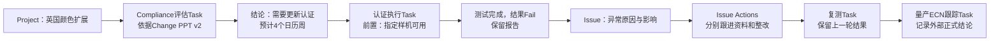

# AutoPM 数据库够不够：按真实工作和员工操作复评

2026-09-13｜设计建议，未修改 Airtable｜本轮重点是能否进入 Interface 设计

**结论：已有主体结构可以保留。基础查询和任务分派够用；完整支撑部门评估、计划交接、测试放行和问题处理，还需补强。主要改动集中在 Tasks、Issues，以及一张 Issue Actions 明细表。**

这不是要把所有长期功能一次建完。先确定下面必补信息的保存位置，用实际场景走通，再进入对应 Interface 的详细设计。样机调配、工时容量、历史周报等专项能力有各自的数据缺口，不能一起宣称已经足够。

## 1. 本次实际核对范围

- 通过 Airtable 连接读取 AutoPM V2（Pilot）全部 **16 张表、424 个字段**的名称、类型及接口返回的配置。北京时间 **2026-09-13 09:12** 保存快照。
- 字段 ID、名称、类型与今天较早的快照一致；不是继续引用旧的18表/498字段数字。
- 重读用户字段工作簿中的字段排列及批注，以及历史工作流 Excel 的阶段、依赖与交付结构。最新口述业务流程优先于历史模板的默认时长和跳步规则。
- 查阅 Asana、Smartsheet、Microsoft Project、Jira 官方功能说明，比较工作交接和信息维护方法。
- 本轮没有重新运行自动化、验证生产记录完整性或开展员工可用性测试。“有保存位置”不等于“页面和自动化已交付”。

新读取的结构单独存于 [本次结构证据](evidence/followup-structure.json)。完整候选字段定义仍见 [FIELD-DECISIONS.md](FIELD-DECISIONS.md)；本页补充优先取舍和进入页面设计的条件。**本轮将 Work Kind 从条件项收敛为推荐必补项**，原因见下文。

继续执行用户已确定的边界：保留现有 Task 多 Owner 完成机制；项目进度改造暂停；Issue 措施不默认成为计划 Task；本轮不实施此前未讲清的日期搬迁或页面布局。

## 2. 从其他软件借鉴什么

| 官方产品机制 | 对 AutoPM 的设计启示 | 不应直接照搬的部分 |
|---|---|---|
| Asana 的任务包含说明、责任、日期、附件、依赖，并可从不同工作视图访问同一记录 | 员工在“我的工作”更新，PM在项目里读取同一项工作；任务需要内容和结果，不只有名称和完成标记 | 不把其单负责人规定套到你已认可的多 Owner 机制，也不改变 Task 归属 Project 的既定设计 |
| Smartsheet 的更新请求针对既有行，可选择让对方看到哪些列 | 后续补评估结论应更新原评估记录；只让员工处理此时需要填写的信息 | 不要求每次部门回复都提交一份新增记录的表单 |
| Microsoft Project 区分依赖、持续时间、工作量及资源 | “等认证四周”“工程师做两天”“需要六台机器”是不同信息；前后依赖必须能关联真实项目任务 | 目前不引入完整资源优化或强制工时填报 |
| Jira 的子项可以分别分派和跟踪 | 一个问题有三项措施，就要有三条能独立维护的措施记录 | Jira 的 work item 不等于 AutoPM 特指异常障碍的 Issue；普通计划工作仍是 Task |

来源：[Asana Tasks](https://asana.com/features/project-management/tasks)、[Smartsheet Update Requests](https://help.smartsheet.com/learning-track/smartsheet-intermediate/update-requests)、[Microsoft Project 排期机制](https://support.microsoft.com/en-us/project/how-project-schedules-tasks-behind-the-scenes)、[Jira 子项](https://support.atlassian.com/jira-software-cloud/docs/create-a-work-item-and-a-subtask/)。

上述产品机制是已查资料；对 AutoPM 的取舍是本次设计判断。员工是否觉得顺手，仍需在页面样例中验证。

## 3. 每张表的判断

“够用”指该表的当前职责，不表示整个系统已完成。

| 表 | 字段数 | 判断 | 应采取的处理 |
|---|---:|---|---|
| PMO Roadmap Programs | 49 | 产品族档案基础够用 | 保留身份、分类、图片、来源和项目入口；风险项目数来自明细汇总，不让用户手填 |
| PMO SKUs | 22 | 产品身份基础够用，关系需明确 | 以正式 SKU/ALE/来源 ID 做映射；Program_Code 文字不等于正式关联；项目内状态留在 Project SKUs |
| Projects | 93 | 内容丰富，重点是分清用途 | 保留范围、团队、工厂、关键日期和资料入口；补清项目整体阶段与紧急程度；不增加十套部门评估正文 |
| Tasks | 19 | 分派够用，工作交接不足 | 补工作说明、结论、任务种类、工作方向、实际前置和评估来源；按类型记录评估/测试/审批结果 |
| Issues | 16 | 能登记，处理过程及经验不足 | 保留直接关联项目和可选关联任务；补实际影响、结果、关闭日期、预防建议和发生阶段；措施独立成明细 |
| People | 34 | 基础够用 | 人员部门与项目职能角色分清；不同角色的反向关联不因同样指向 Projects 就删除 |
| Factories | 8 | 工厂主档够用 | 项目工厂继续由 Projects 指定；工厂在某项目的备料、试装、生产安排放项目 Task 或正式计划 |
| Project SKUs | 10 | 多对多执行结构合理 | 执行状态和是否仍在项目范围内分开；需要移出/重加操作时补范围状态和变更记录 |
| SKU Milestone Plans | 14 | 日期例外结构可保留 | 当前主日期取 Task.Start Date；逐个节点解释日期含义后再做日期编辑页，不统一改成 Start 或 Due |
| SKU From PLM | 9 | 产品来源副本够用 | 负责上游身份和分类，不再承担项目执行状态 |
| Task Template | 23 | 模板内容有基础，来源不够清楚 | 当前存在普通字段与 [STD] 两套工期/依赖字段；确定生成器读哪套，生成后留下模板与版本来源 |
| CPM Analysis | 22 | 计算分析来源可保留 | 不代替每个 Project 的实际前置关系；与 Task Template 确定发布方向，避免同一排期规则两处手改 |
| ALL Tracker | 49 | 外部结构可保留 | 文本日期经明确解析；这是交换结构，不能因为有这些列就认定 Tracker 输出已正确 |
| Schedule Import | 14 | 有入口，配置尚有缺口 | 本轮确认三个 Lookup 的 isValid=false；修复后才接入对应导入页；预览、逐条错误、重试还需要作业明细 |
| System Knowledge & Progress | 26 | 系统维护资料用途够用 | 保存 AutoPM 规则、维护和开发知识；不代替项目问题解决经验 |
| Issue Summary | 16 | 产品反馈用途够用 | 明确为 AutoPM 产品反馈/开发事项，不与项目业务 Issues 混用 |

## 4. 必须先补清的四组信息

### A. 项目要让人看懂“这次做什么、现在在哪一步”

**Project Description 保留。** 用户 Excel 的 F4 批注提出过删除考虑，但项目名称与范围承担不同用途。例如名称“UK color extension”只能定位项目；范围应说明变更颜色、适用型号、硬件是否改变、哪些事项仍待美国确认。

| 信息 | 推荐位置和维护方式 |
|---|---|
| 项目范围 | 复用 Project Description，由开案资料形成，范围变化时更新并保留来源版本 |
| 最新进展 | 复用 Engineering remark；不再覆盖项目范围 |
| 项目整体阶段 | 建议 Project Stage 单选，由项目负责人维护；例如评估规划、前期ECN、执行测试、量产ECN、MP |
| 紧急程度 | 建议 Project Priority 单选；复杂度高不等于时间紧急，不能用 Project Level 代替 |
| 总协调人 | 优先明确 NPI/NPD 的统筹规则；若同一项目仍无法识别唯一牵头人，再增加 Project Lead。不要复制全部部门负责人 |

现有 Project Status 混有 On Track、At Risk、In MP、Cancelled 等含义。新增阶段的同时，要在页面设计前明确各选项的展示和维护用途；旧状态的迁移要另查消费者，不能直接批量替换。

### B. Task 要能承接“评估—结论—后续工作”

评估仍是一项项目 Task。评估结束后保留原记录；需要执行工作时，新建另一条 Task 并关联来源。确认无需变化也是有效评估结论，不能删除这条评估记录。

| 建议字段 | 类型 | 谁主要维护 | 具体解决什么 |
|---|---|---|---|
| Work Brief | 长文本 | PM发起，部门补充 | 这次具体评什么/做什么，依据哪份资料及版本，预期交付什么 |
| Outcome | 长文本 | 执行人员 | 得出了什么结论、实际完成什么、还受什么条件限制 |
| Workstream | 单选 | 模板带入，PM调整 | Packaging、DQTP、Compliance等工作方向；不会因换了Owner而变成另一类工作 |
| Work Kind | 单选 | 模板带入，PM调整 | Assessment / Execution / Test / Approval，用于显示相应结论字段，避免靠任务名称猜类型 |
| Predecessors | 关联Tasks，多选 | PM | 这项工作必须等哪些实际项目任务；与模板的依赖规则分开 |
| Source Assessments | 关联Tasks，多选 | 建计划时带入 | 为什么需要这项执行工作，来自哪些评估；不等同于必须等待的前置工作 |
| Assessment Decision | 单选 | 评估负责人 | 需要后续工作 / 不需要后续工作 / 缺信息无法判断，仅评估Task使用 |
| Estimated Duration | 数字 | 部门估计，PM协调 | 尚未排具体日期时，先记录该项执行工作预计持续多久 |
| Duration Basis | 单选 | 模板带入，PM调整 | Working Days / Calendar Days，避免“20天”被不同人理解为不同周期 |
| Test Result | 单选 | 测试负责人 | 未出结果 / Pass / Fail / Conditional，仅测试Task使用 |
| Approval Status | 单选 | ECN跟进人 | 未提交 / 审批中 / 退回 / 已批准，仅审批跟踪Task使用 |
| Approval Decision Date | 日期 | ECN跟进人 | 外部审批当前结论的发生日，与计划到期日区分 |

**12个候选字段不等于员工每次填写12项。** 大部分身份、分类、项目、Owner、日期由创建/模板带入。员工做评估时主要处理结论、说明和成果链接；测试时处理测试结果和报告；不出现不相关字段。

现有 Deliverables 继续用于成果链接。详细图纸、包装矩阵、测试报告保存在原正式位置。Work Brief 引用具体输入版本，不能只写一个会不断被覆盖的“最新文件”。

Predecessors 先支持清楚的完成后开始关系。检查同项目、不能自关联和循环；字段建好不会自动获得可靠的排期能力。真实存在其他依赖方式时，再扩展，不把所有依赖硬塞成一种含义。

**模板只负责起草，部门评估决定实际计划。** 不能仅因为项目被初判L1，就把尚未判断是否适用的Compliance、EE等评估当作已经完成或必然无需开展。PM先确定评估范围，部门结论再决定实际执行分支。

### C. 测试和审批必须保存“结果”，不能只看完成标记

- 测试工作完成，结果可以是 Fail；保留现有完成操作，另存 Test Result 和报告。
- 复测使用下一轮 Task/记录，关联之前的测试；不要把原 Fail 和报告覆盖掉。
- 两次 ECN 分别跟踪。资料提交完成，不等于 ECN 批准；正式结论仍来自 ECN。
- Conditional 表示存在条件，限制和依据要写清。AutoPM不能据此自行认定可以量产。
- 对比原批准计划与当前计划，需要批准版文件和版本来源。当前 Task 两个日期不能同时表示批准日期、当前预测和实际发生日期。此项先保留正式计划文件，日期字段设计另行处理，不在本轮强制搬迁。

### D. Issue 要能逐项处理，并留下可复用结果

当前一段 Recovery Action、若干 Recovery Owners、一个 Planned close Date，无法可靠回答“三个措施分别是谁做、哪天完成、哪个有效”。

建议新增 **Issue Actions**，一条记录对应一个措施：

| 字段 | 用途 |
|---|---|
| Action ID | 稳定定位措施 |
| Issue | 必填关联一个问题；项目由问题读取 |
| Action | 具体措施 |
| Owner | 此项措施牵头执行人 |
| Due Date | 此项措施承诺日期 |
| Action Status | Open / In Progress / Done / Cancelled |
| Result | 实际执行结果和效果 |
| Evidence URL | 证据或资料位置 |
| Formal Task | 可选；PM决定纳入正式计划时关联Task |

一旦措施转为正式Task，其Owner、日期和执行状态以Task维护，措施行展示引用；不要求双写。旧Recovery Action先保留为历史原文，不能机械拆分后虚构负责人或结果。

Issues本身建议补：**问题详情、具体影响、解决结果、实际关闭日期、发生阶段、预防建议**。Root Cause继续复用。不要在发现问题时就强迫员工填写尚未知道的根因和预防措施。

现有Category只有Workflow / Resource / Technology三个大类。它们能做粗分，但难以发现“同类颜色确认、证书更新、开裂问题反复发生”的规律。建议先整理该字段的业务分类，必要时补一个受控子类；避免所有人自由新增近义选项。原因初判与核实结论在处理过程中明确区分。

Issue只属于一个项目的常见场景先做好。跨项目共性问题若要共享处理，必须分别表达项目影响；不能把多个项目连到同一条Issue后，共用一组责任和日期就算解决。

## 5. 哪些暂时复用，哪些专项功能仍缺数据

| 能力 | 当前可采用的办法 | 进入该功能前还需什么 |
|---|---|---|
| 各部门评估 | 同一Tasks表，按Workstream和Kind区分 | 不另建十张部门表；模板定义各方向的评估要点与交付物 |
| 部门工作队列/My Work | 查询同一批Task和Issue Actions | 不为每个页面复制记录；只过滤当前身份、工作方向与时间范围 |
| 美国资料补充 | Project资料入口＋相关跟进Task | 外部US立项先预留；中国准备期的资料与评估在同一Project上下文留存 |
| 样机需求与分配 | Sample plan URL作为正式计划入口 | 要在AutoPM内合计和分配，必须有需求明细：项目、试装批次、规格/SKU、测试任务/部门、数量、需求日期、可复用条件、分配结果。DQTP要10台、Compliance要4台，不一定生产14台 |
| 人员工时与产能 | Owner和预计周期可支撑工作跟进 | 要比较真实负荷，需投入工时、可用容量等；任务数不能冒充工时负荷 |
| SKU范围的任务/问题筛选 | 当前可以显示项目背景和项目全部工作 | 要准确说“只影响某SKU”，Task/Issue需明确All / Selected / Not Assessed范围及ProjectSKU关联。不能拿项目全部SKU文字当受影响名单 |
| SKU移出/重新加入 | 保留ProjectSKU关系 | 增加范围状态及变更历史；不物理删除已有执行历史 |
| SKU例外日期编辑 | 现有Override与Reason可保留 | 逐节点说明取主任务哪种日期，先讲清含义；本轮不改用户尚未理解的日期规则 |
| 历史周报 | 当前备注用于最新进展 | 固定周期回看需要报告周期和快照，不能用今天的备注还原上周 |
| 导入预览和失败修正 | Schedule Import作为入口 | 修复无效Lookup，增加批次/逐条结果；全链路验证独立进行 |
| Tracker输出 | 保留现有交换表和Bridge | 核对真实映射、日期来源、公式与Baseline保护；字段存在不等于输出正确 |
| 模板升级追溯 | 保留Task Template和CPM | 固定发布版本，在生成任务时保存来源；已有任务不能随模板修改静默重排 |

这些是功能与数据的对应关系，不是宣布延后或取消需求。将哪个功能交付给员工，就必须补齐对应一行。

## 6. 用一个项目验证，避免凭字段数量判断

以下是设计走查案例，不是已执行的测试结果。

| 情况 | 判断数据设计通过的标准 |
|---|---|
| 包装评估确认不需要变更 | 原评估保留，有理由；没有多生成一套不需要的包材任务 |
| Compliance缺美国资料 | 显示缺什么及谁跟进；不假装已有肯定结论 |
| 一个评估产生三项执行工作 | 三项工作可各自分派/排期，仍能找到同一个来源评估 |
| 先做样机，后做认证 | 关联到真实任务，样机调整时能定位哪些后续工作需检查 |
| 测试完成但失败、随后复测通过 | 两次结果和报告均保留；原完成机制不变 |
| 一个问题有三项措施，仅一项完成 | 各项Owner、日期、结果可区分；不能据此认定整个问题已解决 |
| ECN退回后再次批准 | 当前结果正确，旧退回依据可在外部ECN历史找到；不以Task到期日替代批准日 |
| 员工在My Work更新、PM打开Project | 两个入口读取同一条记录，不需要重复录入 |
| 某任务只适用英国SKU | 不出现在其他SKU的“直接相关工作”中；项目总览仍可找到它 |

## 7. 是否进入 Interface：明确判定

**当前可以开始讨论 Programs、Projects基础信息、团队和已有资料的页面。** 这些数据主体已经存在。

**评估、计划编辑、测试/ECN结果、Issue措施页面，先按本页补清数据定义，再进入详细页面设计。** 无需等待所有平台功能建设完毕，也不能先把这些页面定稿，再回来发现结果无处保存。

进入基础执行Interface的检查点只有四个：

1. Tasks能保存工作要求、评估结论、后续任务及两者的关系。
2. 测试、ECN结果能与“工作完成”分别表达。
3. Issue措施能逐项维护，问题解决后有结果可回看。
4. 上面的设计案例中，信息都有明确位置，员工只维护一份。

下一项设计应先落在一条具体的 **Compliance Assessment Task**：PM提供评估依据；Compliance填结论；需要执行时关联后续认证Task。把这一条讲清，才能确定同类部门评估的界面和最小输入。页面布局仍由后续逐页讨论确定。

## 参考输入

- [用户字段整理与批注](<C:/Users/40734/OneDrive/Desktop/ALL data management in Airtable.xlsx>)，Sheet2；F4为Description删除考虑，F16为Engineering remark用途说明，H1:H20与J1:J19为Task/Issue整理。
- [历史流程Excel](<D:/个人资料/AI学习圈/SN Auto PM/99-备份/快照_2026-06-29_整理前整包/AutoPM资料精炼版/03-Demo development/workflow/AutoPM_Workflow_Diagram_EN.xlsx>)，Gate Check List、Task Dependency Details、Dependency Matrix。历史默认工期不直接作为当前排期规则。
- [本轮完整评估底稿](README.md)、[字段候选清单](FIELD-DECISIONS.md)。
