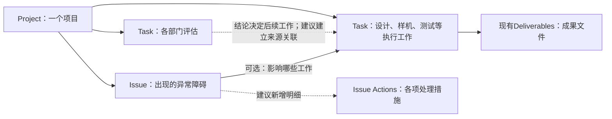

# AutoPM：现有数据库够不够支撑实际工作？

**2026-09-13｜业务适用性评估 v1.0｜讨论稿，尚未实施**

> **结论：主体结构可以保留，基础项目查询和任务维护有数据基础；但完整承接“部门评估→形成计划→执行测试→ECN放行→问题经验积累”，还不够。**
>
> 优先补清三件事：**评估得出了什么、工作之间怎样接续、问题采取了哪些措施并取得什么结果。**
>
> 先确定这些信息放在哪里，再逐页讨论 Interface。无需推倒数据库，也无需为十个部门各建一张表。

这份文件单独放评估意见。原始字段和配置另存于 evidence，不混在正文中。具体候选字段见 [最小补充清单](FIELD-DECISIONS.md)。

下面是建议保留和补充的业务关系。评估和执行是同一张Tasks表中的不同记录；虚线处是建议补充，不代表已经实现。

## 1. 这次的判断依据

### 当前确实查到了什么

通过 Airtable 连接重新读取 **AutoPM V2（Pilot）全部16张表、424个字段的名称、类型及接口可返回的配置**。快照归档时间为北京时间2026-09-13 08:20左右。

相较9月12日的422字段：新增 Projects 与 Schedule Import 的一对反向关联；Schedule Import 原“Project ID”改名为“Project ID (from File)”。没有把旧的18表/498字段盘点当成当前状态。

另查看 Projects前5条、Tasks前40条、Issues前20条、Task Template前12条，辅助理解字段实际怎么用。它们不是随机抽样，不代表全量数据质量。本次没有重新操作页面、运行自动化、检查所有外部文件或做用户测试。

- [当前表与字段](evidence/live-tables.json)
- [当前字段配置](evidence/live-schema.json)
- [检查范围与限制](evidence/read-scope.json)
- [用于说明的两个记录片段](evidence/selected-examples.json)

### 以什么业务为准

以你最新说明的流程为准：美国输入→中国任命负责人、供应商和开案→跨部门评估→完整计划与资料→ECN前期审批→设计、样机、测试→处理异常→ECN量产放行。

你提供的历史流程 Excel、Kick off.pdf、workflow.html用于辅助理解；历史工期和部门分工不直接成为本次的新规则。US立项和正式ECN审批仍是外部过程。

**继续保留的决定：**Task现有完成机制不变，项目进度改造继续暂停。Issue措施不默认进入Tasks。不采用此前未获认可的“所有Project日期统一搬到Tasks”方案，也不恢复此前撤回的页面布局。

## 2. 判断字段够不够，要看员工能否回答这些问题

字段的必要性取决于业务动作，不取决于其他软件有多少列。下面“够用”仅指具有保存这些信息的基础，不等于自动化或页面已经验收。

| 实际工作 | 当前已有内容 | 判断与最小处理 |
|---|---|---|
| 看懂这是哪个项目、要改什么 | Projects有ID、名称、Description、Type、Change Types、产品关系 | **基本够用，理顺用法。** Description保存项目范围，Change Types做分类；Change PPT存现有项目资料位置，不把每个变更都再复制成Project列 |
| 看清现在是评估、执行还是等待审批 | Tasks有Phase，Projects有Milestones文本及混合状态选项 | **项目阶段还需明确位置。** 建议Projects增加Project Stage，表示项目整体所处阶段；不拿某个任务的Phase或完成率代替 |
| 找到中国团队和工厂 | Projects有NPI/NPD及各职能Owner；People有部门、邮箱；Factory有关联 | **基本够用。** NPI/NPD同时存在时要能明确谁统筹，可先由任务分工体现；不再新建十张部门人员表 |
| 查输入资料、包装矩阵、图纸、测试计划 | SharePoint Folder、DQTP、PIS、Sample plan、ECN链接；Task有Deliverables | **文件位置够用。** 需在对应任务说明资料版本和用途；有链接不能证明文件已经齐全或审批通过 |
| 分派十个部门做评估 | Task有项目、Owner、Start/Due、Phase和完成情况；模板有Department | **分派基础够，评估信息不够。** 需记录评估范围、结论、是否需要后续工作及其依据 |
| 把各部门结论变成正式计划 | Task Template/CPM有工期、前置规则；Tasks有起止日期 | **不完全够。** 当前Tasks没有实际任务前置关联，也没有清楚记录“这项执行工作来自哪次评估” |
| 区分工作多久、投入多少、需要几台样机 | 模板有默认工期；Project有Sample plan URL | **目前依靠外部计划。** Task预计持续时间需能按项目调整；样机分配先沿用现有Sample Plan，但不能宣称系统已能汇总机器需求 |
| 跟进设计、开模、EB试装、交付资料 | Tasks的Name、Phase、Milestone、Owner、日期、Deliverables | **基础够用。** 需补工作说明与结果摘要；多数差异是不同任务记录，不是不同数据表 |
| 知道测试做完后是否通过 | 有DQTP/Compliance任务、日期、报告链接和完成情况 | **缺少明确的测试结果。** “测试完成”和“测试通过”分别保存，不改现有Task完成判定 |
| 知道前期ECN、量产ECN是否放行 | Projects有ECN链接、TRA/MPRA日期；Tasks有两个审批阶段 | **基础存在，审批结果不足。** 两个阶段分别追踪外部审批状态、结论日期和对应来源；不在AutoPM重建ECN审批系统 |
| 记录异常及影响哪些工作 | Issue直接关联Project，可选关联Tasks；已有严重度、MP影响、原因 | **关联主干合理。** 需说明具体影响；多个Project同时关联同一Issue的含义要受控，不能随意混在一起 |
| 跟进一个问题的多个措施、解决后复用 | Recovery Action一段文字、多名Owner、一个计划关闭日 | **不够。** 各措施没有独立的执行人/日期/结果位置，Issue也缺明确解决结果和实际关闭日 |
| 管理SKU在项目中的执行和日期差异 | Project SKUs与SKU Milestone Plans | **主体够用。** 指向哪个日期、影响全部还是部分SKU仍需定义；不是再复制一套计划 |

**重要区别：**“工程文件继续保存在SharePoint、ECN等现有位置”是一项建议边界。它可以支撑项目协调，但不等于员工已能在AutoPM内部完成图纸管理、样机调拨或ECN专业审批。如果这些操作也要全部搬进来，必须另补对应数据设计，不能以一个URL算交付。

## 3. 最重要的调整：让评估真正产生计划

### 3.1 部门评估继续作为Task，不另建十张表

“Compliance变更评估”“包装变更评估”本来就是开案要做的工作，应进入项目计划。

建议在同一条评估Task里，清楚保存：

1. **评什么：**具体变化、适用SKU、依据哪个版本的Change PPT/RKO。
2. **评出了什么：**需要做、不需要做，还是缺资料无法判断，以及原因。
3. **下一步是什么：**需要新增哪些执行任务、预估周期和资源要求。
4. **成果在哪里：**现有Deliverables链接到评估文件或资料目录。

评估Task完成以后继续保留。若结论是需要认证，再生成或确认独立的“认证执行”Task，两条记录关联。**不要把原“认证评估”直接改名成“认证执行”，否则评估依据与完成过程会丢失。**

若结论是不需要认证，评估任务仍然真实完成，只是不新增这次认证执行任务。“不需要后续工作”不等于“这个部门没有评估过”。

### 3.2 十个部门共用格式，但各自说清专业结果

下表是建议的评估输出内容，不是要求在Projects新增十组字段。

| 评估方向 | 员工至少要留下的结论 | 对应后续工作 |
|---|---|---|
| Packaging | 包装是否变、变化范围、配置矩阵及版本 | Artwork、包材确认、包装验证等实际需要的任务 |
| CMF / ID / UI | 哪些颜色/外观/UI变、哪些待美国确认、方案及资料 | 配色、打样、外观确认 |
| DQTP | 需要哪些测试、样机规格/数量、测试周期和前提 | 样机需求、测试执行、报告 |
| EE | 软件/硬件变更清单、测试要求与EE测试组接口 | 修改、版本交付、EE测试 |
| Compliance | 无需变更、更新证书还是重新认证；范围、资料、周期 | 资料提交、认证测试、取证 |
| Tooling | 新开/改模范围、周期、试模要求 | 设计、改模、试模及确认 |
| NPD / 3D / 2D | 图纸修改范围、发布版本和接口要求 | 设计、评审、图纸发布 |
| ME | 工装/产线/工艺是否变、试装准备要求 | 工装准备、工艺验证、试装 |
| SC / Cost | 成本差异、供应商报价或待决条件 | 商务确认、采购及相关决策 |
| Factory | 接受的变更范围、物料与产能前提、生产窗口 | 备料、试装、生产安排 |

只对需要筛选、汇总、提醒的信息建立独立字段。专业细节保留在评估说明和原文件中。比如试验方法全文不需要变成Airtable十几列；“测试需要几台机器”若将来要系统汇总，就必须成为有规格和批次的明细，不能继续只放文字。

### 3.3 一个例子就能检验设计是否够用

以下为设计示例，并非真实项目事实：

- Compliance评估Task：依据Change PPT v2，结论“需要重新认证”。
- Outcome：预计四个日历周；需要指定规格样机；正式要求见报告。
- 后续认证Task：关联这条评估；前置是所需样机可交付。
- 测试完成：保留现有完成操作；另外记录“未通过”，报告链接可查。
- 新Issue：说明未通过的异常和交付影响，逐条推进措施。
- 再次测试：保留第一次结果，新增复测工作或后续轮次，不覆盖第一次报告。
- ECN IMP：读取外部审批实际结果；没有正式放行时不把“提交完成”展示成“已批准”。

若数据库无法区分上述事实，页面再美观也无法清楚说明项目到了哪里。

## 4. 两张最需要补强的表

### Tasks：补“内容与结果”，保留现有完成方式

当前19个字段已经回答谁、何时、哪个阶段、是否完成。主要缺的是工作说明、专业结论、实际前置工作和评估来源。

推荐的候选补充见 [Tasks字段清单](FIELD-DECISIONS.md#tasks建议补什么)。其中测试结果、部门评估判断、ECN审批状态只在对应类型的任务里使用，不要求每条任务都填。

**不因为参考Asana就把你的多Owner设计改成单Owner；也不因为增加结果字段就重新定义任务完成率。**

### Issues：措施明细与问题结论分开

当前“Recovery Action + 多名Recovery Owners + 一个Planned close Date”适合简单概述，但不足以管理几条各自推进的措施。

建议新增 **Issue Actions** 表：一条记录是一项问题措施，关联一个Issue，各自有执行人、日期、状态、结果和资料链接。Project从Issue读取，不再保存另一份措施副本。

Issue本身补解决结果、实际关闭日、预防建议及具体影响。原因沿用现有Root Cause；解决措施沿用或迁移现有Recovery信息，不清空历史文本。

不用为收集这些事实，先建设复杂的独立核验审批制度。怎样关闭仍单独讨论，不改写你已接受的Task机制。

两个实际观察说明为什么需要这些区分：

- **NXA0111：**Project Description里出现“美国更新了ID Spec，仍需确认颜色”的进展内容。这说明有些混乱来自写入位置，不是缺字段：项目范围留在Description，进展可用现有Engineering remark；具体待确认工作进入Task。
- **NXA0028-ISS-005：**Recovery Action中已有“提供CBOM”和“提供EE approval sheet”两条措施。现有字段无法分别表达两条措施的完成结果。仅凭“收集资料”标题不能判定它是错误Issue：正常计划收集是Task；资料缺失已造成障碍才是Issue。

## 5. 16张表分别是否足够

这里评价的是表的职责和关键业务支撑，完整字段配置在证据文件中。**没有发现引用，不等于字段可以删除。**

| 当前表 | 字段数 | 本轮判断 | 下一步 |
|---|---:|---|---|
| PMO Roadmap Programs | 49 | 产品族身份、分类、图片、项目入口足够作为基础 | 保留；渠道日期若仅展示可沿用，不能当项目内执行日期 |
| PMO SKUs | 22 | SKU身份和来源字段基本足够 | Program_Code是文本；分类匹配需受控，不按名称猜；项目内状态使用Project SKUs |
| Projects | 93 | 主档、团队、文件链接、关键日期已经较丰富 | 先统一字段用途；补清项目整体阶段，不继续往Projects塞各部门评估全文。紧急程度若需筛选，补Project Priority；复杂度不能替代紧急度 |
| Tasks | 19 | 任务跟踪够，评估结果与计划关系不足 | 补说明、结果、工作方向、前置、来源及按用途显示的结论 |
| Issues | 16 | 基础登记够，多措施推进与解决经验不足 | 补结果等字段；新增Issue Actions，不自动混入Task |
| People | 34 | 人员、部门、身份、邮件、责任反向关系足够 | 多条Projects反向关联对应不同角色，不因此判重复；人员记录不等于已经有系统访问权限 |
| Factories | 8 | 管理项目所属工厂和联系信息基本够用 | 工厂生产安排作为该项目Task/资料维护；不往工厂主档塞不同项目的排期 |
| Project SKUs | 10 | Project与SKU的执行关系方向正确 | 范围退出历史未有专门字段；若要在页面执行移出/重加，先补生效状态和历史，不能直接删除关系 |
| SKU Milestone Plans | 14 | 继承日期、覆盖日期和原因已存在 | Master Date当前取Task Start Date。逐节点明确取哪个日期，再启用相应日期编辑；不统一强改Start或Due |
| SKU From PLM | 9 | 作为产品来源副本可保留 | 与PMO SKUs按明确ID对应；无需再承载项目执行状态 |
| Task Template | 23 | 已有任务、部门、工期、前置与适用层级 | 两套字段并存需决定生成时读取哪一套；这是模板来源与版本问题，不是缺一个新模板库 |
| CPM Analysis | 22 | 可作为模板排期分析来源 | 不代替每个项目实际任务的依赖；与Task Template确定发布方向，避免两处分别维护同一规则 |
| ALL Tracker | 49 | 保留外部字段结构有用 | 多个日期是文本，需经映射处理；不直接当正式排期字段，也不据此宣称Excel输出正常 |
| Schedule Import | 14 | 已新建项目关联，但尚有明确配置缺口 | 三个Lookup仍返回isValid=false，需按新关联重新配置；某SKU命名Lookup指向Project ID，需核对目标。此项影响导入功能，非新增业务表问题 |
| System Knowledge & Progress | 26 | 可保留AutoPM系统文档与维护知识 | 业务问题经验优先留在已解决Issues，不把系统维护知识当项目经验库 |
| Issue Summary | 16 | 可保留AutoPM产品反馈及开发事项 | 与业务Issues明确命名和入口；不用拿它承载全部项目异常 |

### 关系上另外要防止两种误解

1. **一个Issue关联多个Project，与一个Project有多个Issue，不是一回事。** 当前Issues的Project关联允许多选。建议日常以一个主项目为单位处理；共性问题可相互引用。若需要真正跨项目共管，再设计每个项目的影响与责任，不能共用一组日期和结果就算完成。
2. **项目全部SKU，不等于本次问题影响的SKU。** 当前Issue中的Project SKU是从Project读取原始SKU文字，ProjectSKU中的Issues又读取该Project的全部问题。这些字段可作背景。若页面要声称“这些就是受影响SKU”，须另有明确范围关联；不能根据背景字段给出这个结论。

## 6. 参考其他软件后，哪些做法值得借鉴

这是对官方产品机制的比较，使用建议是结合AutoPM流程作出的推断，并非已经开展员工可用性测试。

| 软件做法 | 对AutoPM有用的部分 | 应如何使用 |
|---|---|---|
| Asana把工作说明、负责人、日期、附件、依赖组织在任务中；同一工作可从不同视图查看 | 一个工作记录可以同时服务项目负责人和执行员工 | 不再让员工为“项目页”和“我的工作”各填一份；本次仍保持Task归属Project的既定业务边界。[官方任务说明](https://asana.com/features/project-management/tasks)、[对象结构](https://developers.asana.com/docs/object-hierarchy) |
| Smartsheet可以对已有行请求更新，并选择需要对方维护的字段；新提交表单和更新既有记录有区别 | 部门后续补充评估，应更新原记录，避免每次回复变成新的重复任务 | 只请求员工当前需要补的信息；详细样式等数据位置确定后再讨论。[Update Requests](https://help.smartsheet.com/learning-track/smartsheet-intermediate/update-requests)、[Forms FAQ](https://help.smartsheet.com/articles/2482754-FAQ-Smartsheet-Forms) |
| Microsoft Project区分任务依赖、持续时间、人员工作量和资源 | “测试等待四周”与“工程师投入多少小时”不能用同一个工期数替代 | 先保存项目实际前置与预估周期；不照搬完整资源优化算法，也不默认加人就能缩短测试。[官方排期说明](https://support.microsoft.com/en-us/project/how-project-schedules-tasks-behind-the-scenes) |
| Jira允许把一项工作拆成由不同人处理的子项 | 一个问题的多个措施应能够各自更新 | 借鉴逐项维护，放到Issue Actions；不把Jira广义work item直接套成AutoPM的异常Issue。[官方子项说明](https://support.atlassian.com/jira-software-cloud/docs/create-a-work-item-and-a-subtask/) |

据此，我推荐的员工使用原则是：**一次只维护自己负责的一件工作；先看要做什么，再填结果；不重复填已有信息；需要解释的地方有说明和资料；不适用有明确原因。**

这是数据组织原则，不是提前确定Interface布局。

## 7. 到什么程度，才进入Interface讨论

**现在不建议直接宣布“数据库已经够了，全部转去做页面”。** 也不需要等所有长期功能完备才讨论任何界面。

按你的推进方式，先完成以下四项设计判断：

1. 明确评估Task与后续执行Task各存什么，采用同一张Tasks表；敲定下面的最小字段清单。
2. 明确测试结果与ECN审批结果的保存方式，避免把“完成操作”当成“结果通过”。
3. 明确Issue Actions逐项处理及Issue解决结果，不再依靠一大段文字维护全部措施。
4. 用一个示例项目走通“无需包装变更、需要认证、缺美国资料、复测、ECN退回再批准”这些情况，确认信息有地方放且只维护一份。

通过后，就可以逐页讨论Project、评估/计划和Issue的Interface。导入页需另外修复Schedule Import配置；SKU日期编辑需先讲清具体日期含义。

### 哪些事不能借此被宣称已完成

- 周报导入、旧数据覆盖保护、ALL Tracker生成：需要另做实际链路验证，本次只评估字段承载。
- 批次预览、逐行错误、确认后提交：当前Schedule Import三态并不足以证明具备完整作业管理；若要交付此功能，还需批次/明细设计。
- 历史周报回看：当前最新Engineering remark/AI摘要不能替代固定周期快照。需有报告周期和快照的明确存放位置。
- 全量关联正确、正式权限、安全保存、自动提醒：均不能从本次结构读取直接推出。
- 本次候选字段与新增Issue Actions是设计建议，并非已获批准的生产改造。

**下一步应先收敛Tasks如何记录部门评估与结果。这部分决定后，Project页需要展示什么、员工需要填写什么，才有清楚的依据。**

### 本地参考资料

- [历史流程与任务工作簿](<D:/个人资料/AI学习圈/SN Auto PM/99-备份/快照_2026-06-29_整理前整包/AutoPM资料精炼版/03-Demo development/workflow/AutoPM_Workflow_Diagram_EN.xlsx>)：阶段、部门交付与依赖的参考；不采用其默认时长作为当前结论。
- [Kick off流程图](<D:/个人资料/AI学习圈/SN Auto PM/99-备份/快照_2026-06-29_整理前整包/AutoPM资料精炼版/03-Demo development/workflow/Kick off.pdf>)、[历史网页流程](<D:/个人资料/AI学习圈/SN Auto PM/99-备份/快照_2026-06-29_整理前整包/AutoPM资料精炼版/03-Demo development/workflow/workflow.html>)：辅助理解，不作为已部署功能证明。
- [9月12日字段盘点及讨论约束](../2026-09-12/README.md)：沿用已确认的暂停项；旧建议需经过本轮业务复审，不能自动执行。
