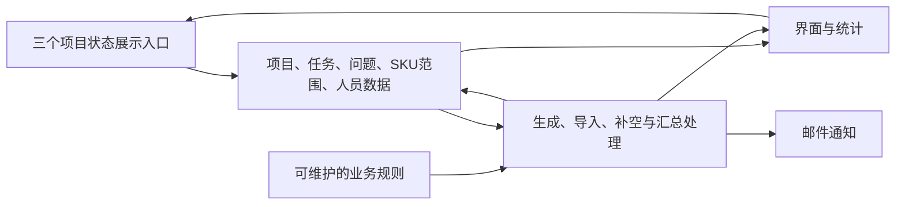

# AutoPM 架构与接手：公开说明

AutoPM 把项目、任务、问题、SKU范围、人员与规则连接起来，供项目维护、个人工作和管理汇总使用。项目状态的三个展示入口读取同一业务数据，但页面布局和筛选各自独立；它们不是项目、个人、管理三个角色的划分。数据保存事实，规则定义生成条件，自动化执行处理，界面展示结果；邮件是另一个输出渠道。

项目负责人维护项目范围、分工和状态；任务负责人更新进展和完成信息；问题责任人维护恢复行动；规则维护者调整后续任务生成条件；系统维护者检查自动化回执、页面发布和权限。人工填入的事实受保护，重复请求应补缺而不覆盖。缺负责人需要清楚提示，但不阻止创建任务。

关联同源便于从状态追到明细，但各页口径要一致；规则可配置便于调整后续生成，但不追改历史任务；人工值受保护，但业务错误仍需负责人更正；请求和运行结果可追踪，但运行成功仍需对照实际记录。

用户已确认创建/导入/重试、多入口、负责人及人工信息、日期、日常统计、页面与权限六类业务验收通过。此结论不代替逐脚本的技术证明。待办、发布与新变更的最新状态只看[原协调 Issue](https://github.com/sunny-06064710-3/autopm-dadhboard/issues/1)；旧审计不作当前缺陷判定。

授权维护者可从受限交接包取得实际表/字段关系、规则、自动化写入者与问题定位步骤。公开仓库只保留本责任层说明，不在此复制内部对象映射或维护第二份状态。
