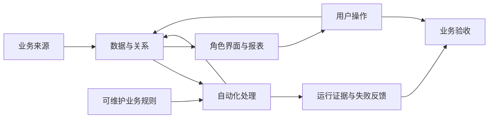

# 系统接手说明：公开版

本图表达通用责任层，不披露AutoPM内部表、字段或自动化映射。完整真实拓扑、字段字典和公式保存在[受限交付包](evidence.md)，远程执行者取得相应输入后才能修改。

| 角色 | 日常目标 | 交付需要证明 |
|---|---|---|
| 项目经理 | 建立项目、维护计划、处理问题和提交进展 | 操作路径明确，生成/导入反馈可理解，手工修改有保护 |
| 成员 | 找到自己的工作并更新 | 个人/团队范围清楚，更新结果一致，权限正确 |
| 管理者 | 看组合、风险与明细 | 口径有说明，数字能下钻核对，筛选范围一致 |
| 维护者 | 管人员、规则、配置和故障 | 写入责任明确、失败可见、变更可回退 |

数据、自动化、界面共享同一业务定义。字段修改前核查全部写入者、读取者、公式、页面、筛选和通知；自动化运行成功不保证业务结果正确；管理员API可读不代表普通成员有同样权限。

交接时由Codex提供该任务所需的真实对象映射、当前版本、改动预览、既有业务约定和回退方案；执行AI交回实际结果，原Issue记录状态，PR记录变更。演示程序、迁移方案与线上已验收系统分开标记。

最小验收记录：日期/版本、角色、测试对象、预期、实际、证据、复核人。核心路径包含创建、重复请求、更新/完成、异常处理、汇总、权限及返回导航；发送测试使用明确同意的收件人。
